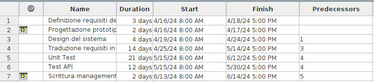

# Project Estimation - CURRENT
Date:

Version:

# Estimation approach
Consider the EZElectronics  project in CURRENT version (as given by the teachers), assume that you are going to develop the project INDEPENDENT of the deadlines of the course, and from scratch
# Estimate by size
### 
|             | Estimate                        |             
| ----------- | ------------------------------- |  
| NC =  Estimated number of classes to be developed   |              27            |             
|  A = Estimated average size per class, in LOC       |     43                       | 
| S = Estimated size of project, in LOC (= NC * A) | 1170| 
| E = Estimated effort, in person hours (here use productivity 10 LOC per person hour)  |                 117                     |   
| C = Estimated cost, in euro (here use 1 person hour cost = 30 euro) | 3510| 
| Estimated calendar time, in calendar weeks (Assume team of 4 people, 8 hours per day, 5 days per week ) |             4    |               

# Estimate by product decomposition
### 
|         component name    | Estimated effort (person hours)   |             
| ----------- | ------------------------------- | 
| requirement document    |24|
| GUI prototype |16|
| design document |32|
| code |117|
| unit tests |170|
| api tests |100|
| management documents  |16|

# Estimate by activity decomposition
### 
|         Activity name    | Estimated effort (person hours)   |             
| ----------- | ------------------------------- | 
| Definizione requisiti del sistema| 27|
| Progettazione prototipo GUI |14|
|Design del sistema|34|
|Traduzione requisiti in codice|125|
|Unit Test|175|
|Test API|103|
|Scrittura management documents|12|
###

# Summary

Report here the results of the three estimation approaches. The  estimates may differ. Discuss here the possible reasons for the difference

|             | Estimated effort                        |   Estimated duration |          
| ----------- | ------------------------------- | ---------------|
| estimate by size |117| 30|
| estimate by product decomposition |475| 118 |
| estimate by activity decomposition |490| 122|

Le differenze sono dovute alla natura delle stime, nel caso della stima per dimensione consideriamo il progetto nell'insieme calcolando LOC e producendo quindi una stima.
Nel caso invece della stima per prodotto si divide per le sue parti costituitenti(caratteristiche), ed ogni parte è considerata per complessità e altri fattori.
Infine la stima più accurata per questo progetto è la stima per attività in quanto viene considerato l'effort che effettivamente richiede una certa attività. 

