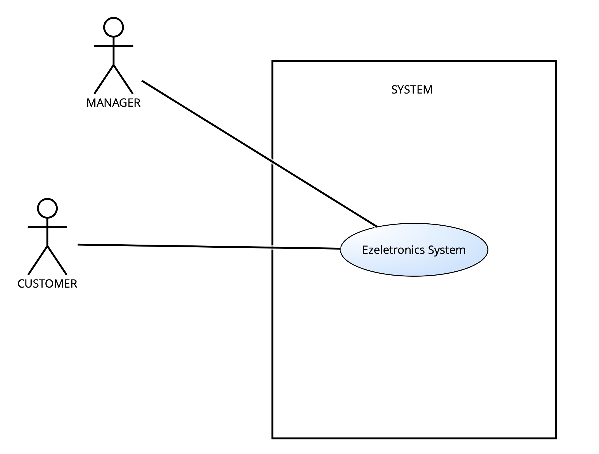
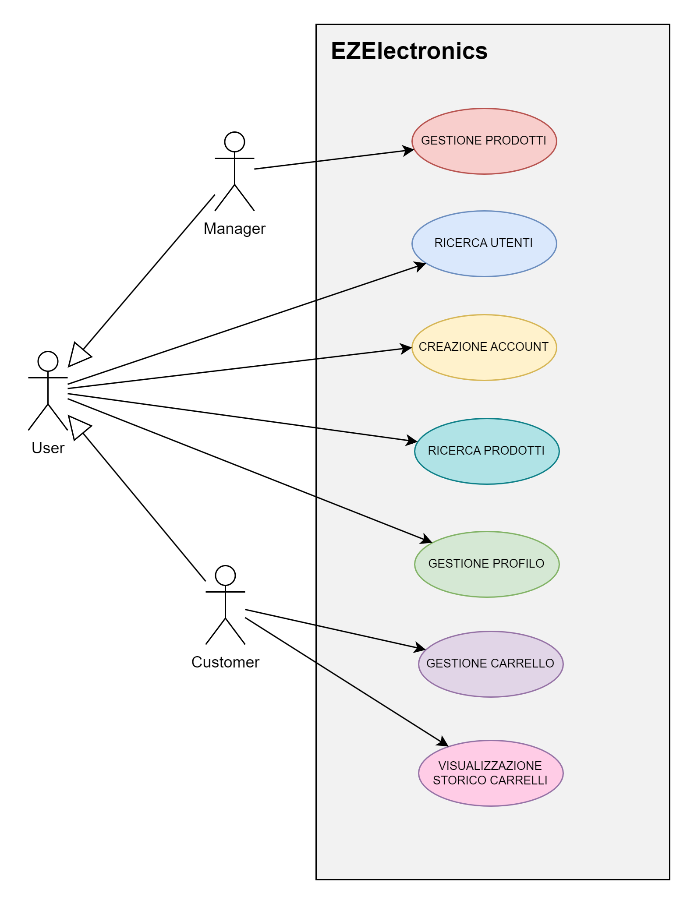
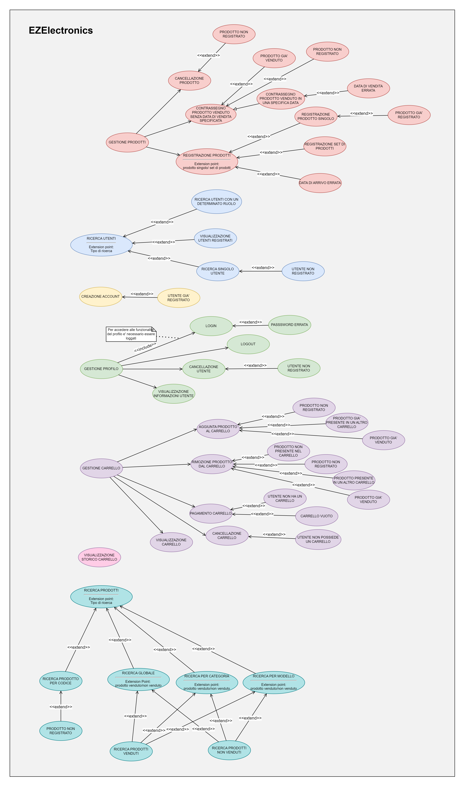
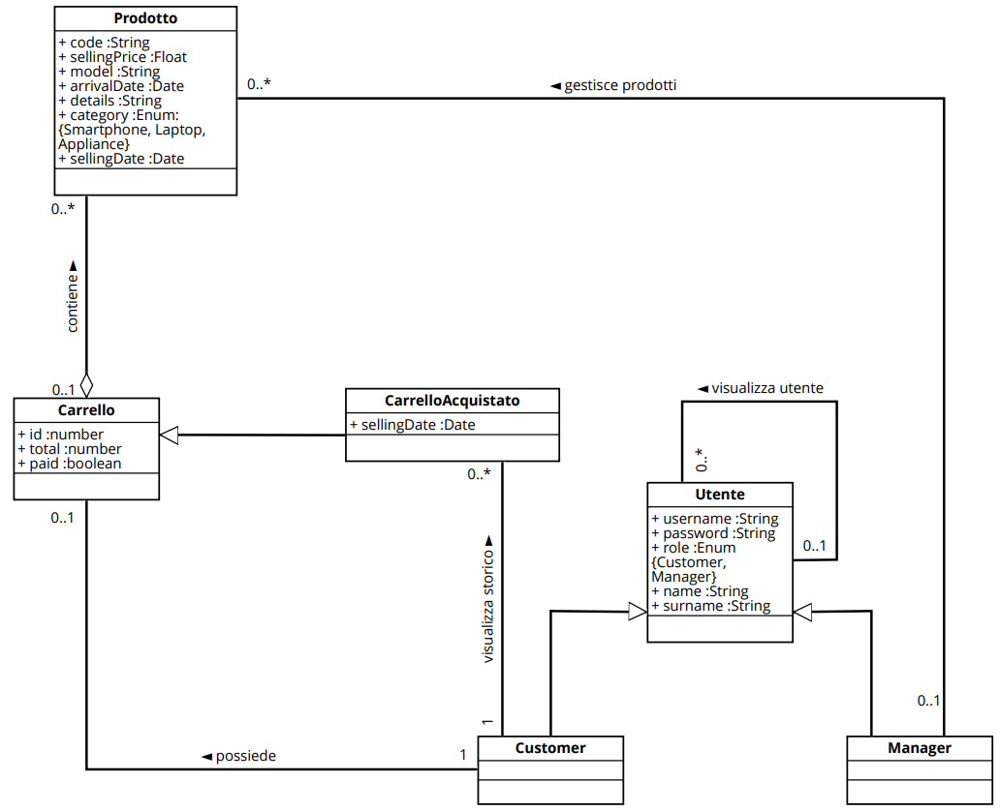
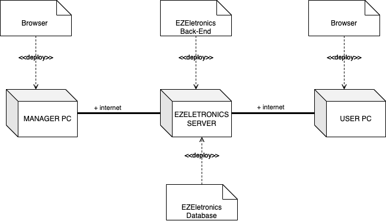

# Requirements Document - current EZElectronics

Date: 

Version: V1 - description of EZElectronics in CURRENT form (as received by teachers)

| Version number | Change |
| :------------: | :----: |
|         1      |        |

# Contents

- [Requirements Document - current EZElectronics](#requirements-document---current-ezelectronics)
- [Contents](#contents)
- [Informal description](#informal-description)
- [Stakeholders](#stakeholders)
- [Context Diagram and interfaces](#context-diagram-and-interfaces)
  - [Context Diagram](#context-diagram)
  - [Interfaces](#interfaces)
- [Stories and personas](#stories-and-personas)
- [Functional and non functional requirements](#functional-and-non-functional-requirements)
  - [Functional Requirements](#functional-requirements)
  - [Access Rights](#access-rights)
  - [Non Functional Requirements](#non-functional-requirements)
- [Use case diagram and use cases](#use-case-diagram-and-use-cases)
  - [Use case diagram](#use-case-diagram)
    - [Use case 1, UC1](#login---uc1)
    - [Use case 2, UC2](#logout---uc2)
    - [Use case 3, UC3](#creazione-account---uc3)
    - [Use case 4, UC4](#visualizzazione-informazioni-Prodotti---uc4)
    - [Use case 5, UC5](#registrazione-prodotti---uc5)
    - [Use case 6, UC6](#contrassegno-prodotto-Venduto---uc6)
    - [Use case 7, UC7](#cancellazione-prodotto---uc7)
    - [Use case 8, UC8](#aggiunta-prodotto-al-Carrello---uc8)
    - [Use case 9, UC9](#rimozione-prodotto-dal-Carrello---uc9)
    - [Use case 10, UC10](#pagamento-carrello---uc10)
    - [Use case 11, UC11](#cancellazione-carrello---uc11)
    - [Use case 12, UC12](#visualizzazione-carrello---uc12)
    - [Use case 13, UC13](#visualizzazione-storia-Carrelli---uc13)
    - [Use case 14, UC14](#ricerca-prodotti---uc14)
    - [Use case 15, UC15](#ricerca-utenti---uc15)
    - [Use case 16, UC16](#cancellazione-utente---uc16)
- [Glossary](#glossary)
- [System Design](#system-design)
- [Deployment Diagram](#deployment-diagram)

# Informal description

EZElectronics (read EaSy Electronics) is a software application designed to help managers of electronics stores to manage their products and offer them to customers through a dedicated website. Managers can assess the available products, record new ones, and confirm purchases. Customers can see available products, add them to a cart and see the history of their past purchases.

# Stakeholders

| Stakeholder name | Description |
| :--------------: | :---------: |
| Customer  | Cliente che interagisce con il sito EZEletronics per visualizzare e acquistare prodotti elettronici |
| Manager | Fornitore di prodotti elettronici, si occupa della gestione dei prodotti sul sito EZEletronics|

# Context Diagram and interfaces

## Context Diagram

## Interfaces

|   Actor   | Logical Interface | Physical Interface |
| :-------: | :---------------: | :----------------: |
| Customer |         GUI (tbd)          |      COMPUTER             |
| Manager |         GUI (tbd)          |          COMPUTER          |

# Stories and personas

 **Persona 1**: 
 Chiara ha 35 anni ed è il manager di un negozio di elettronica.
 La sua giornata è molto impegnata, poiché si occupa sia della gestione del negozio che degli ordini dei clienti.
 **Story 1**:  
  Spesso ha bisogno di <u>aggiungere un nuovo set di prodotti di uno stesso modello arrivati in negozio</u> al sistema, quindi utilizza l'applicazione EZElectronics direttamente dal suo ufficio.
 **Story 2**:  
  Spesso succede che Chiara debba <u>aggiungere o rimuovere manualmente singoli prodotti dal magazzino </u>
 **Story 3**:  
  A volte ha bisogno di <u>cercare dei prodotti nel magazzino</u> per verificarne la disponibilità
 **Story 4**:  
  Quando vuole verificare quanti e quali utenti sono registrati sul sito, fa una <u>ricerca per utente</u>, ottenendo la lista di utenti registrati

 **Persona 2**: 
Giovanni, di età 30, è un cliente affezionato al negozio di elettronica del quartiere. Ogni volta che ha bisogno di un nuovo dispositivo, controlla prima il sito web di EZElectronics per vedere se il negozio ha ciò che cerca.
 **Story 1**:  
Una delle sue caratteristiche preferite dell'applicazione è la possibilità di vedere lo <u>storico degli acquisti passati</u>, che gli permette di tenere traccia dei prodotti che ha acquistato e del denaro speso nel tempo.
 **Story 2**: 
Per controllare la presenza dei prodotti che gli interessano, effettua delle <u>ricerche per modello, per categoria o per singolo prodotto</u>

 **Persona 3**: 
Marco è un cliente abituale di EZElectronics. Essendo un appassionato di tecnologia, visita regolarmente il sito per acquistare nuovi prodotti 
 **Story 1**:  
Quando trova un articolo che gli interessa, lo <u>aggiunge al carrello</u> e completa l'acquisto senza esitazione
 **Story 2**: 
Quando si accorge di aver aggiunto un prodotto al carrello per errore <u>lo rimuove</u>
 **Story 3**: 
A volte è costretto a <u>cancellare il carrello</u> non potendo più acquistare quei prodotti

 **Persona 4**: 
Giovanni è un cliente affezionato di EZElectronics da molti anni.
 **Story 1**: 
 Purtroppo per ragioni di lavoro deve trasferirsi all'estero e non potrà più usufruire dei servizi di EZElectronics, pertanto con dispiacere<u> cancella il suo account dal sistema</u>.
  

# Functional and non functional requirements

## Functional Requirements
|  ID   |  |Description|
| :---: | :---------: |:----:|
|FR1||GESTIONE PROFILO|
||FR1.1|Login|
||FR1.2|Logout|
||FR1.3|Cancellazione di uno specifico utente dato il suo username|
||FR1.4|Visualizzazione informazioni sull'utente loggato|
|FR2||CREAZIONE ACCOUNT|
||FR2.1|Creazione account|
|FR3||RICERCA UTENTI|
||FR3.1|Visualizzazione lista utenti|
||FR3.2|Visualizzazione lista utenti di uno specifico ruolo|
||FR3.3|Visualizzazione utente dato il suo username|
|FR4||GESTIONE PRODOTTI|
||FR4.1|Registrazione nuovo prodotto|
||FR4.2|Registrazione dell'arrivo di un set di prodotti di uno stesso modello|
||FR4.3|Contrassegno prodotto come venduto|
||FR4.4|Cancellazione di uno specifico prodotto|
|FR5||RICERCA PRODOTTI|
||FR5.1|Visualizzazione di tutti i prodotti registrati |
||FR5.2|Visualizzazione di tutti i prodotti di una determinata categoria |
||FR5.3|Visualizzazione di tutti i prodotti di uno specifico modello |
||FR5.4|Visualizzazione di un prodotto dato il suo codice |
|FR6||GESTIONE CARRELLO|
||FR6.1|Visualizzazione del carrello dell’utente corrente loggato|
||FR6.2|Aggiunta prodotto al carrello|
||FR6.3|Checkout carrello, calcolando il totale e impostando la data di vendita|
||FR6.4|Rimozione prodotto dal carrello|
||FR6.5|Visualizzazione di tutti i carrelli precedenti acquistati dall’utente (escluso quello attuale)|
||FR6.6|Cancellazione del carrello corrente dell’utente loggato|

### Access Rights
|  Function   | Customer | Manager |
| :---: | :---------: |:----:|
| FR1.1 | X | X |
| FR1.2 | X | X |
| FR1.3 |   | X |
| FR1.4 | X | X |
| FR2.1 | X | X |
| FR3.1 | X | X |
| FR3.2 | X | X |
| FR3.3 | X | X |
| FR4.1 |   | X |
| FR4.2 |   | X |
| FR4.3 |   | X |
| FR4.4 |   | X |
| FR5.1 | X | X |
| FR5.2 | X | X |
| FR5.3 | X | X |
| FR5.4 | X | X |
| FR6.1 | X |   |   
| FR6.2 | X |   |
| FR6.3 | X |   |
| FR6.4 | X |   |
| FR6.5 | X |   |
| FR6.6 | X |   |

## Non Functional Requirements
|   ID    | Type (efficiency, reliability, ..) | Description | Refers to |
| :-----: | :--------------------------------: | :---------: | :-------: |
|NFR1|Usabilità|Gli utenti non devono avere bisogno di training|Tutti i requisiti funzionali|
|NFR2|Efficienza|Tutte le funzionalità dell'app devono completarsi in un tempo < 0.5 sec (escludendo la rete)|Tutti i requisiti funzionali|
|NFR3|Portabilità|L’applicazione web deve essere disponibile per i seguenti browser: Chrome (versione 80 o successiva), Firefox (versione 75 o successiva), Safari (versione 13 o successiva), Opera (versione 67 o successiva)|Tutti i requisiti funzionali|
|NFR4|Dominio|Il codice del prodotto è un alfanumerico lungo almeno 6 caratteri|FR4, FR5, FR6.2, FR6.4|
|NFR5|Dominio|Le date sono in formato YYYY-MM-DD|FR4.1, FR4.2, FR4.3|
|NFR6|Dominio|Il modello di un prodotto è un alfanumerico lungo almeno 1 carattere|FR4.1,FR4.2, FR5.3, FR6.2|
|NFR7|Dominio|Il prezzo di vendita è un decimale maggiore di 0|FR4.1, FR4.2|
|NFR8|Dominio|Quantità dei set di prodotti deve essere numerica|FR4.2|

# Use case diagram and use cases

## Use case diagram

### Login - UC1

| Actors Involved  |                   User                                           |
| :--------------: | :------------------------------------------------------------------: |
|   Precondition   | Utente non loggato, utente registrato                                |
|  Post condition  | L'utente viene loggato                      |
| Nominal Scenario |         Scenario 1.1         |
|     Variants     |                      -                      |
|    Exceptions    |       Scenario 1.2, 1.3         |

|  Scenario 1.1  |                Login                                   |
| :------------: | :------------------------------------------------------------------------: |
|  Precondition  |  Utente non loggato, utente registrato                                     |
| Post condition |  Utente loggato                                                            |
|     Step#      |                                                                            |
|       1        |  Il sistema richiede username e password                                   |
|       2        |  L'utente fornisce lo username e la password                               |
|       3        |  Il sistema legge i dati inseriti dall'utente                              |
|       4        |  Il sistema reperisce la password dell'utente e la confronta con quella inserita. La password è corretta e l'utente viene autorizzato               |

|  Scenario 1.2  |                Utente non registrato                                   |
| :------------: | :------------------------------------------------------------------------: |
|  Precondition  |  Utente non loggato, utente non registrato                                 |
| Post condition |  Utente non loggato                                                        |
|     Step#      |                                                                            |
|       1        |  Il sistema richiede username e password                                   |
|       2        |  L'utente fornisce lo username e la password                               |
|       3        |  Il sistema legge i dati inseriti dall'utente                              |
|       4        |  Il sistema non trova l'utente. L'utente non viene autorizzato all'accesso |

|  Scenario 1.3  |                Password errata                                   |
| :------------: | :------------------------------------------------------------------------: |
|  Precondition  |  Utente non loggato, utente registrato                                     |
| Post condition |  Utente non loggato                                                        |
|     Step#      |                                                                            |
|       1        |  Il sistema richiede username e password                                   |
|       2        |  L'utente fornisce lo username e la password                               |
|       3        |  Il sistema legge i dati inseriti dall'utente                              |
|       4        |  Il sistema reperisce la password dell'utente e la confronta con quella inserita. La password è errata, l'utente non viene autorizzato all'accesso          |

### Logout - UC2

| Actors Involved  |                   User                                           |
| :--------------: | :------------------------------------------------------------------: |
|   Precondition   | Utente loggato                                |
|  Post condition  | L'utente non è loggato                      |
| Nominal Scenario |         Scenario 2.1         |
|     Variants     |                      -                      |
|    Exceptions    |                       -                      |

|  Scenario 2.1  |                Logout                                   |
| :------------: | :------------------------------------------------------------------------: |
|  Precondition  |  Utente loggato                                    |
| Post condition |  Utente non loggato                                                        |
|     Step#      |                                                                            |
|       1        |  L'utente richiede di effettuare il logout                                  |
|       2        |  Il sistema elimina la sessione attuale dell'utente                              |

### Creazione Account - UC3

| Actors Involved  |                   Utente                                           |
| :--------------: | :------------------------------------------------------------------: |
|   Precondition   | Utente non registrato                                 |
|  Post condition  |  Utente registrato                       |
| Nominal Scenario |         Scenario 3.1         |
|     Variants     |                      -                      |
|    Exceptions    |   Scenario 3.2                                             |

|  Scenario 3.1  |                Creazione Account                                   |
| :------------: | :------------------------------------------------------------------------: |
|  Precondition  |  Utente non registrato                                    |
| Post condition |  Utente registrato                                                        |
|     Step#      |                                                                            |
|       1        |  L'utente richiede di creare un account                                  |
|       2        |  Il sistema richiede username, nome, cognome, password, ruolo                              |
|       3        |  L'utente fornisce username, nome, cognome, password e ruolo                              |
|       4        |  Il sistema legge username, nome, cognome, password e ruolo          |
|       5        |  Il sistema verifica che lo username fornito non appartenga ad un utente già registrato. Lo username non è già in uso       |
|       6        |  Il sistema crea l'utente          |

|  Scenario 3.2  |                Utente già registrato                                 |
| :------------: | :------------------------------------------------------------------------: |
|  Precondition  |  Utente registrato                                    |
| Post condition |  Registrazione fallita                                                        |
|     Step#      |                                                                            |
|       1        |  L'utente richiede di creare un account                                  |
|       2        |  Il sistema richiede username, nome, cognome, password, ruolo                              |
|       3        |  L'utente fornisce username, nome, cognome, password e ruolo                              |
|       4        |  Il sistema legge username, nome, cognome, password e ruolo          |
|       5        |  Il sistema verifica che lo username fornito non appartenga ad un utente già registrato. Lo username è già in uso       |
|       6        |  Il sistema restituisce un messaggio di errore |

### Visualizzazione Informazioni Prodotti - UC4

<!--USE CASE-->
| Actors Involved  |                   Manager                                           |
| :--------------: | :------------------------------------------------------------------: |
|   Precondition   | Utente loggato    |
|  Post condition  | Prodotto registrato, Set di prodotti registrati |
| Nominal Scenario |         Scenario 4.1       |
|     Variants     |                      -                      |
|    Exceptions    |        -    |

|  Scenario 4.1  |       Visualizzazione informazioni utente           |
| :------------: | :------------------------------------------------------------------------: |
|  Precondition  |  Utente loggato                           |
| Post condition |  Registrazione fallita                    |
|     Step#      |                                                                            |
|       1        |  L'utente richiede di visualizzare le informazioni sull'utente attualmente loggato                |
|       2        |  Il sistema fornisce le informazioni dell'utente loggato   |

### Registrazione Prodotti - UC5

<!--USE CASE-->
| Actors Involved  |                   Manager                                           |
| :--------------: | :------------------------------------------------------------------: |
|   Precondition   | Utente loggato, utente con ruolo Manager                                 |
|  Post condition  | Prodotto registrato, Set di prodotti registrati |
| Nominal Scenario |         Scenario 5.1, 5.5       |
|     Variants     |        Scenario 5.2, 5.6 (registrazione prodotti senza specificare data di arrivo)      |
|    Exceptions    |        Scenario 5.3, 5.4, 5.7   |

<!--REGISTRAZIONE SINGOLO PRODOTTO + CASI FALLIMENTO-->
|  Scenario 5.1  |            Registrazione singolo prodotto                                 |
| :------------: | :------------------------------------------------------------------------: |
|  Precondition  |  Utente loggato, utente con ruolo Manager                                    |
| Post condition |  Prodotto registrato                                                        |
|     Step#      |                                                                            |
|       1        |  Il manager richiede di registrare un prodotto                                  |
|       2        |  Il sistema richiede codice, prezzo di vendita, modello, categoria, dettagli, data di arrivo |
|       3        | L'utente inserisce codice, prezzo di vendita, modello, categoria, dettagli, data di arrivo |
|       4        | Il sistema legge codice, prezzo di vendita, modello, categoria, dettagli, data di arrivo |
|       5        | Il sistema verifica che il prodotto non sia già registrato. Il prodotto non è già registrato |
|       6        | Il sistema verifica che la data inserita non sia successiva alla data attuale. La data inserita è valida |
|       7        | Il sistema restituisce il codice del prodotto registrato |

|  Scenario 5.2  |            Registrazione singolo prodotto senza specificare data di arrivo      |
| :------------: | :------------------------------------------------------------------------: |
|  Precondition  |  Utente loggato, utente con ruolo Manager                                    |
| Post condition |  Prodotto registrato                                                        |
|     Step#      |                                                                            |
|       1        |  Il manager richiede di registrare un prodotto                             |
|       2        |  Il sistema richiede codice, prezzo di vendita, modello, categoria, dettagli, data di arrivo |
|       3        | L'utente inserisce codice, prezzo di vendita, modello, categoria, dettagli |
|       4        | Il sistema legge codice, prezzo di vendita, modello, categoria, dettagli, data di arrivo |
|       5        | Il sistema verifica che il prodotto non sia già registrato. Il prodotto non è già registrato |
|       6        | Il sistema verifica che la data di arrivo non è stata specificata. Il sistema inserisce la data corrente |
|       7        | Il sistema restituisce il codice del prodotto registrato |

|  Scenario 5.3  |            Data di arrivo singolo prodotto errata                              |
| :------------: | :------------------------------------------------------------------------: |
|  Precondition  |  Utente loggato, utente con ruolo Manager                                    |
| Post condition |  Prodotto non registrato                                                        |
|     Step#      |                                                                            |
|       1        |  Il manager richiede di registrare un prodotto                                  |
|       2        |  Il sistema richiede codice, prezzo di vendita, modello, categoria, dettagli, data di arrivo |
|       3        | L'utente inserisce codice, prezzo di vendita, modello, categoria, dettagli, data di arrivo |
|       4        | Il sistema legge codice, prezzo di vendita, modello, categoria, dettagli, data di arrivo |
|       5        | Il sistema verifica che il prodotto non sia già registrato. Il prodotto non è già registrato |
|       6        | Il sistema verifica che la data inserita non sia successiva alla data attuale. La data inserita non è valida |
|       7        | Il sistema restituisce un messaggio di errore |

|  Scenario 5.4  |            Prodotto già registrato                              |
| :------------: | :------------------------------------------------------------------------: |
|  Precondition  |  Utente loggato, utente con ruolo Manager                                    |
| Post condition |  Prodotto non registrato                                                        |
|     Step#      |                                                                            |
|       1        |  Il manager richiede di registrare un prodotto                                  |
|       2        |  Il sistema richiede codice, prezzo di vendita, modello, categoria, dettagli, data di arrivo |
|       3        | L'utente inserisce codice, prezzo di vendita, modello, categoria, dettagli, data di arrivo |
|       4        | Il sistema legge codice, prezzo di vendita, modello, categoria, dettagli, data di arrivo |
|       5        | Il sistema verifica che il prodotto non sia già registrato. Il prodotto è già registrato |
|       6        | Il sistema restituisce un messaggio di errore |

<!--REGISTRAZIONE SET DI PRODOTTI + CASI FALLIMENTO-->
|  Scenario 5.5  |            Registrazione di un set di prodotti dello stesso modello        |
| :------------: | :------------------------------------------------------------------------: |
|  Precondition  |  Utente loggato, utente con ruolo Manager                                    |
| Post condition |  Prodotti appartenenti al set registrati                             |
|     Step#      |                                                                            |
|       1        |  Il manager richiede di registrare un set di prodotti dello stesso modello                       |
|       2        |  Il sistema richiede modello, categoria, dettagli, quantità, data di arrivo e prezzo di vendita |
|       3        | L'utente inserisce modello, categoria, dettagli, quantità, data di arrivo e prezzo di vendita |
|       4        | Il sistema legge modello, categoria, dettagli, quantità, data di arrivo e prezzo di vendita |
|       5        | Il sistema verifica che la data inserita non sia successiva alla data attuale. La data inserita è valida |
|       6        | Il sistema registra i prodotti |

|  Scenario 5.6  |            Registrazione di un set di prodotti dello stesso modello senza data di arrivo specificata       |
| :------------: | :------------------------------------------------------------------------: |
|  Precondition  |  Utente loggato, utente con ruolo Manager                                    |
| Post condition |  Prodotti appartenenti al set registrati                             |
|     Step#      |                                                                            |
|       1        |  Il manager richiede di registrare un set di prodotti dello stesso modello                       |
|       2        |  Il sistema richiede modello, categoria, dettagli, quantità, data di arrivo e prezzo di vendita |
|       3        | L'utente inserisce modello, categoria, dettagli, quantità e prezzo di vendita |
|       4        | Il sistema legge modello, categoria, dettagli, quantità, data di arrivo e prezzo di vendita |
|       5        | Il sistema verifica che non è stata specificata la data di arrivo. Il sistema inserisce la data corrente |
|       6        | Il sistema registra i prodotti |

|  Scenario 5.7  | Data di arrivo di un set di prodotti errata                              |
| :------------: | :------------------------------------------------------------------------: |
|  Precondition  |  Utente loggato, utente con ruolo Manager                                    |
| Post condition |  Prodotti appartenenti al set non registrati                                                       |
|     Step#      |                                                                            |
|       1        |  Il manager richiede di registrare un set di prodotti dello stesso modello |
|       2        |  Il sistema richiede modello, categoria, dettagli, quantità, data di arrivo e prezzo di vendita |
|       3        | L'utente inserisce modello, categoria, dettagli, quantità, data di arrivo e prezzo di vendita |
|       4        | Il sistema legge modello, categoria, dettagli, quantità, data di arrivo e prezzo di vendita |
|       5        | Il sistema verifica che la data inserita non sia successiva alla data attuale. La data inserita non è valida |
|       6        | Il sistema restituisce un messaggio di errore |

### Contrassegno Prodotto Venduto - UC6
<!--USE CASE-->
| Actors Involved  |                   Manager                                           |
| :--------------: | :------------------------------------------------------------------: |
|   Precondition   | Utente loggato, utente con ruolo Manager              |
|  Post condition  | Prodotto contrassegnato come venduto |
| Nominal Scenario |         Scenario 6.1       |
|     Variants     |    Scenario 6.2 (prodotto venduto in una specifica data)     |
|    Exceptions    |        Scenario 6.3, 6.4, 6.5, 6.6   |

<!--CONTRASSEGNO PRODOTTO COME VENDUTO + CASI FALLIMENTO-->
|  Scenario 6.1  | Contrassegno prodotto come venduto senza data di vendita        |
| :------------: | :------------------------------------------------------------------------: |
|  Precondition  |  Utente loggato, utente con ruolo Manager                                    |
| Post condition |  Prodotto contrassegnato come venduto              |
|     Step#      |                                                                            |
|       1        |  L'utente richiede di segnare un prodotto come venduto     |
|       2        |  Il sistema richiede il codice del prodotto e la data di vendita |
|       3        |  L'utente inserisce il codice del prodotto   |
|       4        |  Il sistema legge il codice del prodotto   |
|       5        |  Il sistema verifica che il prodotto sia registrato. Il prodotto è registrato |
|       6        |  Il sistema utilizza la data corrente |
|       7        |  Il sistema verifica che il prodotto non sia già stato venduto. Il prodotto non è ancora stato venduto |
|       8        |  Il sistema segna il prodotto come venduto nella data corrente |

|  Scenario 6.2  | Contrassegno prodotto come venduto in una specifica data                        |
| :------------: | :------------------------------------------------------------------------: |
|  Precondition  |  Utente loggato, utente con ruolo Manager                                    |
| Post condition |  Prodotto contrassegnato come venduto              |
|     Step#      |                                                                            |
|       1        |  L'utente richiede di segnare un prodotto come venduto       |
|       2        |  Il sistema richiede il codice del prodotto e la data di vendita |
|       3        |  L'utente inserisce il codice del prodotto e la data di vendita |
|       4        |  Il sistema legge il codice del prodotto e la data di vendita|
|       5        |  Il sistema verifica che il prodotto sia registrato. Il prodotto è registrato |
|       6        |  Il sistema verifica che la data di vendita non sia successiva alla data attuale. La data è valida |
|       7        |  Il sistema verifica che la data di vendita non sia antecedente alla data attuale. La data è valida |
|       8        |  Il sistema verifica che il prodotto non sia già stato venduto. Il prodotto non è ancora stato venduto |
|       9        |  Il sistema segna il prodotto come venduto |

|  Scenario 6.3  | Prodotto da segnare come venduto non registrato                             |
| :------------: | :------------------------------------------------------------------------: |
|  Precondition  |  Utente loggato, utente con ruolo Manager                                    |
| Post condition |  Prodotto non contrassegnato come venduto              |
|     Step#      |                                                                            |
|       1        |  L'utente richiede di segnare un prodotto come venduto       |
|       2        |  Il sistema richiede il codice del prodotto e la data di vendita |
|       3        |  L'utente inserisce il codice del prodotto e la data di vendita |
|       4        |  Il sistema legge il codice del prodotto e la data di vendita |
|       5        |  Il sistema verifica che il prodotto sia registrato. Il prodotto non è registrato |
|       6        |  Il sistema restituisce un messaggio di errore |

|  Scenario 6.4  | Data di vendita del prodotto da segnare come venduto successiva a quella attuale   |
| :------------: | :------------------------------------------------------------------------: |
|  Precondition  |  Utente loggato, utente con ruolo Manager                                    |
| Post condition |  Prodotto non contrassegnato come venduto              |
|     Step#      |                                                                            |
|       1        |  L'utente richiede di segnare un prodotto come venduto       |
|       2        |  Il sistema richiede il codice del prodotto e la data di vendita |
|       3        |  L'utente inserisce il codice del prodotto e la data di vendita |
|       5        |  Il sistema verifica che il prodotto sia registrato. Il prodotto è registrato |
|       6        |  Il sistema verifica che la data di vendita non sia successiva alla data attuale. La data non è valida |
|       7        |  Il sistema restituisce un messaggio di errore |

|  Scenario 6.5  | Data di vendita antecedente alla data di acquisto del prodotto da segnare come venduto   |
| :------------: | :------------------------------------------------------------------------: |
|  Precondition  |  Utente loggato, utente con ruolo Manager                                    |
| Post condition |  Prodotto non contrassegnato come venduto              |
|     Step#      |                                                                            |
|       1        |  L'utente richiede di segnare un prodotto come venduto       |
|       2        |  Il sistema richiede il codice del prodotto e la data di vendita |
|       3        |  L'utente inserisce il codice del prodotto e la data di vendita |
|       5        |  Il sistema verifica che il prodotto sia registrato. Il prodotto è registrato |
|       6        |  Il sistema verifica che la data di vendita non sia successiva alla data attuale. La data è valida |
|       7        |  Il sistema verifica che la data di vendita non sia antecedente alla data di arrivo del prodotto. La data non è valida |
|       8        |  Il sistema restituisce un messaggio di errore |

|  Scenario 6.6  | Prodotto da segnare come venduto già venduto |
| :------------: | :------------------------------------------------------------------------: |
|  Precondition  |  Utente loggato, utente con ruolo Manager                                    |
| Post condition |  Prodotto non contrassegnato come venduto              |
|     Step#      |                                                                          |
|       1        |  L'utente richiede di segnare un prodotto come venduto       |
|       2        |  Il sistema richiede il codice del prodotto e la data di vendita |
|       3        |  L'utente inserisce il codice del prodotto e la data di vendita |
|       4        |  Il sistema legge il codice del prodotto e la data di vendita |
|       5        |  Il sistema verifica che il prodotto sia registrato. Il prodotto è registrato |
|       6        |  Il sistema verifica che la data di vendita non sia successiva alla data attuale. La data è valida |
|       7        |  Il sistema verifica che la data di vendita non sia antecedente alla data di arrivo del prodotto. La data è valida |
|       8        |  Il sistema verifica che il prodotto non sia già stato venduto. Il prodotto è già stato venduto |
|       9        |  Il sistema restituisce un messaggio di errore |

### Cancellazione Prodotto - UC7
<!--USE CASE-->
| Actors Involved  |                   Manager                                           |
| :--------------: | :------------------------------------------------------------------: |
|   Precondition   | Utente loggato, utente con ruolo Manager              |
|  Post condition  | Prodotto cancellato |
| Nominal Scenario |         Scenario 7.1       |
|     Variants     |                      -                      |
|    Exceptions    |        Scenario 7.2   |

|  Scenario 7.1  | Cancellazione prodotto |
| :------------: | :------------------------------------------------------------------------: |
|  Precondition  |  Utente loggato, utente con ruolo Manager                                    |
| Post condition |  Prodotto cancellato              |
|     Step#      |                                                                          |
|       1        |  Il manager richiede di cancellare un prodotto       |
|       2        |  Il sistema richiede il codice del prodotto da cancellare |
|       3        |  Il manager inserisce il codice del prodotto |
|       4        |  Il sistema legge il codice del prodotto |
|       5        |  Il sistema verifica che il prodotto sia registrato. Il prodotto è registrato |
|       6        |  Il sistema cancella il prodotto |

|  Scenario 7.2  | Prodotto non registrato |
| :------------: | :------------------------------------------------------------------------: |
|  Precondition  |  Utente loggato, utente con ruolo Manager                                    |
| Post condition |  Prodotto non cancellato              |
|     Step#      |                                                                          |
|       1        |  Il manager richiede di cancellare un prodotto       |
|       2        |  Il sistema richiede il codice del prodotto da cancellare |
|       3        |  Il manager inserisce il codice del prodotto |
|       4        |  Il sistema legge il codice del prodotto |
|       5        |  Il sistema verifica che il prodotto sia registrato. Il prodotto non è registrato |
|       6        |  Il sistema restituisce un messaggio d'errore |

### Aggiunta Prodotto al Carrello - UC8
<!--USE CASE-->
| Actors Involved  |                   Customer                                           |
| :--------------: | :------------------------------------------------------------------: |
|   Precondition   | Utente loggato, utente con ruolo Customer                            |
|  Post condition  | Prodotto aggiunto al carrello dell'utente                            |
| Nominal Scenario |     Scenario 8.1       |
|     Variants     |                      -                      |
|    Exceptions    |     Scenario 8.2, 8.3, 8.4  |

|  Scenario 8.1 |      Aggiunta prodotto al carrello                                                               |
| :------------: | :------------------------------------------------------------------------: |
|  Precondition  |      Utente loggato con ruolo Customer   |
| Post condition |      Prodotto aggiunto al carrello dell'utente                                              |
|     Step#      |                                Description                                 |
|       1        |L'utente chiede di poter aggiungere un prodotto al carrello    |
|       2        |      Il sistema chiede il codice del prodotto       |
| 3 | L'utente inserisce il codice del prodotto|
| 4 | Il sistema legge il codice del prodotto. |
| 5 | Il sistema controlla che il prodotto sia registrato. Il prodotto è registrato |
| 6 | Il sistema controlla che il prodotto non sia già presente in un altro carrello. Il prodotto non è in nessun altro carrello |
| 7 | Il sistema controlla che il prodotto non sia già stato venduto. Il prodotto non è già stato venduto |
| 8 | Il sistema aggiunge il prodotto nel carrello |

|  Scenario 8.2 |      Prodotto non registrato                                                               |
| :------------: | :------------------------------------------------------------------------: |
|  Precondition  |      Utente loggato, utente con ruolo Customer   |
| Post condition |      Prodotto non viene aggiunto al carrello |
|     Step#      |                                Description                                 |
|       1        | L'utente chiede di poter aggiungere un prodotto al carrello    |
|       2        |      Il sistema chiede il codice del prodotto       |
| 3 | L'utente inserisce il codice del prodotto|
| 4 | Il sistema legge il codice del prodotto. |
| 5 | Il sistema controlla che il prodotto sia registrato. Il prodotto non è registrato |
| 6 | Il sistema restituisce un messaggio di errore |

|  Scenario 8.3 |      Prodotto già inserito in un altro carrello       |
| :------------: | :------------------------------------------------------------------------: |
|  Precondition  |      Utente loggato con ruolo Customer   |
| Post condition |      Prodotto non aggiunto al carrello                                |
|     Step#      |                                Description                                 |
|       1        | L'utente chiede di poter aggiungere un prodotto al carrello    |
|       2        |      Il sistema chiede il codice del prodotto       |
| 3 | L'utente inserisce il codice del prodotto|
| 4 | Il sistema legge il codice del prodotto. |
| 5 | Il sistema controlla che il prodotto sia registrato. Il prodotto è registrato |
| 6 | Il sistema controlla che il prodotto non sia già presente in un altro carrello. Il prodotto è gia in un altro carrello |
| 7 | Il sistema restituisce un messaggio d'errore |

|  Scenario 8.4 |      Prodotto già venduto                                                               |
| :------------: | :------------------------------------------------------------------------: |
|  Precondition  |      Utente loggato con ruolo Customer   |
| Post condition |      Prodotto non aggiunto al carrello                                            |
|     Step#      |                                Description                                 |
|       1        | L'utente chiede di poter aggiungere un prodotto al carrello    |
|       2        |      Il sistema chiede il codice del prodotto       |
| 3 | L'utente inserisce il codice del prodotto|
| 4 | Il sistema legge il codice del prodotto. |
| 5 | Il sistema controlla che il prodotto sia registrato. Il prodotto è registrato |
| 6 | Il sistema controlla che il prodotto non sia già presente in un altro carrello. Il prodotto non è in nessun altro carrello |
| 7 | Il sistema controlla che il prodotto non sia già stato venduto. Il prodotto è già stato venduto |
| 8 | Il sistema restituisce un messaggio d'errore |

### Rimozione Prodotto dal Carrello - UC9
<!--USE CASE-->
| Actors Involved  |                   Customer                                           |
| :--------------: | :------------------------------------------------------------------: |
|   Precondition   | Utente loggato, utente con ruolo Customer                            |
|  Post condition  | Prodotto rimosso dal carrello dell'utente                            |
| Nominal Scenario |     Scenario 9.1       |
|     Variants     |                      -                      |
|    Exceptions    |     Scenario 9.2, 9.3, 9.4, 9.5  |

|  Scenario 9.1 |      Rimozione prodotto dal carrello                                                               |
| :------------: | :------------------------------------------------------------------------: |
|  Precondition  |      Utente loggato con ruolo Customer   |
| Post condition |      Prodotto rimosso dal carrello                                              |
|     Step#      |                                Description                                 |
| 1 | L'utente chiede di poter rimuovere un prodotto dal carrello    |
| 2 | Il sistema controlla che l'utente abbia un carrello. L'utente ha un carrello   |
| 3 | Il sistema chiede all'utente il codice del prodotto |
| 4 | L'utente inserisce il codice del prodotto |
| 5 | Il sistema legge il codice del prodotto |
| 6 | Il sistema controlla che il prodotto sia presente nel carrello dell'utente. Il prodotto è presente |
| 7 | Il sistema controlla che il prodotto sia registrato. Il prodotto è registrato |
| 8 | Il sistema controlla che il prodotto non sia già stato venduto. Il prodotto non è ancora stato venduto |
| 9 | Il sistema rimuove il prodotto dal carrello |

|  Scenario 9.2 |      L'utente non ha un carrello                       |
| :------------: | :------------------------------------------------------------------------: |
|  Precondition  |      Utente loggato con ruolo Customer   |
| Post condition |      Prodotto non viene rimosso dal carrello                                              |
|     Step#      |                                Description                                 |
| 1 | L'utente chiede di poter rimuovere un prodotto dal carrello    |
| 2 | Il sistema controlla che l'utente abbia un carrello. L'utente non ha un carrello   |
| 3 | Il sistema restituisce un messaggio d'errore |

|  Scenario 9.3 |       Prodotto non presente nel carrello                  |
| :------------: | :------------------------------------------------------------------------: |
|  Precondition  |      Utente loggato con ruolo Customer   |
| Post condition |      Prodotto non viene rimosso dal carrello                                              |
|     Step#      |                                Description                                 |
| 1 | L'utente chiede di poter rimuovere un prodotto dal carrello    |
| 2 | Il sistema controlla che l'utente abbia un carrello. L'utente ha un carrello   |
| 3 | Il sistema chiede all'utente il codice del prodotto |
| 4 | L'utente inserisce il codice del prodotto |
| 5 | Il sistema legge il codice del prodotto |
| 6 | Il sistema controlla che il prodotto sia presente nel carrello dell'utente. Il prodotto non è presente |
| 7 | Il sistema restituisce un messaggio d'errore |

|  Scenario 9.4 |      Prodotto non registrato                                  |
| :------------: | :------------------------------------------------------------------------: |
|  Precondition  |      Utente loggato con ruolo Customer   |
| Post condition |      Prodotto non viene rimosso dal carrello                                              |
|     Step#      |                                Description                                 |
| 1 | L'utente chiede di poter rimuovere un prodotto dal carrello    |
| 2 | Il sistema controlla che l'utente abbia un carrello. L'utente ha un carrello   |
| 3 | Il sistema chiede all'utente il codice del prodotto |
| 4 | L'utente inserisce il codice del prodotto |
| 5 | Il sistema legge il codice del prodotto |
| 6 | Il sistema controlla che il prodotto sia presente nel carrello dell'utente. Il prodotto è presente |
| 7 | Il sistema controlla che il prodotto sia registrato. Il prodotto non è registrato |
| 8 | Il sistema restituisce un messaggio d'errore |

|  Scenario 9.5 |      Prodotto già venduto                                 |
| :------------: | :------------------------------------------------------------------------: |
|  Precondition  |      Utente loggato con ruolo Customer   |
| Post condition |      Prodotto non viene rimosso dal carrello                                              |
|     Step#      |                                Description                                 |
| 1 | L'utente chiede di poter rimuovere un prodotto dal carrello    |
| 2 | Il sistema controlla che l'utente abbia un carrello. L'utente ha un carrello   |
| 3 | Il sistema chiede all'utente il codice del prodotto |
| 4 | L'utente inserisce il codice del prodotto |
| 5 | Il sistema legge il codice del prodotto |
| 6 | Il sistema controlla che il prodotto sia presente nel carrello dell'utente. Il prodotto è presente |
| 7 | Il sistema controlla che il prodotto sia registrato. Il prodotto non è registrato |
| 8 | Il sistema controlla che il prodotto non sia già stato venduto. Il prodotto è segnato come venduto |
| 9 | Il sistema restituisce un messaggio d'errore |

### Pagamento Carrello - UC10
<!--USE CASE-->
| Actors Involved  |                   Customer                                           |
| :--------------: | :------------------------------------------------------------------: |
|   Precondition   | Utente loggato, utente con ruolo Customer                            |
|  Post condition  | Carrello pagato                           |
| Nominal Scenario |     Scenario 10.1       |
|     Variants     |                      -                      |
|    Exceptions    |     Scenario 10.2, 10.3  |

|  Scenario 10.1 |      Carrello pagato                                                               |
| :------------: | :------------------------------------------------------------------------: |
|  Precondition  |      Utente loggato con ruolo Customer   |
| Post condition |      Carrello pagato                                              |
|     Step#      |                                Description                                 |
| 1 | L'utente chiede di poter pagare il carrello |
| 2 | Il sistema controlla che l'utente abbia un carrello. L'utente ha un carrello   |
| 3 | Il sistema controlla che l'utente abbia almeno 1 prodotto nel carrello. Il carrello non è vuoto |
| 4 | Il sistema segna il carrello come pagato |

|  Scenario 10.2 |      Utente senza carrello                                                               |
| :------------: | :------------------------------------------------------------------------: |
|  Precondition  |      Utente loggato con ruolo Customer   |
| Post condition |      Carrello non pagato                                              |
|     Step#      |                                Description                                 |
| 1 | L'utente chiede di poter pagare il carrello |
| 2 | Il sistema controlla che l'utente abbia un carrello. L'utente non ha un carrello   |
| 3 | Il sistema restituisce un messaggio d'errore |

|  Scenario 10.3 |      Carrello vuoto                                                            |
| :------------: | :------------------------------------------------------------------------: |
|  Precondition  |      Utente loggato con ruolo Customer   |
| Post condition |      Carrello non pagato                                              |
|     Step#      |                                Description                                 |
| 1 | L'utente chiede di poter pagare il carrello |
| 2 | Il sistema controlla che l'utente abbia un carrello. L'utente ha un carrello   |
| 3 | Il sistema controlla che l'utente abbia almeno 1 prodotto nel carrello. Il carrello è vuoto |
| 4 | Il sistema restituisce un messaggio d'errore |

### Cancellazione Carrello - UC11
<!--USE CASE-->
| Actors Involved  |                   Customer                                           |
| :--------------: | :------------------------------------------------------------------: |
|   Precondition   | Utente loggato, utente con ruolo Customer                            |
|  Post condition  | Carrello cancellato                           |
| Nominal Scenario |     Scenario 11.1       |
|     Variants     |                      -                      |
|    Exceptions    |     Scenario 11.2  |

|  Scenario 11.1 |      Carrello cancellato                                                               |
| :------------: | :------------------------------------------------------------------------: |
|  Precondition  |      Utente loggato con ruolo Customer   |
| Post condition |      Carrello cancellato                                              |
|     Step#      |                                Description                                 |
| 1 | L'utente chiede di poter cancellare il carrello |
| 2 | Il sistema controlla che l'utente abbia un carrello. L'utente ha un carrello   |
| 3 | Il sistema cancella il carrello |

|  Scenario 11.2 |      Utente senza carrello                                                               |
| :------------: | :------------------------------------------------------------------------: |
|  Precondition  |      Utente loggato con ruolo Customer   |
| Post condition |      Carrello non cancellato                                              |
|     Step#      |                                Description                                 |
| 1 | L'utente chiede di poter cancellare il carrello |
| 2 | Il sistema controlla che l'utente abbia un carrello. L'utente non ha un carrello   |
| 3 | Il sistema restituisce un messaggio d'errore |

### Visualizzazione Carrello - UC12
<!--USE CASE-->
| Actors Involved  |                   Customer                                           |
| :--------------: | :------------------------------------------------------------------: |
|   Precondition   | Utente loggato, utente con ruolo Customer                            |
|  Post condition  | Carrello visualizzato                           |
| Nominal Scenario |     Scenario 12.1       |
|     Variants     |                      -                      |
|    Exceptions    |    - |

|  Scenario 12.1 |      Carrello visualizzato                                                               |
| :------------: | :------------------------------------------------------------------------: |
|  Precondition  |      Utente loggato con ruolo Customer   |
| Post condition |      Carrello visualizzato                                              |
|     Step#      |                                Description                                 |
| 1 | L'utente chiede di poter visualizzare il carrello |
| 2 | Il sistema restituisce il carrello |

### Visualizzazione Storia Carrelli - UC13
<!--USE CASE-->
| Actors Involved  |                   Customer                                           |
| :--------------: | :------------------------------------------------------------------: |
|   Precondition   | Utente loggato, utente con ruolo Customer                            |
|  Post condition  | Carrello visualizzato                           |
| Nominal Scenario |     Scenario 13.1       |
|     Variants     |                      -                      |
|    Exceptions    |    - |

|  Scenario 12.1 |      Carrello visualizzato                                                               |
| :------------: | :------------------------------------------------------------------------: |
|  Precondition  |      Utente loggato con ruolo Customer   |
| Post condition |      Carrello visualizzato                                              |
|     Step#      |                                Description                                 |
| 1 | L'utente chiede di poter visualizzare lo storico dei suoi carrelli |
| 2 | Il sistema restituisce lo storico dei carrelli |

### Ricerca Prodotti - UC14

<!--USE CASE-->
| Actors Involved  |                   User                                           |
| :--------------: | :------------------------------------------------------------------: |
|   Precondition   | Utente loggato                  |
|  Post condition  | Restituzione lista prodotti cercati (per codice, globale, per categoria, per modello) |
| Nominal Scenario |       Scenario 14.1, 14.3,  14.6,  14.9         |
|     Variants     |   14.4, 14.5 (per ricerca globale venduti/non venduti) 13.7, 13.8 (per ricerca per categoria venduti/non venduti)  13.10, 13.11 (per ricerca per modello venduti/non venduti) |
|    Exceptions    |       14.2  |

<!--RICERCA PRODOTTO PER CODICE-->  
|  Scenario 14.1  |            Ricerca prodotto per codice                                 |
| :------------: | :------------------------------------------------------------------------: |
|  Precondition  |  Utente loggato      |
| Post condition |  Prodotto mostrato          |
|     Step#      |                                                                            |
|       1        |  L'utente richiede la ricerca di un prodotto per codice     |
|       2        |  Il sistema richiede il codice del prodotto di interesse |
|       3        | L'utente inserisce il codice del prodotto |
|       4        | Il sistema legge codice del prodotto |
|       5        | Il sistema verifica che il prodotto sia registrato. Il prodotto è registrato |
|       6        | Il sistema restituisce il prodotto cercato |

|  Scenario 14.2  |            Prodotto cercato non registrato                                 |
| :------------: | :------------------------------------------------------------------------: |
|  Precondition  |  Utente loggato, utente con ruolo Customer      |
| Post condition |  Prodotto non mostrato          |
|     Step#      |                                                                            |
|       1        |  L'utente richiede la ricerca di un prodotto per codice     |
|       2        |  Il sistema richiede il codice del prodotto di interesse |
|       3        | L'utente inserisce il codice del prodotto |
|       4        | Il sistema legge codice del prodotto |
|       5        | Il sistema verifica che il prodotto sia registrato. Il prodotto non è registrato |
|       6        | Il sistema restituisce un messaggio d'errore |

<!--RICERCA GLOBALE + VENDUTI/NON VENDUTI-->  
|  Scenario 14.3  |            Restituzione di tutti i prodotti registrati                      |
| :------------: | :------------------------------------------------------------------------:  |
|  Precondition  |  Utente loggato, utente con ruolo Customer                                  |
| Post condition |  Restituzione lista di tutti i prodotti registrati              |
|     Step#      |                                                                             |
|       1        |  L'utente richiede la visualizzazione di tutti i prodotti registrati     |
|       2        |  Il sistema restituisce l'elenco dei prodotti registrati  |

|  Scenario 14.4  |            Restituzione di tutti i prodotti registrati e venduti            |
| :------------: | :------------------------------------------------------------------------:  |
|  Precondition  |  Utente loggato, utente con ruolo Customer                                  |
| Post condition |  Restituzione lista di tutti i prodotti registrati e segnati come venduti             |
|     Step#      |                                                                             |
|       1        |  L'utente richiede la visualizzazione di tutti i prodotti registrati con parametro 'sold=yes'     |
|       2        |  Il sistema restituisce l'elenco dei prodotti registrati e segnati come venduti|

|  Scenario 14.5  |            Restituzione di tutti i prodotti registrati e non venduti            |
| :------------: | :------------------------------------------------------------------------:  |
|  Precondition  |  Utente loggato              |
| Post condition |  Restituzione lista di tutti i prodotti registrati e segnati come venduti             |
|     Step#      |                                                                             |
|       1        |  L'utente richiede la visualizzazione di tutti i prodotti registrati con parametro 'sold=no'     |
|       2        |  Il sistema restituisce l'elenco dei prodotti registrati e segnati come non venduti |

<!--RICERCA PRODOTTI PER CATEGORIA + VENDUTI/NON VENDUTI-->  
|  Scenario 14.6  |  Restituzione di tutti i prodotti appartenenti ad una determinata categoria   |
| :------------: | :------------------------------------------------------------------------:  |
|  Precondition  |  Utente loggato                          |
| Post condition |  Restituzione lista prodotti della categoria richiesta    |
|     Step#      |                                                                             |
|       1        | L'utente richiede la visualizzazione di tutti i prodotti appartenenti ad una categoria |
|       2        |  Il sistema chiede la categoria |
|       3        |  L'utente inserisce la categoria |
|       4        |  Il sistema legge la categoria|
|       5        | Il sistema restituisce la lista di prodotti della categoria richiesta|

|  Scenario 14.7  |  Restituzione prodotti appartenenti ad una determinata categoria segnati come venduti   |
| :------------: | :------------------------------------------------------------------------:  |
|  Precondition  |  Utente loggato          |
| Post condition |  Restituzione lista prodotti della categoria richiesta e venduti   |
|     Step#      |                                                                             |
|       1        |  L'utente richiede la visualizzazione di tutti i prodotti appartenenti ad una categoria|
|       2        |  Il sistema chiede la categoria |
|       3        |  L'utente inserisce la categoria e il parametro aggiuntivo 'sold=yes'|
|       4        | Il sistema legge la categoria e il parametro aggiuntivo |
|       5        | Il sistema restituisce lista prodotti della categoria richiesta e segnati come venduti|

|  Scenario 14.8  |  Restituzione prodotti appartenenti ad una determinata categoria segnati come non venduti   |
| :------------: | :------------------------------------------------------------------------:  |
|  Precondition  |  Utente loggato       |
| Post condition |  Restituzione lista prodotti della categoria richiesta e non venduti  |
|     Step#      |                                                                             |
|       1        |  L'utente richiede la visualizzazione di tutti i prodotti appartenenti ad una categoria|
|       2        |  Il sistema chiede la categoria |
|       3        |  L'utente inserisce la categoria e il parametro aggiuntivo 'sold=no'|
|       4        | Il sistema legge la categoria e il parametro aggiuntivo |
|       5        | Il sistema restituisce lista prodotti della categoria richiesta e segnati come non venduti|

<!--RICERCA PRODOTTI PER MODELLO-->  
|  Scenario 14.9  |  Restituzione di tutti i prodotti appartenenti ad un modello   |
| :------------: | :------------------------------------------------------------------------:  |
|  Precondition  |  Utente loggato       |
| Post condition |  Restituzione lista prodotti del modello richiesto    |
|     Step#      |                                                                             |
|       1        |  L'utente richiede la visualizzazione di tutti i prodotti appartenenti ad un modello |
|       2        |  Il sistema chiede il modello |
|       3        |  L'utente inserisce il modello |
|       4        |  Il sistema legge il modello |
|       5        | Il sistema restituisce la lista di prodotti appartenenti al modello|

<!--RICERCA PRODOTTI PER MODELLO SEGNATI COME VENDUTI-->  
|  Scenario 14.10  |  Restituzione prodotti appartenenti ad un modello segnati come venduti   |
| :------------: | :------------------------------------------------------------------------:  |
|  Precondition  |  Utente loggato        |
| Post condition |  Restituzione lista prodotti del modello richiesto e venduti   |
|     Step#      |                                                                             |
|       1        |  L'utente richiede la visualizzazione di tutti i prodotti di un modello|
|       2        |  Il sistema chiede il modello |
|       3        |  L'utente inserisce il modello e il parametro aggiuntivo 'sold=yes'|
|       4        | Il sistema legge il modello e il parametro aggiuntivo |
|       5        | Il sistema restituisce lista prodotti del modello richiesto e segnati come venduti|

<!--RICERCA PRODOTTI PER MODELLO SEGNATI COME NON VENDUTI-->  
|  Scenario 14.11  |  Restituzione prodotti appartenenti ad un modello segnati come non venduti   |
| :------------: | :------------------------------------------------------------------------:  |
|  Precondition  |  Utente loggato                    |
| Post condition |  Restituzione lista prodotti del modello richiesto e non venduti  |
|     Step#      |                                                                             |
|       1        |  L'utente richiede la visualizzazione di tutti i prodotti di un modello|
|       2        |  Il sistema chiede il modello |
|       3        |  L'utente inserisce il modello e il parametro aggiuntivo 'sold=no'|
|       4        | Il sistema legge il modello e il parametro aggiuntivo |
|       5        | Il sistema restituisce lista prodotti al modello e segnati come non venduti|

### Ricerca Utenti - UC15
<!--USE CASE-->
| Actors Involved  |                   User                                  |
| :--------------: | :------------------------------------------------------------------: |
|   Precondition   | Utente loggato                                 |
|  Post condition  | Visualizzazione utenti registrati, utenti con un determinato ruolo, singolo utente |
| Nominal Scenario |       Scenario 15.1, 15.2, 15.3       |
|     Variants     |                      -                      |
|    Exceptions    |        Scenario 15.4  |

<!--RICERCA UTENTI -->
|  Scenario 15.1  |            Ricerca utenti registrati                                 |
| :------------: | :------------------------------------------------------------------------: |
|  Precondition  |  Utente loggato                                   |
| Post condition |  Visualizzazione utenti registrati                                      |
|     Step#      |                                                                     |
|       1        |  L'utente richiede la ricerca degli utenti registrati               |
|       2        |  Il sistema restituisce la lista di utenti registrati |

|  Scenario 15.2  |            Ricerca utenti con un ruolo                                 |
| :------------: | :------------------------------------------------------------------------: |
|  Precondition  |  Utente loggato                                   |
| Post condition |  Visualizzazione utenti con un ruolo                                      |
|     Step#      |                                                                            |
|       1        |  L'utente richiede la ricerca degli utenti con un ruolo                 |
|       2        |  Il sistema chiede il ruolo |
|       3        | L'utente inserisce il ruolo |
|       4        | Il sistema legge il ruolo |
|       5        | Il sistema restituisce la lista di utenti aventi quel ruolo |

<!--RICERCA SINGOLO UTENTE-->
|  Scenario 15.3  |            Ricerca singolo utente                           |
| :------------: | :------------------------------------------------------------------------: |
|  Precondition  |  Utente loggato                                   |
| Post condition |  Visualizzazione utente                                     |
|     Step#      |                                                                            |
|       1        |  L'utente richiede la ricerca di un utente                 |
|       2        |  Il sistema chiede username |
|       3        | L'utente inserisce username |
|       4        | Il sistema legge username |
|       5        | Il sistema verifica che l'utente sia registrato. L'utente è registrato |
|       6        | Il sistema restituisce l'utente |

|  Scenario 15.4  |            Ricerca utente fallita                        |
| :------------: | :------------------------------------------------------------------------: |
|  Precondition  |  Utente loggato                                   |
| Post condition |  Ricerca fallita                                     |
|     Step#      |                                                                            |
|       1        |  L'utente richiede la ricerca di un utente                 |
|       2        |  Il sistema chiede username |
|       3        | L'utente inserisce username |
|       4        | Il sistema legge username |
|       5        | Il sistema verifica che l'utente sia registrato. L'utente non è registrato |
|       6        | Il sistema restituisce un messaggio di errore |

### Cancellazione Utente - UC16
<!--USE CASE-->
| Actors Involved  |                   User                               |
| :--------------: | :------------------------------------------------------------------: |
|   Precondition   | Utente loggato                                 |
|  Post condition  | Cancellazione utente |
| Nominal Scenario |       Scenario 16.1       |
|     Variants     |                      -                      |
|    Exceptions    |        Scenario 16.2  |

|  Scenario 16.1  |            Cancellazione utente                        |
| :------------: | :------------------------------------------------------------------------: |
|  Precondition  |  Utente loggato                                   |
| Post condition |  Utente di interesse cancellato                                     |
|     Step#      |                                                                            |
|       1        |  L'utente richiede la cancellazione di un utente                 |
|       2        |  Il sistema chiede username |
|       3        | L'utente inserisce username |
|       4        | Il sistema legge username |
|       5        | Il sistema verifica che l'utente sia registrato. L'utente è registrato |
|       6        | Il sistema cancella l'utente |

|  Scenario 16.2  |            Cancellazione utente fallita                  |
| :------------: | :------------------------------------------------------------------------: |
|  Precondition  |  Utente loggato                                   |
| Post condition |  Utente di interesse non cancellato                                     |
|     Step#      |                                                                            |
|       1        |  L'utente richiede la cancellazione di un utente                 |
|       2        |  Il sistema chiede username |
|       3        | L'utente inserisce username |
|       4        | Il sistema legge username |
|       5        | Il sistema verifica che l'utente sia registrato. L'utente non è registrato |
|       6        | Il sistema restituisce un messaggio d'errore |

# Glossary
|TERMINE   | DEFINIZIONE  |
| :------------: | :------------------------------------------------------------------------: |
|  User | Persona che accede al sito per usufruire dei suoi servizi; può essere un manager o un customer. |
| Manager|  Utente autorizzato a svolgere specifiche funzioni di gestione non consentite al customer, come l'aggiunta o la rimozione di prodotti; responsabile della gestione dei prodotti di un negozio fisico e delle relative vendite online|
| Customer |  Utente che naviga sul sito per esplorare i prodotti, aggiungerli al carrello e completare l'acquisto|
| Prodotto    | Articolo elettronico disponibile per l'acquisto sul sito, suddiviso in tre categorie: smartphone, laptop, appliance |
|Carrello| Contenitore temporaneo dei prodotti selezionati dall'utente per l'acquisto, durante la sessione di navigazione sul sito|

 

# System Design

# Deployment Diagram

