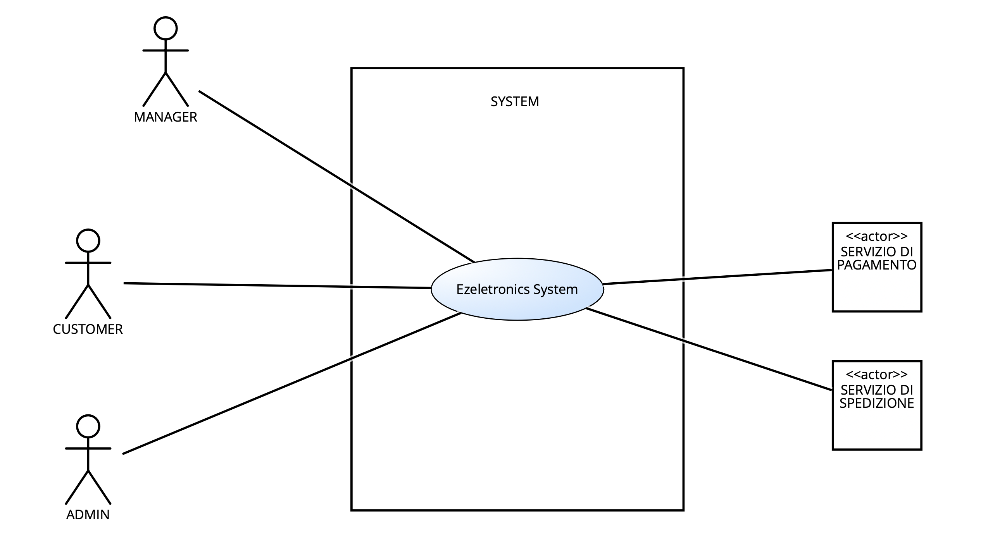
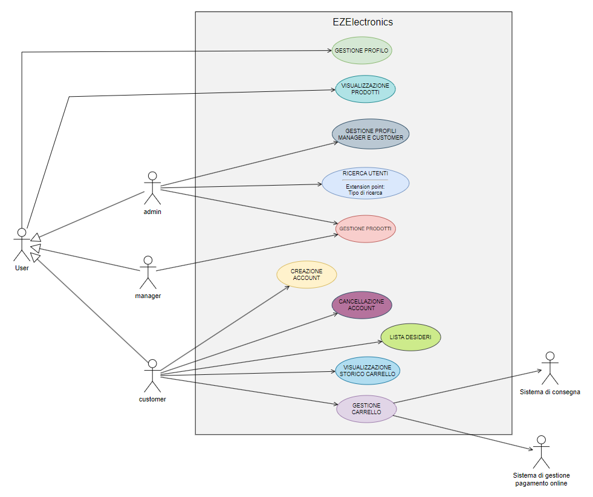
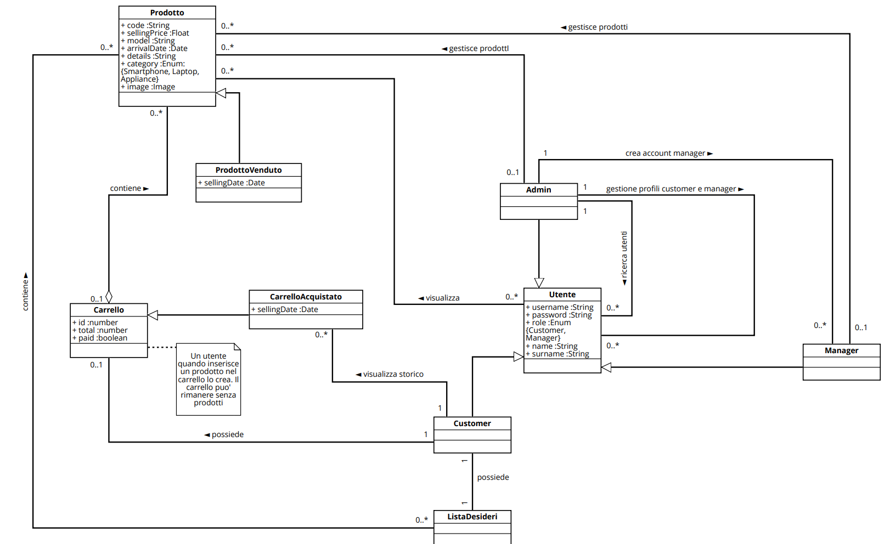
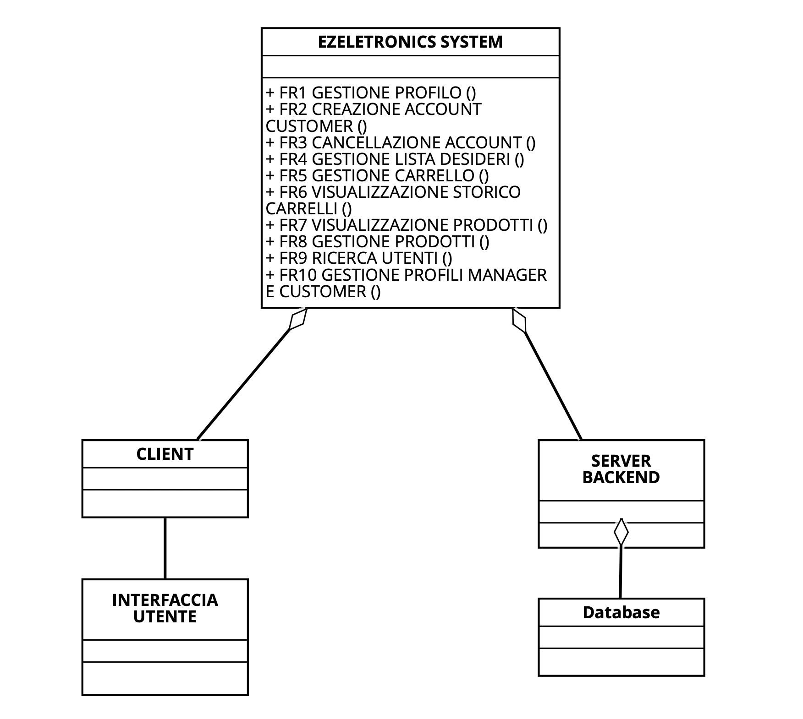
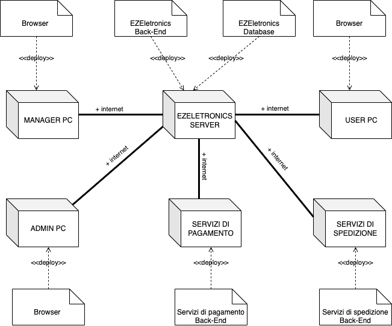

# Requirements Document - future EZEletronics

Date:

Version: V1 - description of EZEletronics in FUTURE form (as proposed by the team)

| Version number | Change |
| :------------: | :----: |
|         2       |        |

# Contents

- [Requirements Document - future EZEletronics](#requirements-document---future-EZEletronics)
- [Contents](#contents)
- [Informal description](#informal-description)
- [Stakeholders](#stakeholders)
- [Context Diagram and interfaces](#context-diagram-and-interfaces)
  - [Context Diagram](#context-diagram)
  - [Interfaces](#interfaces)
- [Stories and personas](#stories-and-personas)
- [Functional and non functional requirements](#functional-and-non-functional-requirements)
  - [Functional Requirements](#functional-requirements)
  - [Non Functional Requirements](#non-functional-requirements)
- [Use case diagram and use cases](#use-case-diagram-and-use-cases)
  - [Use case diagram](#use-case-diagram)
    - [Use case 1, UC1](#login---uc1)
    - [Use case 2, UC2](#logout---uc2)
    - [Use case 3, UC3](#creazione-account-customer---uc3)
    - [Use case 4, UC4](#visualizzazione-informazioni-utente---uc4)
    - [Use case 5, UC5](#modifica-password-account---uc5)
    - [Use case 6, UC6](#registrazione-prodotti---uc6)
    - [Use case 7, UC7](#contrassegno-prodotto-venduto---uc7)
    - [Use case 8, UC8](#cancellazione-prodotto---uc8)
    - [Use case 9, UC9](#modifica-informazioni-prodotto---uc9)
    - [Use case 10, UC10](#aggiunta-prodotto-al-carrello---uc10)
    - [Use case 11, UC11](#rimozione-prodotto-dal-carrello---uc11)
    - [Use case 12, UC12](#checkout-carrello---uc12)
    - [Use case 13, UC13](#cancellazione-carrello---uc13)
    - [Use case 14, UC14](#visualizzazione-carrello---uc14)
    - [Use case 15, UC15](#visualizzazione-storico-carrelli---uc15)
    - [Use case 16, UC16](#ricerca-prodotti---uc16)
    - [Use case 17, UC17](#visualizzazione-informazioni-prodotto---uc17)
    - [Use case 18, UC18](#ricerca-utenti---uc18)
    - [Use case 19, UC19](#cancellazione-utente---uc19)
    - [Use case 20, U20](#creazione-account-manager---uc20)
    - [Use case 21, UC21](#visualizzazione-lista-desideri---uc21)
    - [Use case 22, UC22](#aggiunta-prodotto-alla-lista-desideri---uc22)
    - [Use case 23, UC23](#rimozione-prodotto-dalla-lista-desideri---uc23)
- [Glossary](#glossary)
- [System Design](#system-design)
- [Deployment Diagram](#deployment-diagram)

# Informal description

EZEletronics (read EaSy Electronics) is a software application designed to help managers of electronics stores to manage their products and offer them to customers through a dedicated website. Managers can assess the available products, record new ones, and confirm purchases. Customers can see available products, add them to a cart and see the history of their past purchases.

# Stakeholders

| Stakeholder name | Description |
| :--------------: | :---------: |
| Customer  | Cliente che interagisce con il sito EzEletronics per visualizzare e acquistare prodotti elettronici |
| Manager | Fornitore di prodotti elettronici, si occupa della gestione dei prodotti sul sito EzEletronics|
| Admin | Responsabile della gestione generale dell'applicazione EZEletronics |
|Software factory | Entità responsabile dello sviluppo, del mantenimento e dell'evoluzione dell'applicazione EZEletronics | 
| Servizi di pagamento | Fornitori dei sistemi di pagamento |
| Servizi di spedizione | Fornitori dei sistemi di spedizione |

# Context Diagram and interfaces

## Context Diagram

## Interfaces

|   Actor   | Logical Interface | Physical Interface |
| :-------: | :---------------: | :----------------: |
| Customer |         GUI (tbd)          |      COMPUTER|
| Manager |         GUI (tbd)          |          COMPUTER |
| Admin |        GUI (tbd)           |      COMPUTER              |
| Servizi di pagamento |  https://nexi.it|INTERNET|
|Servizi di spedizione|Compagnia di spedizione|INTERNET|

# Stories and personas

 **Persona 1**: 
 Chiara ha 35 anni ed è il manager di un negozio di elettronica.
 La sua giornata è molto impegnata, poiché si occupa sia della gestione del negozio che degli ordini dei clienti.
 **Story 1**:  
  Spesso ha bisogno di <u>aggiungere un nuovo modello di prodotti arrivati in negozio</u> al sistema mentre è al lavoro, quindi utilizza l'applicazione EZEletronics direttamente dal suo ufficio.
 **Story 2**:  
  Spesso succede che Chiara fa errori nell'aggiungere prodotti quando arrivano in magazzino, per questo deve correggere l'errore <u>togliendo, aggiungendo o modificando manualmente prodotti nel magazzino </u>

 **Persona 2**: 
Giovanni, di età 30, è un cliente affezionato al negozio di elettronica del quartiere. Ogni volta che ha bisogno di un nuovo dispositivo, controlla prima il sito web di EZEletronics per vedere se il negozio ha ciò che cerca.
 **Story 1**:  
Una delle sue caratteristiche preferite dell'applicazione è la possibilità di vedere la <u>cronologia degli acquisti passati</u>, che gli permette di tenere traccia dei prodotti che ha acquistato e del denaro speso nel tempo.
 **Story 2**:  
Quando trova un articolo che gli interessa, lo <u>aggiunge al carrello</u> e completa l'acquisto senza esitazione, apprezzando la comodità e la rapidità del processo di acquisto, avendo anche la possibilità di <u>rimuovere i prodotti dal carrello</u> se aggiunti per sbaglio. 
 **Story 3**:  Utilizza spesso la <u>lista desideri</u> per salvare i prodotti che non sono attualmente disponibili o che vuole salvarsi per acquisti futuri.

 **Persona 4**: 
Maria è un admin di EZEletronics, responsabile della gestione del sito e dell'assistenza tecnica. Si occupa di fornire supporto tecnico in caso di necessità e fornire informazioni utili riguardanti gli utenti registrati e i loro acquisti.
 **Story 1**: 
  Quando un nuovo manager ha bisogno di un account, <u>l'admin crea un nuovo account con ruolo manager</u>, fornendogli poi le credenziali.
 **Story 2**:  
 A volte i manager del negozio necessitano di supporto sulla gestione prodotti per problemi tecnici. Avendo <u>accesso a tutte le funzionalità di gestione dei prodotti</u> è in grado di aiutarli a risolvere le criticità.
  **Story 3**:  
 È in grado di fare <u>ricerche di utenti</u> per <u>eliminare un account di un manager o di un customer</u> in caso di necessità.
  **Story 4**: 
 Una delle sue responsabilità chiave è monitorare la lista completa degli utenti di EZEletronics. Questo non solo gli permette di garantire un ambiente sicuro e protetto per tutti gli utenti, ma gli consente anche di intervenire rapidamente in caso di necessità, come eliminare un account utente per motivi di sicurezza o di conformità alle regole dell'applicazione. Inoltre, Maria ha la responsabilità di creare o eliminare gli account con il ruolo di manager dopo aver ricevuto una richiesta ufficiale da un negozio fisico, accompagnata dai vari documenti di verifica necessari.
</u>

 **Persona 5**: 
Giovanni è un cliente affezionato di EZEletronics da molti anni.
 **Story**: 
 Purtroppo per ragioni di lavoro deve trasferirsi all'estero e non potrà più usufruire dei servizi di EZEletronics, pertanto con dispiacere<u> cancella il suo account dal sistema</u>.

# Functional and non functional requirements

## Functional Requirements
|  ID   |  |Description|
| :---: | :---------: |:----:|
|FR1||GESTIONE PROFILO|
||FR1.1|Login|
||FR1.2|Logout|
||FR1.3|Visualizzazione informazioni sull'utente loggato|
||FR1.4|Modifica password|
|FR2||CREAZIONE ACCOUNT CUSTOMER|
||FR2.1|Creazione dell'account customer|
|FR3||CANCELLAZIONE ACCOUNT|
||FR3.1|Customer cancella il proprio account|
|FR4||GESTIONE LISTA DESIDERI|
||FR4.1|Visualizzazione lista desideri|
||FR4.2|Aggiunta prodotto alla lista desideri|
||FR4.3|Rimozione prodotto dalla lista desideri |
|FR5||GESTIONE CARRELLO|
||FR5.1|Aggiunta prodotto al carrello|
||FR5.2|Rimozione prodotto dal carrello|
||FR5.3|Checkout carrello, calcolando il totale e impostando la data di vendita del carrello e di tutti i prodotti appartenenti al carrello |
||FR5.4|Cancellazione del carrello |
||FR5.5|Visualizzazione del carrello |
|FR6||VISUALIZZAZIONE STORICO CARRELLI|
||FR6.1|Visualizzazione storico dei carrelli|
|FR7|| VISUALIZZAZIONE PRODOTTI |
||FR7.1|Visualizzazione informazioni di un prodotto|
||FR7.2|Visualizzazione dei nuovi prodotti con data di arrivo entro un mese dalla data corrente |
||FR7.3| Visualizzazione di tutti i prodotti di una determinata categoria|
||FR7.4|Visualizzazione di tutti i prodotti di uno specifico modello|
||FR7.5|Visualizzazione di un prodotto dato il suo codice|
||FR7.6|Visualizzazione di tutti i prodotti venduti di una determinata categoria|
||FR7.7|Visualizzazione di tutti i prodotti non venduti di una determinata categoria|
||FR7.8|Visualizzazione di tutti i prodotti venduti di uno specifico modello|
||FR7.9|Visualizzazione di tutti i prodotti non venduti di uno specifico modello|
||FR7.10|Visualizzazione di un prodotto venduto dato il suo codice|
||FR7.11|Visualizzazione di un prodotto non venduto dato il suo codice|
||FR7.12|Visualizzazione di tutti i prodotti venduti di uno specifico modello|
||FR7.13|Visualizzazione di tutti i prodotti non venduti di uno specifico modello|
|FR8||GESTIONE PRODOTTI|
||FR8.1|Registrazione nuovo prodotto singolo|
||FR8.2|Registrazione dell'arrivo di un set di prodotti di uno stesso modello|
||FR8.3|Contrassegno prodotto come venduto|  
||FR8.4|Cancellazione di uno specifico prodotto|
||FR8.5|Modifica delle informazioni di un prodotto|
|FR9||RICERCA UTENTI|
||FR9.1|Ricerca utenti con un determinato ruolo|
||FR9.2|Visualizzazione utenti registrati|
||FR9.3|Ricerca singolo utente|
|FR10||GESTIONE PROFILI MANAGER E CUSTOMER|
||FR10.1|Cancellazione account manager|
||FR10.2|Cancellazione account customer|
||FR10.3|Creazione account manager|

### Access Rights
|  Function   | Customer | Manager |Admin|
| :---: | :---------: |:----:|:----:|
| FR1.1 | X | X | X |
| FR1.2 | X | X | X |
| FR1.3 | X | X | X |
| FR1.4 | X | X | X |
| FR2.1 | X |   |   |
| FR3.1 | X |   |   |
| FR4.1 | X |   |   |
| FR4.2 | X |   |   |
| FR4.3 | X |   |   |
| FR5.1 | X |   |   |
| FR5.2 | X |   |   |
| FR5.3 | X |   |   |
| FR5.4 | X |   |   |
| FR5.5 | X |   |   |  
| FR6.1 | X |   |   | 
| FR7.1 | X | X | X |
| FR7.2 | X | X | X |
| FR7.3 | X | X | X |
| FR7.4 | X | X | X |
| FR7.5 | X | X | X |
| FR7.6 | X | X | X |
| FR7.7 | X | X | X |
| FR7.8 | X | X | X |
| FR7.9 | X | X | X |
| FR7.10| X | X | X |
| FR7.11| X | X | X |
| FR7.12| X | X | X |
| FR7.13| X | X | X |
| FR8.1 |   | X | X |
| FR8.2 |   | X | X |
| FR8.3 |   | X | X |
| FR8.4 |   | X | X |
| FR8.5 |   | X | X |
| FR9.1 |   |   | X |
| FR9.2 |   |   | X |
| FR9.3 |   |   | X |
| FR10.1|   |   | X |
| FR10.2|   |   | X |
| FR10.3|   |   | X |

## Non Functional Requirements

|   ID    | Type (efficiency, reliability, ..) | Description | Refers to |
| :-----: | :--------------------------------: | :---------: | :-------: |
|NFR1|Usabilità|Gli utenti non devono avere bisogno di training|Tutti i requisiti funzionali|
|NFR2|Efficienza|Tutte le funzionalità della app devono completarsi in un tempo < 0.5 sec (escludendo la rete)|Tutti i requisiti funzionali|
|NFR3|Portabilità|L’applicazione web deve essere disponibile per i seguenti browser: Chrome (versione 80 o successiva), Firefox (versione 75 o successiva), Safari (versione 13 o successiva), Opera (versione 67 o successiva)|Tutti i requisiti funzionali|
|NFR4|Dominio|Il codice del prodotto è un alfanumerico lungo almeno 6 caratteri|FR4, FR5, FR6.2, FR6.4|
|NFR5|Dominio|Le date sono in formato YYYY-MM-DD|FR4.1,4.2,4.3|
|NFR6|Dominio|Il modello di un prodotto è un alfanumerico lungo almeno 1 carattere|FR4.1,FR4.2, FR5.3, FR6.2|
|NFR7|Dominio|Il prezzo di vendita è un decimale maggiore di 0|FR4.1, FR4.2|
|NFR8|Dominio|Quantità dei set di prodotti deve essere numerica|FR4.2|
|NFR9|Sicurezza|L’applicazione deve garantire la protezione dei dati degli utenti attraverso l’uso di autenticazione e autorizzazioni appropriate impedendo ogni accesso con credenziali diverse da quelle inserite in fase di registrazione|FR1.1|
|NFR10|Scalabilità|Il server è in grado di gestire almeno un numero pari a 100 richieste in contemporanea sul sito senza degradare le prestazioni|Tutti i requisiti funzionali|
|NFR11|Dominio|Le immagini inserite per i prodotti devono avere un formato tra: png, jpg, jpeg|FR3.1, FR4.5, FR5.1, FR7, FR8.1, FR8.2, FR8.5|

# Use case diagram and use cases

## Use case diagram

 <!--A risoluzione piu' alta -->

<!---->

### Login - UC1

| Actors Involved  |                   User                                           |
| :--------------: | :------------------------------------------------------------------: |
|   Precondition   | Utente non loggato, utente registrato                                |
|  Post condition  | L'utente viene loggato                      |
| Nominal Scenario |         Scenario 1.1         |
|     Variants     |                      -                      |
|    Exceptions    |                       Scenario 1.2, 1.3                       |

|  Scenario 1.1  |                Login                                   |
| :------------: | :------------------------------------------------------------------------: |
|  Precondition  |  Utente non loggato, utente registrato                                     |
| Post condition |  Utente loggato                                                            |
|     Step#      |                                                                            |
|       1        |  Il sistema richiede username e password                                   |
|       2        |  L'utente fornisce lo username e la password                               |
|       3        |  Il sistema legge i dati inseriti dall'utente                              |
|       4        |  Il sistema verifica che l'utente sia registrato. L'utente è registrato                  |
|       5        |  Il sistema reperisce la password dell'utente e la confronta con quella inserita. La password è corretta e l'utente viene autorizzato    |

|  Scenario 1.2  |                Utente non registrato                                   |
| :------------: | :------------------------------------------------------------------------: |
|  Precondition  |  Utente non loggato, utente non registrato                                 |
| Post condition |  Utente non loggato                                                        |
|     Step#      |                                                                            |
|       1        |  Il sistema richiede username e password                                   |
|       2        |  L'utente fornisce lo username e la password                               |
|       3        |  Il sistema legge i dati inseriti dall'utente                              |
|       4        |  Il sistema verifica che l'utente sia registrato. L'utente non è registrato   |
|       5        |  Il sistema restituisce un messaggio d'errore |

|  Scenario 1.3  |                Password errata                                   |
| :------------: | :------------------------------------------------------------------------: |
|  Precondition  |  Utente non loggato, utente registrato                                     |
| Post condition |  Utente non loggato                                                        |
|     Step#      |                                                                            |
|       1        |  Il sistema richiede username e password                                   |
|       2        |  L'utente fornisce lo username e la password                               |
|       3        |  Il sistema legge i dati inseriti dall'utente                              |
|       4        |  Il sistema reperisce la password dell'utente e la confronta con quella inserita. La password è errata, l'utente non viene autorizzato all'accesso   |
|       5        |  Il sistema restituisce un messaggio d'errore |

<!-- Utente già loggato?-->

### Logout - UC2

| Actors Involved  |                   User                                           |
| :--------------: | :------------------------------------------------------------------: |
|   Precondition   | Utente loggato                                |
|  Post condition  | L'utente non è loggato                      |
| Nominal Scenario |         Scenario 2.1         |
|     Variants     |                      -                      |
|    Exceptions    |                       -                      |

|  Scenario 2.1  |                Logout                                   |
| :------------: | :------------------------------------------------------------------------: |
|  Precondition  |  Utente loggato                                    |
| Post condition |  Utente non loggato                                                        |
|     Step#      |                                                                            |
|       1        |  L'utente richiede di effettuare il logout tramite il relativo bottone           |
|       2        |  Il sistema elimina la sessione attuale dell'utente                              |

### Creazione Account Customer - UC3

| Actors Involved  |                   Customer                                           |
| :--------------: | :------------------------------------------------------------------: |
|   Precondition   | Utente non registrato                                 |
|  Post condition  |  Utente registrato, utente registrato con ruolo Customer                      |
| Nominal Scenario |         Scenario 3.1         |
|     Variants     |                      -                      |
|    Exceptions    |   Scenario 3.2          |

|  Scenario 3.1  |                Creazione Account                                   |
| :------------: | :------------------------------------------------------------------------: |
|  Precondition  |  Utente non registrato                                    |
| Post condition |  Utente registrato con ruolo customer                                         |
|     Step#      |                                                                            |
|       1        |  L'utente richiede di creare un account                                  |
|       2        |  Il sistema richiede username, nome, cognome, password                   |
|       3        |  L'utente fornisce username, nome, cognome, password                     |
|       4        |  Il sistema legge username, nome, cognome, password                      |
|       5        |  Il sistema verifica che lo username fornito non appartenga ad un utente già registrato. Lo username non è già in uso   |
|       6        |  Il sistema crea l'account customer          |

|  Scenario 3.2  |                Utente già registrato                                 |
| :------------: | :------------------------------------------------------------------------: |
|  Precondition  |  Utente registrato                                    |
| Post condition |  Registrazione fallita                                                        |
|     Step#      |                                                                            |
|       1        |  L'utente richiede di creare un account                                  |
|       2        |  Il sistema richiede username, nome, cognome, password                              |
|       3        |  L'utente fornisce username, nome, cognome, password                              |
|       4        |  Il sistema legge username, nome, cognome, password          |
|       5        |  Il sistema verifica che lo username fornito non appartenga ad un utente già registrato. Lo username è già in uso       |
|       6        |  Il sistema restituisce un messaggio di errore |

### Visualizzazione Informazioni Utente - UC4

<!--USE CASE-->
| Actors Involved  |                   User                                           |
| :--------------: | :------------------------------------------------------------------: |
|   Precondition   | Utente loggato    |
|  Post condition  | Visualizzazione informazioni utente |
| Nominal Scenario |         Scenario 4.1       |
|     Variants     |                      -                      |
|    Exceptions    |        -    |

|  Scenario 4.1  |       Visualizzazione informazioni utente           |
| :------------: | :------------------------------------------------------------------------: |
|  Precondition  |  Utente loggato                           |
| Post condition |  Visualizzazione informazioni utente                    |
|     Step#      |                                                                            |
|       1        |  L'utente richiede di visualizzare le informazioni relative al suo account cliccando il relativo bottone |
|       2        |  Il sistema fornisce le informazioni dell'account all'utente  |

### Modifica Password Account - UC5

<!--USE CASE-->
| Actors Involved  |                   User                                           |
| :--------------: | :------------------------------------------------------------------: |
|   Precondition   | Utente loggato, Utente nella pagina di visualizzazione delle informazioni account    |
|  Post condition  | Password modificata |
| Nominal Scenario |         Scenario 5.1       |
|     Variants     |                      -                      |
|    Exceptions    |        Scenario 5.2, 5.3   |

|  Scenario 5.1  |       Modifica password           |
| :------------: | :------------------------------------------------------------------------: |
|  Precondition  |  Utente loggato, Utente nella pagina di visualizzazione delle informazioni account  |
| Post condition |  Password modificata                    |
|     Step#      |                                                                            |
|       1        |  L'utente richiede di modificare la password del proprio account, tramite il relativo bottone |
|       2        |  Il sistema richiede la vecchia password, la nuova password e di ripetere la nuova password  |
|       3        |  L'utente inserisce la vecchia password, la nuova password e la conferma della nuova password  |
|       4        |  Il sistema reperisce la password attuale dell'utente e la confronta con la vecchia password inserita. Le password coincidono  |
|       5        |  Il sistema verifica che la nuova password e la conferma corrispondano. Le due password corrispondono  |
|       6        |  Il sistema modifica la password  |

|  Scenario 5.2  |       Vecchia password errata           |
| :------------: | :------------------------------------------------------------------------: |
|  Precondition  |  Utente loggato, Utente nella pagina di visualizzazione delle informazioni account  |
| Post condition |  Password modificata                    |
|     Step#      |                                                                            |
|       1        |  L'utente richiede di modificare la password del proprio account, tramite il relativo bottone |
|       2        |  Il sistema richiede la vecchia password, la nuova password e di ripetere la nuova password  |
|       3        |  L'utente inserisce la vecchia password, la nuova password e la conferma della nuova password  |
|       4        |  Il sistema reperisce la password attuale dell'utente e la confronta con la vecchia password inserita. Le password non coincidono  |
|       5        |  Il sistema restituisce un messaggio d'errore  |

|  Scenario 5.3  |       Nuova password e conferma diverse           |
| :------------: | :------------------------------------------------------------------------: |
|  Precondition  |  Utente loggato, Utente nella pagina di visualizzazione delle informazioni account  |
| Post condition |  Password modificata                    |
|     Step#      |                                                                            |
|       1        |  L'utente richiede di modificare la password del proprio account, tramite il relativo bottone |
|       2        |  Il sistema richiede la vecchia password, la nuova password e di ripetere la nuova password  |
|       3        |  L'utente inserisce la vecchia password, la nuova password e la conferma della nuova password  |
|       4        |  Il sistema reperisce la password attuale dell'utente e la confronta con la vecchia password inserita. Le password coincidono  |
|       5        |  Il sistema verifica che la nuova password e la conferma corrispondano. Le due password non corrispondono  |
|       6        |  Il sistema restituisce un messaggio d'errore |

### Registrazione Prodotti - UC6

<!--USE CASE-->
| Actors Involved  |                   Manager                                           |
| :--------------: | :------------------------------------------------------------------: |
|   Precondition   | Utente loggato, utente con ruolo Manager     |
|  Post condition  | Prodotto registrato, Set di prodotti registrati |
| Nominal Scenario |         Scenario 6.1, 6.5       |
|     Variants     |  Scenario 6.2, 6.6 (registrazione senza data di arrivo)          |
|    Exceptions    |        Scenario 6.3, 6.4, 6.7   |

<!--REGISTRAZIONE SINGOLO PRODOTTO + CASI FALLIMENTO-->
|  Scenario 6.1  |            Registrazione singolo prodotto                                 |
| :------------: | :------------------------------------------------------------------------: |
|  Precondition  |  Utente loggato, utente con ruolo Manager                                    |
| Post condition |  Prodotto registrato                                                        |
|     Step#      |                                                                            |
|       1        |  Il manager richiede di registrare un prodotto                             |
|       2        |  Il sistema richiede codice, prezzo di vendita, modello, categoria, dettagli, data di arrivo |
|       3        | L'utente inserisce codice, prezzo di vendita, modello, categoria, dettagli, data di arrivo |
|       4        | Il sistema legge codice, prezzo di vendita, modello, categoria, dettagli, data di arrivo |
|       5        | Il sistema verifica che il prodotto non sia già registrato. Il prodotto non è già registrato |
|       6        | Il sistema verifica che la data inserita non sia successiva alla data attuale. La data inserita è valida |
|       7        | Il sistema restituisce il codice del prodotto registrato |

|  Scenario 6.2  |            Registrazione singolo prodotto senza specificare data di arrivo                                |
| :------------: | :------------------------------------------------------------------------: |
|  Precondition  |  Utente loggato, utente con ruolo Manager                                    |
| Post condition |  Prodotto registrato                                                        |
|     Step#      |                                                                            |
|       1        |  Il manager richiede di registrare un prodotto                             |
|       2        |  Il sistema richiede codice, prezzo di vendita, modello, categoria, dettagli, data di arrivo |
|       3        | L'utente inserisce codice, prezzo di vendita, modello, categoria, dettagli |
|       4        | Il sistema legge codice, prezzo di vendita, modello, categoria, dettagli, data di arrivo |
|       5        | Il sistema verifica che il prodotto non sia già registrato. Il prodotto non è già registrato |
|       6        | Il sistema verifica che la data di arrivo non è stata specificata. Il sistema inserisce la data corrente |
|       7        | Il sistema restituisce il codice del prodotto registrato |

|  Scenario 6.3  |            Data di arrivo prodotto errata                              |
| :------------: | :------------------------------------------------------------------------: |
|  Precondition  |  Utente loggato, utente con ruolo Manager                                    |
| Post condition |  Prodotto non registrato                                                        |
|     Step#      |                                                                            |
|       1        |  Il manager richiede di registrare un prodotto                                  |
|       2        |  Il sistema richiede codice, prezzo di vendita, modello, categoria, dettagli, data di arrivo |
|       3        | L'utente inserisce codice, prezzo di vendita, modello, categoria, dettagli, data di arrivo |
|       4        | Il sistema legge codice, prezzo di vendita, modello, categoria, dettagli, data di arrivo |
|       5        | Il sistema verifica che il prodotto non sia già registrato. Il prodotto non è già registrato |
|       6        | Il sistema verifica che la data inserita non sia successiva alla data attuale. La data inserita non è valida |
|       7        | Il sistema restituisce un messaggio di errore |

|  Scenario 6.4  |            Prodotto già registrato                              |
| :------------: | :------------------------------------------------------------------------: |
|  Precondition  |  Utente loggato, utente con ruolo Manager                                    |
| Post condition |  Prodotto non registrato                                                        |
|     Step#      |                                                                            |
|       1        |  Il manager richiede di registrare un prodotto                                  |
|       2        |  Il sistema richiede codice, prezzo di vendita, modello, categoria, dettagli, data di arrivo |
|       3        | L'utente inserisce codice, prezzo di vendita, modello, categoria, dettagli, data di arrivo |
|       4        | Il sistema legge codice, prezzo di vendita, modello, categoria, dettagli, data di arrivo |
|       5        | Il sistema verifica che il prodotto non sia già registrato. Il prodotto è già registrato |
|       6        | Il sistema restituisce un messaggio di errore |

<!--REGISTRAZIONE SET DI PRODOTTI + CASI FALLIMENTO-->
|  Scenario 6.5  |            Registrazione di un set di prodotti dello stesso modello        |
| :------------: | :------------------------------------------------------------------------: |
|  Precondition  |  Utente loggato, utente con ruolo Manager                                    |
| Post condition |  Prodotti appartenenti al set registrati                             |
|     Step#      |                                                                            |
|       1        |  Il manager richiede di registrare un set di prodotti dello stesso modello                       |
|       2        |  Il sistema richiede modello, categoria, dettagli, quantità, data di arrivo e prezzo di vendita |
|       3        | L'utente inserisce modello, categoria, dettagli, quantità, data di arrivo e prezzo di vendita |
|       4        | Il sistema legge modello, categoria, dettagli, quantità, data di arrivo e prezzo di vendita |
|       5        | Il sistema verifica che la data inserita non sia successiva alla data attuale. La data inserita è valida |
|       6        | Il sistema registra i prodotti |

|  Scenario 6.6  |            Registrazione di un set di prodotti dello stesso modello senza data di arrivo specificata       |
| :------------: | :------------------------------------------------------------------------: |
|  Precondition  |  Utente loggato, utente con ruolo Manager                                    |
| Post condition |  Prodotti appartenenti al set registrati                             |
|     Step#      |                                                                            |
|       1        |  Il manager richiede di registrare un set di prodotti dello stesso modello                       |
|       2        |  Il sistema richiede modello, categoria, dettagli, quantità, data di arrivo e prezzo di vendita |
|       3        | L'utente inserisce modello, categoria, dettagli, quantità e prezzo di vendita |
|       4        | Il sistema legge modello, categoria, dettagli, quantità, data di arrivo e prezzo di vendita |
|       5        | Il sistema verifica che non è stata specificata la data di arrivo. Il sistema inserisce la data corrente |
|       6        | Il sistema registra i prodotti |

|  Scenario 6.7  | Data di arrivo di un set di prodotti errata                              |
| :------------: | :------------------------------------------------------------------------: |
|  Precondition  |  Utente loggato, utente con ruolo Manager                                    |
| Post condition |  Prodotti appartenenti al set non registrati                                                       |
|     Step#      |                                                                            |
|       1        |  Il manager richiede di registrare un set di prodotti dello                                  |
|       2        |  Il sistema richiede modello, categoria, dettagli, quantità, data di arrivo e prezzo di vendita |
|       3        | L'utente inserisce modello, categoria, dettagli, quantità, data di arrivo e prezzo di vendita |
|       4        | Il sistema legge modello, categoria, dettagli, quantità, data di arrivo e prezzo di vendita |
|       5        | Il sistema verifica che la data inserita non sia successiva alla data attuale. La data inserita non è valida |
|       6        | Il sistema restituisce un messaggio di errore |

### Contrassegno Prodotto Venduto - UC7
<!--USE CASE-->
| Actors Involved  |                   Manager                                           |
| :--------------: | :------------------------------------------------------------------: |
|   Precondition   | Utente loggato, utente con ruolo Manager              |
|  Post condition  | Prodotto segnato come venduto |
| Nominal Scenario |         Scenario 7.1       |
|     Variants     |      7.2 (prodotto venduto in una specifica data)     |
|    Exceptions    |        Scenario 7.3, 7.4, 7.5, 7.6   |

<!--CONTRASSEGNO PRODOTTO COME VENDUTO + CASI FALLIMENTO-->
|  Scenario 7.1  | Contrassegno prodotto come venduto                             |
| :------------: | :------------------------------------------------------------------------: |
|  Precondition  |  Utente loggato, utente con ruolo Manager                                    |
| Post condition |  Prodotto contrassegnato come venduto              |
|     Step#      |                                                                            |
|       1        |  L'utente richiede di segnare un prodotto come venduto cliccando sul bottone nella riga del prodotto      |
|       2        |  Il sistema recupera il codice del prodotto |
|       3        |  Il sistema verifica che il prodotto sia registrato. Il prodotto è registrato |
|       4        |  Il sistema chiede di inserire la data di vendita |
|       5        |  L'utente non specifica alcuna data   |
|       6        |  Il sistema utilizza la data corrente |
|       7        |  Il sistema verifica che il prodotto non sia già stato venduto. Il prodotto non è ancora stato venduto |
|       8        |  Il sistema segna il prodotto come venduto nella data corrente |

|  Scenario 7.2  | Contrassegno prodotto come venduto in una specifica data                        |
| :------------: | :------------------------------------------------------------------------: |
|  Precondition  |  Utente loggato, utente con ruolo Manager                                    |
| Post condition |  Prodotto contrassegnato come venduto              |
|     Step#      |                                                                            |
|       1        |  L'utente richiede di segnare un prodotto come venduto cliccando sul bottone relativo al prodotto      |
|       2        |  Il sistema recupera il codice del prodotto |
|       3        |  Il sistema verifica che il prodotto sia registrato. Il prodotto è registrato |
|       4        |  Il sistema chiede di inserire la data di vendita |
|       5        |  L'utente inserisce la data di vendita |
|       6        |  Il sistema legge la data di vendita |
|       7        |  Il sistema verifica che la data di vendita non sia successiva alla data attuale. La data è valida |
|       8        |  Il sistema verifica che la data di vendita non sia antecedente alla data attuale. La data è valida |
|       9        |  Il sistema verifica che il prodotto non sia già stato venduto. Il prodotto non è ancora stato venduto |
|       10       |  Il sistema segna il prodotto come venduto nella data corrente |

|  Scenario 7.3  | Prodotto da segnare come venduto non registrato                             |
| :------------: | :------------------------------------------------------------------------: |
|  Precondition  |  Utente loggato, utente con ruolo Manager                                    |
| Post condition |  Prodotto non contrassegnato come venduto              |
|     Step#      |                                                                            |
|       1        |  L'utente richiede di segnare un prodotto come venduto cliccando sul bottone nella riga del prodotto      |
|       2        |  Il sistema recupera il codice del prodotto |
|       3        |  Il sistema verifica che il prodotto sia registrato. Il prodotto non è registrato |
|       4        |  Il sistema restituisce un messaggio d'errore |

|  Scenario 7.4  | Data di vendita del prodotto da segnare come venduto successiva a quella attuale   |
| :------------: | :------------------------------------------------------------------------: |
|  Precondition  |  Utente loggato, utente con ruolo Manager                                    |
| Post condition |  Prodotto non contrassegnato come venduto              |
|     Step#      |                                                                            |
|       1        |  L'utente richiede di segnare un prodotto come venduto cliccando sul bottone relativo al prodotto      |
|       2        |  Il sistema recupera il codice del prodotto |
|       3        |  Il sistema verifica che il prodotto sia registrato. Il prodotto è registrato |
|       4        |  Il sistema chiede di inserire la data di vendita |
|       5        |  L'utente inserisce la data di vendita |
|       6        |  Il sistema legge la data di vendita |
|       7        |  Il sistema verifica che la data di vendita non sia successiva alla data attuale. La data non è valida |
|       8        |  Il sistema restituisce un messaggio d'errore |

|  Scenario 7.5  | Data di vendita antecedente alla data di arrivo del prodotto da segnare come venduto   |
| :------------: | :------------------------------------------------------------------------: |
|  Precondition  |  Utente loggato, utente con ruolo Manager                                    |
| Post condition |  Prodotto non contrassegnato come venduto              |
|     Step#      |                                                                            |
|       1        |  L'utente richiede di segnare un prodotto come venduto cliccando sul bottone relativo al prodotto      |
|       2        |  Il sistema recupera il codice del prodotto |
|       3        |  Il sistema verifica che il prodotto sia registrato. Il prodotto è registrato |
|       4        |  Il sistema chiede di inserire la data di vendita |
|       5        |  L'utente inserisce la data di vendita |
|       6        |  Il sistema legge la data di vendita |
|       7        |  Il sistema verifica che la data di vendita non sia successiva alla data attuale. La data è valida |
|       8        |  Il sistema verifica che la data di vendita non sia antecedente alla data di arrivo. La data non è valida |
|       9        |  Il sistema restituisce un messaggio d'errore |

|  Scenario 7.6  | Prodotto da segnare come venduto già venduto |
| :------------: | :------------------------------------------------------------------------: |
|  Precondition  |  Utente loggato, utente con ruolo Manager                                    |
| Post condition |  Prodotto non contrassegnato come venduto              |
|     Step#      |                                                                          |
|       1        |  L'utente richiede di segnare un prodotto come venduto cliccando sul bottone relativo al prodotto      |
|       2        |  Il sistema recupera il codice del prodotto. Il sistema verifica che il prodotto sia registrato |
|       3        |  Il sistema verifica che il prodotto sia registrato. Il prodotto è registrato |
|       4        |  Il sistema chiede di inserire la data di vendita |
|       5        |  L'utente inserisce la data di vendita |
|       6        |  Il sistema legge la data di vendita |
|       7        |  Il sistema verifica che la data di vendita non sia successiva alla data attuale. La data è valida |
|       8        |  Il sistema verifica che la data di vendita non sia successiva alla data attuale. La data è valida |
|       9        |  Il sistema verifica che il prodotto non sia già stato venduto. Il prodotto è già stato venduto |
|       10       |  Il sistema restituisce un messaggio di errore |

### Cancellazione Prodotto - UC8
<!--USE CASE-->
| Actors Involved  |                   Manager                                           |
| :--------------: | :------------------------------------------------------------------: |
|   Precondition   | Utente loggato, utente con ruolo Manager              |
|  Post condition  | Prodotto cancellato |
| Nominal Scenario |         Scenario 8.1       |
|     Variants     |                      -                      |
|    Exceptions    |        Scenario 8.2   |

<!--CANCELLAZIONE PRODOTTO-->
|  Scenario 8.1  | Cancellazione prodotto |
| :------------: | :------------------------------------------------------------------------: |
|  Precondition  |  Utente loggato, utente con ruolo Manager                                    |
| Post condition |  Prodotto cancellato              |
|     Step#      |                                                                          |
|       1        |  Il manager richiede di cancellare un prodotto cliccando sul bottone presente nella riga del prodotto   |
|       2        |  Il sistema recupera il codice del prodotto da cancellare |
|       3        |  Il sistema verifica che il prodotto sia registrato. Il prodotto è registrato |
|       4        |  Il sistema cancella il prodotto |

|  Scenario 8.2  | Prodotto non registrato |
| :------------: | :------------------------------------------------------------------------: |
|  Precondition  |  Utente loggato, utente con ruolo Manager                                    |
| Post condition |  Prodotto non cancellato              |
|     Step#      |                                                                          |
|       1        |  Il manager richiede di cancellare un prodotto cliccando sul bottone presente nella riga del prodotto   |
|       2        |  Il sistema recupera il codice del prodotto da cancellare |
|       3        |  Il sistema verifica che il prodotto sia registrato. Il prodotto non è registrato |
|       4        |  Il sistema restituisce un messaggio di errore|

### Modifica Informazioni Prodotto - UC9
<!--USE CASE-->
| Actors Involved  |                   Manager                                  |
| :--------------: | :------------------------------------------------------------------: |
|   Precondition   | Utente loggato, utente con ruolo Manager                                 |
|  Post condition  | Modifica informazioni prodotto |
| Nominal Scenario |       Scenario 9.1       |
|     Variants     |                      -                      |
|    Exceptions    |   Scenario 9.2, 9.3, 9.4      |

<!--MODIFICA INFORMAZIONI PRODOTTO -->
|  Scenario 9.1  |            Modifca informazioni prodotto                                 |
| :------------: | :------------------------------------------------------------------------: |
|  Precondition  |  Utente loggato, utente con ruolo Manager                                   |
| Post condition |  Modifica informazioni prodotto                                    |
|     Step#      |                                                                     |
|       1        |  Il manager richiede di modificare le informazioni di un prodotto premendo il bottone nella riga del prodotto  |
|       2        |  Il sistema recupera il codice del prodotto |
|       3        |  Il sistema verifica che il prodotto sia registrato. Il prodotto è registrato |
|       4        |  Il sistema permette la modifica dei campi image, sellingPrice, model, category, arrivalDate, sellingDate, details | 
|       5        |  L'utente modifica i campi di interesse | 
|       6        |  L'utente conferma le modifiche cliccando il bottone di conferma | 
|       7        |  Il sistema verifica che la data di vendita non preceda la data di arrivo. La data di vendita è valida | 
|       8        |  Il sistema verifica che la data di arrivo non sia successiva alla data di vendita. La data di arrivo è valida | 
|       9        |  Il sistema applica le modifiche al prodotto |

|  Scenario 9.2  |            Prodotto non registrato                                |
| :------------: | :------------------------------------------------------------------------: |
|  Precondition  |  Utente loggato, utente con ruolo Manager                                   |
| Post condition |  Modifica informazioni prodotto non applicate                                   |
|     Step#      |                                                                     |
|       1        |  Il manager richiede di modificare le informazioni di un prodotto premendo il bottone nella riga del prodotto  |
|       2        |  Il sistema recupera il codice del prodotto |
|       3        |  Il sistema verifica che il prodotto sia registrato. Il prodotto non è registrato |
|       4        |  Il sistema restituisce un messaggio d'errore |

|  Scenario 9.3  |            Data di vendita precedente alla data di arrivo                  |
| :------------: | :------------------------------------------------------------------------: |
|  Precondition  |  Utente loggato, utente con ruolo Manager                                   |
| Post condition |  Modifica informazioni prodotto non applicate                                   |
|     Step#      |                                                                     |
|       1        |  Il manager richiede di modificare le informazioni di un prodotto premendo il bottone nella riga del prodotto  |
|       2        |  Il sistema recupera il codice del prodotto |
|       3        |  Il sistema verifica che il prodotto sia registrato. Il prodotto è registrato |
|       4        |  Il sistema permette la modifica dei campi image, sellingPrice, model, category, arrivalDate, sellingDate, details | 
|       5        |  L'utente modifica i campi di interesse | 
|       6        |  L'utente conferma le modifiche cliccando il bottone di conferma | 
|       7        |  Il sistema verifica che la data di vendita non preceda la data di arrivo. La data di vendita non è valida | 
|       8        |  Il sistema restituisce un messaggio d'errore |

|  Scenario 9.4  |            Data di arrivo successiva alla data di vendita                                 |
| :------------: | :------------------------------------------------------------------------: |
|  Precondition  |  Utente loggato, utente con ruolo Manager                                   |
| Post condition |  Modifica informazioni prodotto non applicate                                   |
|     Step#      |                                                                     |
|       1        |  Il manager richiede di modificare le informazioni di un prodotto premendo il bottone nella riga del prodotto  |
|       2        |  Il sistema recupera il codice del prodotto |
|       3        |  Il sistema verifica che il prodotto sia registrato. Il prodotto è registrato |
|       4        |  Il sistema permette la modifica dei campi image, sellingPrice, model, category, arrivalDate, sellingDate, details | 
|       5        |  L'utente modifica i campi di interesse | 
|       6        |  L'utente conferma le modifiche cliccando il bottone di conferma | 
|       7        |  Il sistema verifica che la data di vendita non preceda la data di arrivo. La data di vendita è valida | 
|       8        |  Il sistema verifica che la data di arrivo non sia successiva alla data di vendita. La data di arrivo non è valida | 
|       9        |  Il sistema restituisce un messaggio d'errore |

### Aggiunta Prodotto al Carrello - UC10
<!--USE CASE-->
| Actors Involved  |                   Customer                                           |
| :--------------: | :------------------------------------------------------------------: |
|   Precondition   | Utente loggato, utente con ruolo Customer, utente visualizza elenco prodotti    |
|  Post condition  | Prodotto aggiunto al carrello dell'utente                            |
| Nominal Scenario |     Scenario 10.1       |
|     Variants     |                      -                      |
|    Exceptions    |     Scenario 10.2, 10.3, 10.4  |

|  Scenario 10.1 |      Aggiunta prodotto al carrello                                                              |
| :------------: | :------------------------------------------------------------------------: |
|  Precondition  |      Utente loggato, utente con ruolo Customer, utente visualizza elenco prodotti   |
| Post condition |      Prodotto aggiunto al carrello dell'utente                              |
|     Step#      |                                -                                 |
| 1 | L'utente indica di voler aggiungere un prodotto al carrello cliccando il bottone presente nella card prodotto      |
| 2 | Il sistema reperisce il codice del prodotto |
| 3 | Il sistema verifica che il prodotto selezionato sia registrato. Il prodotto è registrato |
| 4 | Il sistema verifica che il prodotto non sia già presente in un altro carrello. Il prodotto non è presente in un altro carrello |
| 5 | Il sistema controlla che il prodotto non ia già stato venduto. Il prodotto non è già stato venduto |
| 6 | Il sistema aggiunge il prodotto nel carrello dell'utente |

|  Scenario 10.2 |      Prodotto da aggiungere non registrato                                                               |
| :------------: | :------------------------------------------------------------------------: |
|  Precondition  |      Utente loggato, utente con ruolo Customer, utente visualizza elenco prodotti   |
| Post condition |      Prodotto non viene aggiunto al carrello |
|     Step#      |                                -                                 |
| 1 | L'utente indica di voler aggiungere un prodotto al carrello cliccando il bottone presente nella card prodotto      |
| 2 | Il sistema reperisce il codice del prodotto |
| 3 | Il sistema verifica che il prodotto selezionato sia registrato. Il prodotto non è registrato |
| 4 | Il sistema restituisce un messaggio d'errore |

|  Scenario 10.3 |      Prodotto presente in un altro carrello       |
| :------------: | :------------------------------------------------------------------------: |
|  Precondition  |      Utente loggato, utente con ruolo Customer, utente visualizza elenco prodotti   |
| Post condition |      Prodotto non aggiunto al carrello                                |
|     Step#      |                                -                                 |
| 1 | L'utente indica di voler aggiungere un prodotto al carrello cliccando il bottone presente nella card prodotto      |
| 2 | Il sistema reperisce il codice del prodotto |
| 3 | Il sistema verifica che il prodotto selezionato sia registrato. Il prodotto è registrato |
| 4 | Il sistema verifica che il prodotto non sia già presente in un altro carrello. Il prodotto è già in un altro carrello |
| 5 | Il sistema restituisce un messaggio d'errore |

|  Scenario 10.4 |      Porodotto da aggiungere già venduto                                                               |
| :------------: | :------------------------------------------------------------------------: |
|  Precondition  |      Utente loggato, utente con ruolo Customer, utente visualizza elenco prodotti   |
| Post condition |      Prodotto non aggiunto al carrello                                            |
|     Step#      |                                -                                 |
| 1 | L'utente indica di voler aggiungere un prodotto al carrello cliccando il bottone presente nella card prodotto      |
| 2 | Il sistema reperisce il codice del prodotto |
| 3 | Il sistema verifica che il prodotto selezionato sia registrato. Il prodotto è registrato |
| 4 | Il sistema verifica che il prodotto non sia già presente in un altro carrello. Il prodotto non è presente in un altro carrello |
| 5 | Il sistema controlla che il prodotto non sia già stato venduto. Il prodotto è già stato venduto |
| 6 | Il sistema restituisce un messaggio d'errore |

### Rimozione Prodotto dal Carrello - UC11
<!--USE CASE-->
| Actors Involved  |                   Customer                                           |
| :--------------: | :------------------------------------------------------------------: |
|   Precondition   | Utente loggato, utente con ruolo Customer, utente nella pagina del carrello     |
|  Post condition  | Prodotto rimosso dal carrello dell'utente                            |
| Nominal Scenario |     Scenario 11.1       |
|     Variants     |                      -                      |
|    Exceptions    |     Scenario 11.2, 11.3, 11.4, 11.5  |

<!--RIMOZIONE PRODOTTO DAL CARRELLO-->
|  Scenario 11.1 |      Rimozione prodotto dal carrello                                        |
| :------------: | :------------------------------------------------------------------------: |
|   Precondition   | Utente loggato, utente con ruolo Customer, utente nella pagina del carrello     |
| Post condition |      Prodotto rimosso dal carrello                                         |
|     Step#      |                                -                                 |
| 1 | L'utente chiede di poter rimuovere un prodotto dal carrello cliccando il bottone presente nella card del prodotto   |
| 2 | Il sistema controlla che l'utente abbia un carrello. L'utente ha un carrello   |
| 3 | Il sistema reperisce il codice del prodotto da eliminare |
| 4 | Il sistema controlla che il prodotto sia presente nel carrello dell'utente. Il prodotto è presente |
| 5 | Il sistema controlla che il prodotto sia registrato. Il prodotto è registrato |
| 6 | Il sistema controlla che il prodotto non sia già stato venduto. Il prodotto non è ancora stato venduto |
| 7 | Il sistema rimuove il prodotto dal carrello |

|  Scenario 11.2 |      L'utente non ha un carrello                       |
| :------------: | :------------------------------------------------------------------------: |
|   Precondition   | Utente loggato, utente con ruolo Customer, utente nella pagina del carrello     |
| Post condition |      Prodotto non viene rimosso dal carrello                                              |
|     Step#      |                                -                                 |
| 1 | L'utente chiede di poter rimuovere un prodotto dal carrello cliccando il bottone presente nella card del prodotto   |
| 2 | Il sistema controlla che l'utente abbia un carrello. L'utente non ha un carrello   |
| 3 | Il sistema restituisce un messaggio d'errore |

|  Scenario 11.3 |       Prodotto non presente nel carrello                  |
| :------------: | :------------------------------------------------------------------------: |
|   Precondition   | Utente loggato, utente con ruolo Customer, utente nella pagina del carrello     |
| Post condition |      Prodotto non viene rimosso dal carrello                                              |
|     Step#      |                                -                                 |
| 1 | L'utente chiede di poter rimuovere un prodotto dal carrello cliccando il bottone presente nella card del prodotto   |
| 2 | Il sistema controlla che l'utente abbia un carrello. L'utente ha un carrello   |
| 3 | Il sistema reperisce il codice del prodotto da eliminare |
| 4 | Il sistema controlla che il prodotto sia presente nel carrello dell'utente. Il prodotto non è presente |
| 5 | Il sistema restituisce un messaggio d'errore |

|  Scenario 11.4 |      Prodotto da rimuovere non registrato                                  |
| :------------: | :------------------------------------------------------------------------: |
|   Precondition   | Utente loggato, utente con ruolo Customer, utente nella pagina del carrello     |
| Post condition |      Prodotto non viene rimosso dal carrello                                              |
|     Step#      |                                -                                 |
| 1 | L'utente chiede di poter rimuovere un prodotto dal carrello cliccando il bottone presente nella card del prodotto   |
| 2 | Il sistema controlla che l'utente abbia un carrello. L'utente ha un carrello   |
| 3 | Il sistema reperisce il codice del prodotto da eliminare |
| 4 | Il sistema controlla che il prodotto sia presente nel carrello dell'utente. Il prodotto è presente |
| 5 | Il sistema controlla che il prodotto sia registrato. Il prodotto non è registrato |
| 6 | Il sistema restituisce un messaggio d'errore |

|  Scenario 11.5 |      Prodotto da rimuovere già venduto                                 |
| :------------: | :------------------------------------------------------------------------: |
|   Precondition   | Utente loggato, utente con ruolo Customer, utente nella pagina del carrello     |
| Post condition |      Prodotto non viene rimosso dal carrello                                              |
|     Step#      |                     -                         |
| 1 | L'utente chiede di poter rimuovere un prodotto dal carrello cliccando il bottone presente nella card del prodotto   |
| 2 | Il sistema controlla che l'utente abbia un carrello. L'utente ha un carrello   |
| 3 | Il sistema reperisce il codice del prodotto da eliminare |
| 4 | Il sistema controlla che il prodotto sia presente nel carrello dell'utente. Il prodotto è presente |
| 5 | Il sistema controlla che il prodotto sia registrato. Il prodotto è registrato |
| 6 | Il sistema controlla che il prodotto non sia già stato venduto. Il prodotto è già stato venduto |
| 7 | Il sistema restituisce un messaggio d'errore |

### Checkout Carrello - UC12
<!--USE CASE-->
| Actors Involved  |      Customer, Sistema di Pagamento Online, Sistema di spedizione              |
| :--------------: | :------------------------------------------------------------------: |
|   Precondition   | Utente loggato, utente con ruolo Customer, utente nella pagina del carrello          |
|  Post condition  | Checkout carrello effettuato                           |
| Nominal Scenario |     Scenario 12.1       |
|     Variants     |                      -                      |
|    Exceptions    |     Scenario 12.2, 12.3  |

|  Scenario 12.1 |      Checkout carrello con ritiro in negozio           |
| :------------: | :------------------------------------------------------------------------: |
|  Precondition  |      Utente loggato con ruolo Customer   |
| Post condition |      Checkout effettuato                                            |
|     Step#      |                 -                    |
| 1 | L'utente chiede di poter pagare il carrello cliccando sul relativo bottone |
| 2 | Il sistema controlla che l'utente abbia un carrello. L'utente ha un carrello   |
| 3 | Il sistema controlla che l'utente abbia almeno 1 prodotto nel carrello. Il carrello non è vuoto |
| 4 | Il sistema chiede il metodo di consegna |
| 5 | L'utente sceglie ritiro in negozio |
| 6 | Il sistema dirige il customer al sistema di pagamento online |
| 7 | L'utente completa il pagamento | 
| 8 | Il sistema comunica con il servizio di pagamento online. Il pagamento è stato effettuato | 
| 9 | Il sistema segna il carrello come pagato e registra la data del pagamento | 
| 10| Il sistema segna come venduti i prodotti appartenenti al carrello venduto, impostando la data di vendita di ciascuno |

|  Scenario 12.2 |   Checkout carrello con consegna a casa          |
| :------------: | :------------------------------------------------------------------------: |
|  Precondition  |      Utente loggato con ruolo Customer   |
| Post condition |      Checkout effettuato                                            |
|     Step#      |                                -                                 |
| 1 | L'utente chiede di poter pagare il carrello cliccando sul relativo bottone |
| 2 | Il sistema controlla che l'utente abbia un carrello. L'utente ha un carrello   |
| 3 | Il sistema controlla che l'utente abbia almeno 1 prodotto nel carrello. Il carrello non è vuoto |
| 4 | Il sistema chiede il metodo di consegna |
| 5 | L'utente sceglie la consegna a casa |
| 6 | Il sistema richiede l'indirizzo di consegna |
| 7 | L'utente inserisce l'indirizzo di consegna |
| 8 | Il sistema legge l'indirizzo di consegna |
| 9 | Il sistema dirige il customer al sistema di pagamento online |
| 10| L'utente completa il pagamento |
| 11| Il sistema comunica con il servizio di pagamento online. Il pagamento è stato effettuato |
| 12| Il sistema comunica al servizio di spedizione i dati per la consegna inseriti dall'utente |
| 13| Il sistema segna il carrello come pagato e registrata la data del pagamento|
| 14| Il sistema segna come venduti i prodotti appartenenti al carrello venduto, impostando la data di vendita |

|  Scenario 12.3 |      Utente senza carrello                 |
| :------------: | :------------------------------------------------------------------------: |
|  Precondition  |      Utente loggato con ruolo Customer   |
| Post condition |      Checkout non effettuato                     |
|     Step#      |                                -                                 |
| 1 | L'utente chiede di poter pagare il carrello cliccando sul relativo bottone |
| 2 | Il sistema controlla che l'utente abbia un carrello. L'utente non ha un carrello   |
| 3 | Il sistema restituisce un messaggio d'errore |

|  Scenario 12.4 |      Carrello vuoto                                                            |
| :------------: | :------------------------------------------------------------------------: |
|  Precondition  |      Utente loggato con ruolo Customer   |
| Post condition |      Checkout non effettuato                                       |
|     Step#      |                                -                                 |
| 1 | L'utente chiede di poter pagare il carrello cliccando sul relativo bottone |
| 2 | Il sistema controlla che l'utente abbia un carrello. L'utente ha un carrello   |
| 3 | Il sistema controlla che l'utente abbia almeno 1 prodotto nel carrello. Il carrello è vuoto |
| 4 | Il sistema restituicse un messaggio d'errore |

|  Scenario 12.5 |      Carrello non pagato                                          |
| :------------: | :------------------------------------------------------------------------: |
|  Precondition  |      Utente loggato con ruolo Customer   |
| Post condition |      Checkout non effettutato                          |
|     Step#      |                                                     |
| 1 | L'utente chiede di poter pagare il carrello cliccando sul relativo bottone |
| 2 | Il sistema controlla che l'utente abbia un carrello. L'utente ha un carrello   |
| 3 | Il sistema controlla che l'utente abbia almeno 1 prodotto nel carrello. Il carrello non è vuoto |
| 4 | Il sistema chiede il metodo di consegna |
| 5 | L'utente sceglie ritiro in negozio |
| 6 | Il sistema dirige il customer al sistema di pagamento online |
| 7 | L'utente non completa il pagamento |
| 8 | Il sistema comunica con il servizio di pagamento online. Il pagamento non è stato effettuato |
| 9 | Il sistema restituisce un messaggio d'errore |

### Cancellazione Carrello - UC13
<!--USE CASE-->
| Actors Involved  |                   Customer                                           |
| :--------------: | :------------------------------------------------------------------: |
|   Precondition   | Utente loggato, utente con ruolo Customer, utente nella pagina del carrello     |
|  Post condition  | Carrello cancellato                           |
| Nominal Scenario |     Scenario 13.1       |
|     Variants     |                      -                      |
|    Exceptions    |     Scenario 13.2  |

|  Scenario 13.1 |      Carrello cancellato                                                               |
| :------------: | :------------------------------------------------------------------------: |
|  Precondition  |      Utente loggato con ruolo Customer   |
| Post condition |      Carrello cancellato                                              |
|     Step#      |                                -                                 |
| 1 | L'utente chiede di poter cancellare il carrello tramite il relativo bottone  |
| 2 | Il sistema controlla che l'utente abbia un carrello. L'utente ha un carrello   |
| 3 | Il sistema cancella il carrello |

|  Scenario 13.2 |      Utente senza carrello                                                               |
| :------------: | :------------------------------------------------------------------------: |
|  Precondition  |      Utente loggato con ruolo Customer   |
| Post condition |      Carrello non cancellato                                              |
|     Step#      |                                -                                 |
| 1 | L'utente chiede di poter cancellare il carrello |
| 2 | Il sistema controlla che l'utente abbia un carrello. L'utente non ha un carrello   |
| 3 | Il sistema restituisce un messaggio d'errore |

### Visualizzazione Carrello - UC14
<!--USE CASE-->
| Actors Involved  |                   Customer                                           |
| :--------------: | :------------------------------------------------------------------: |
|   Precondition   | Utente loggato, utente con ruolo Customer                            |
|  Post condition  | Carrello visualizzato                           |
| Nominal Scenario |     Scenario 14.1       |
|     Variants     |                      -                      |
|    Exceptions    |    - |

|  Scenario 14.1 |      Carrello visualizzato                                                               |
| :------------: | :------------------------------------------------------------------------: |
|  Precondition  |      Utente loggato con ruolo Customer   |
| Post condition |      Carrello visualizzato                                              |
|     Step#      |                                -                                 |
| 1 | L'utente chiede di poter visualizzare il carrello |
| 2 | Il sistema verifica che l'utente abbia un carrello. L'utente ha un carrello |
| 2 | Il sistema restituisce il carrello |

|  Scenario 14.1 |      Utente senza carrello                                                              |
| :------------: | :------------------------------------------------------------------------: |
|  Precondition  |      Utente loggato con ruolo Customer   |
| Post condition |      Carrello non visualizzato                                              |
|     Step#      |                                -                                 |
| 1 | L'utente chiede di poter visualizzare il carrello |
| 2 | Il sistema verifica che l'utente abbia un carrello. L'utente non ha un carrello |
| 3 | Il sistema restituisce un messaggio d'errore |

### Visualizzazione Storico Carrelli - UC15
<!--USE CASE-->
| Actors Involved  |                   Customer                                           |
| :--------------: | :------------------------------------------------------------------: |
|   Precondition   | Utente loggato, utente con ruolo Customer                            |
|  Post condition  | Visualizzato storico carrelli                           |
| Nominal Scenario |     Scenario 15.1       |
|     Variants     |                      -                      |
|    Exceptions    |    -     |

|  Scenario 15.1 |      Carrello visualizzato                                                 |
| :------------: | :------------------------------------------------------------------------: |
|  Precondition  |      Utente loggato con ruolo Customer   |
| Post condition |      Visualizzato storico carrelli                             |
|     Step#      |                                -                                 |
| 1 | L'utente chiede di poter visualizzare lo storico dei suoi carrelli |
| 2 | Il sistema restituisce lo storico dei carrelli |

### Ricerca Prodotti - UC16

<!--USE CASE-->
| Actors Involved  |                   User                                           |
| :--------------: | :------------------------------------------------------------------: |
|   Precondition   | Utente loggato, utente in sezione selezione filtro                  |
|  Post condition  | Restituzione lista prodotti cercati (per codice, globale, per categoria, per modello, nuovi arrivi) |
| Nominal Scenario |       Scenario 16.1, 16.3,  16.6,  16.9         |
|     Variants     |   16.4, 16.5 (per ricerca globale venduti/non venduti) 16.7, 16.8 (per ricerca per categoria venduti/non venduti) 16.10, 16.11 (per ricerca per modello venduti/non venduti) 16.13, 16.14 (per ricerca nuovi arrivi venduti/non venduti) |
|    Exceptions    |    16.2  |

<!--RICERCA PRODOTTO PER CODICE-->  
|  Scenario 16.1  |            Ricerca prodotto per codice                                 |
| :------------: | :------------------------------------------------------------------------: |
|  Precondition  |  Utente loggato, utente in sezione selezione filtro      |
| Post condition |  Prodotto mostrato          |
|     Step#      |                                                                            |
|       1        | L'utente richiede la ricerca di un prodotto per codice  |
|       2        | Il sistema richiede il codice del prodotto di interesse |
|       3        | L'utente inserisce il codice del prodotto |
|       4        | Il sistema legge il codice del prodotto |
|       5        | Il sistema verifica che il prodotto sia registrato. Il prodotto è registrato |
|       6        | Il sistema restituisce il prodotto cercato |

|  Scenario 16.2  |            Prodotto cercato non registrato                                 |
| :------------: | :------------------------------------------------------------------------: |
|  Precondition  |  Utente loggato, utente in sezione selezione filtro     |
| Post condition |  Prodotto non mostrato          |
|     Step#      |                                                                            |
|       1        | L'utente richiede la ricerca di un prodotto per codice     |
|       2        | Il sistema richiede il codice del prodotto di interesse |
|       3        | L'utente inserisce il codice del prodotto |
|       4        | Il sistema legge il codice del prodotto |
|       5        | Il sistema verifica che il prodotto sia registrato. Il prodotto non è registrato |
|       6        | Il sistema restituisce un messaggio d'errore |

<!--RICERCA GLOBALE + VENDUTI/NON VENDUTI-->  
|  Scenario 16.3  |            Restituzione di tutti i prodotti registrati                      |
| :------------: | :------------------------------------------------------------------------:  |
|  Precondition  |  Utente loggato, utente in sezione selezione filtro                                  |
| Post condition |  Restituzione lista di tutti i prodotti registrati              |
|     Step#      |                                                                             |
|       1        |  L'utente richiede la visualizzazione di tutti i prodotti registrati     |
|       2        |  Il sistema restituisce l'elenco dei prodotti registrati,  |

|  Scenario 16.4  |            Restituzione di tutti i prodotti registrati e venduti            |
| :------------: | :------------------------------------------------------------------------:  |
|  Precondition  |  Utente loggato, utente in sezione selezione filtro                                  |
| Post condition |  Restituzione lista di tutti i prodotti registrati e segnati come venduti             |
|     Step#      |                                                                             |
|       1        |  L'utente richiede la visualizzazione di tutti i prodotti registrati con parametro 'sold=yes'     |
|       2        |  Il sistema restituisce l'elenco dei prodotti registrati e segnati come venduti|

|  Scenario 16.5  |            Restituzione di tutti i prodotti registrati e non venduti            |
| :------------: | :------------------------------------------------------------------------:  |
|  Precondition  |  Utente loggato, utente in sezione selezione filtro              |
| Post condition |  Restituzione lista di tutti i prodotti registrati e segnati come venduti             |
|     Step#      |                                                                             |
|       1        |  L'utente richiede la visualizzazione di tutti i prodotti registrati con parametro 'sold=no'     |
|       2        |  Il sistema restituisce l'elenco dei prodotti registrati e segnati come non venduti |

<!--RICERCA PRODOTTI PER CATEGORIA + VENDUTI/NON VENDUTI-->  
|  Scenario 16.6  |  Restituzione di tutti i prodotti appartenenti ad una determinata categoria   |
| :------------: | :------------------------------------------------------------------------:  |
|  Precondition  |  Utente loggato, utente in sezione selezione filtro                          |
| Post condition |  Restituzione lista prodotti della categoria richiesta    |
|     Step#      |                                                                             |
|       1        | L'utente richiede la visualizzazione di tutti i prodotti appartenenti ad una categoria |
|       2        |  Il sistema chiede la categoria |
|       3        |  L'utente inserisce la categoria |
|       4        |  Il sistema legge la categoria|
|       5        | Il sistema restituisce la lista di prodotti della categoria richiesta|

|  Scenario 16.7  |  Restituzione prodotti appartenenti ad una determinata categoria segnati come venduti   |
| :------------: | :------------------------------------------------------------------------:  |
|  Precondition  |  Utente loggato, utente in sezione selezione filtro          |
| Post condition |  Restituzione lista prodotti della categoria richiesta e venduti   |
|     Step#      |                                                                             |
|       1        |  L'utente richiede la visualizzazione di tutti i prodotti appartenenti ad una categoria|
|       2        |  Il sistema chiede la categoria |
|       3        |  L'utente inserisce la categoria e il parametro aggiuntivo 'sold=yes'|
|       4        | Il sistema legge la categoria e il parametro aggiuntivo |
|       5        | Il sistema restituisce lista prodotti della categoria richiesta e segnati come venduti|

|  Scenario 16.8  |  Restituzione prodotti appartenenti ad una determinata categoria segnati come non venduti   |
| :------------: | :------------------------------------------------------------------------:  |
|  Precondition  |  Utente loggato, utente in sezione selezione filtro       |
| Post condition |  Restituzione lista prodotti della categoria richiesta e non venduti  |
|     Step#      |                                                                             |
|       1        |  L'utente richiede la visualizzazione di tutti i prodotti appartenenti ad una categoria|
|       2        |  Il sistema chiede la categoria |
|       3        |  L'utente inserisce la categoria e il parametro aggiuntivo 'sold=no'|
|       4        | Il sistema legge la categoria e il parametro aggiuntivo |
|       5        | Il sistema restituisce lista prodotti della categoria richiesta e segnati come non venduti|

<!--RICERCA PRODOTTI PER MODELLO-->  
|  Scenario 16.9  |  Restituzione di tutti i prodotti appartenenti ad un modello   |
| :------------: | :------------------------------------------------------------------------:  |
|  Precondition  |  Utente loggato, utente in sezione selezione filtro       |
| Post condition |  Restituzione lista prodotti del modello richiesto    |
|     Step#      |                                                                             |
|       1        |  L'utente richiede la visualizzazione di tutti i prodotti appartenenti ad un modello |
|       2        |  Il sistema chiede il modello |
|       3        |  L'utente inserisce il modello |
|       4        |  Il sistema legge il modello |
|       5        | Il sistema restituisce la lista di prodotti appartenenti al modello|

|  Scenario 16.10  |  Restituzione prodotti appartenenti di un modello segnati come venduti   |
| :------------: | :------------------------------------------------------------------------:  |
|  Precondition  |  Utente loggato, utente in sezione selezione filtro        |
| Post condition |  Restituzione lista prodotti del modello richiesta e venduti   |
|     Step#      |                                                                             |
|       1        |  L'utente richiede la visualizzazione di tutti i prodotti di un modello|
|       2        |  Il sistema chiede il modello |
|       3        |  L'utente inserisce il modello e il parametro aggiuntivo 'sold=yes'|
|       4        | Il sistema legge il modello e il parametro aggiuntivo |
|       5        | Il sistema restituisce lista prodotti del modello richiesto e segnati come venduti|

|  Scenario 16.11  |  Restituzione prodotti appartenenti di un modello segnati come non venduti   |
| :------------: | :------------------------------------------------------------------------:  |
|  Precondition  |  Utente loggato, utente in sezione selezione filtro                    |
| Post condition |  Restituzione lista prodotti del modello richiesta e non venduti  |
|     Step#      |                                                                             |
|       1        |  L'utente richiede la visualizzazione di tutti i prodotti di un modello|
|       2        |  Il sistema chiede il modello |
|       3        |  L'utente inserisce il modello e il parametro aggiuntivo 'sold=no'|
|       4        | Il sistema legge il modello e il parametro aggiuntivo |
|       5        | Il sistema restituisce lista prodotti al modello e segnati come non venduti|

<!--RICERCA NUOVI ARRIVI-->
|  Scenario 16.12  |  Ricerca nuovi prodotti   |
| :------------: | :------------------------------------------------------------------------:  |
|  Precondition  |  Utente loggato, utente in sezione selezione filtro                    |
| Post condition |  Restituzione lista nuovi prodotti  |
|     Step#      |                                                                             |
|       1        | L'utente richiede la visualizzazione di tutti i nuovi prodotti |
|       2        | Il sistema restituisce lista dei prodotti con data di arrivo entro un mese dalla data corrente |

|  Scenario 16.13  |  Ricerca nuovi prodotti venduti  |
| :------------: | :------------------------------------------------------------------------:  |
|  Precondition  |  Utente loggato, utente in sezione selezione filtro                    |
| Post condition |  Restituzione lista nuovi prodotti segnati come venduti  |
|     Step#      |                                                                             |
|       1        | L'utente richiede la visualizzazione di tutti i nuovi prodotti, con parametro aggiuntivo "sold=yes" |
|       2        | Il sistema restituisce lista dei prodotti con data di arrivo entro un mese dalla data corrente segnati come venduti |

|  Scenario 16.14  |  Ricerca nuovi prodotti non venduti |
| :------------: | :------------------------------------------------------------------------:  |
|  Precondition  |  Utente loggato, utente in sezione selezione filtro                    |
| Post condition |  Restituzione lista nuovi prodotti non venduti  |
|     Step#      |                                                                             |
|       1        | L'utente richiede la visualizzazione di tutti i nuovi prodotti, con parametro aggiuntivo "sold=yes" |
|       2        | Il sistema restituisce lista dei prodotti con data di arrivo entro un mese dalla data corrente, segnati come non venduti |

### Visualizzazione Informazioni Prodotto - UC17
<!--USE CASE-->
| Actors Involved  |                   User                                  |
| :--------------: | :------------------------------------------------------------------: |
|   Precondition   | Utente loggato, utente visualizza elenco prodotti                                 |
|  Post condition  | Visualizzazione informazioni prodotto |
| Nominal Scenario |       Scenario 17.1       |
|     Variants     |                      -                      |
|    Exceptions    |          |

<!--VISUALIZZAZIONE PRODOTTO -->
|  Scenario 17.1  |            Visualizzazione informazioni prodotto                                 |
| :------------: | :------------------------------------------------------------------------: |
|  Precondition  |  Utente loggato, utente visualizza elenco prodotti                                   |
| Post condition |  Visualizzazione informazioni prodotto                                      |
|     Step#      |                                                                     |
|       1        |  L'utente richiede di visualizzare le informazioni di un prodotto cliccando sulla card (nel caso di customer) o cliccando due volte sulla riga (nel caso di manager o admin) del prodotto  |
|       2        |  Il sistema restituisce le informazioni del prodotto |

### Ricerca Utenti - UC18
<!--USE CASE-->
| Actors Involved  |                   Admin                                  |
| :--------------: | :------------------------------------------------------------------: |
|   Precondition   | Utente loggato, utente con ruolo Admin, utente visualizza elenco utenti            |
|  Post condition  | Visualizzazione utenti registrati, utenti con un determinato ruolo, singolo utente |
| Nominal Scenario |       Scenario 18.1, 18.2, 18.3       |
|     Variants     |                      -                      |
|    Exceptions    |        Scenario 18.4  |

<!--RICERCA UTENTI -->
|  Scenario 18.1  |            Ricerca utenti registrati                                 |
| :------------: | :------------------------------------------------------------------------: |
|  Precondition  |  Utente loggato, utente con ruolo Admin                                    |
| Post condition |  Visualizzazione utenti registrati                                      |
|     Step#      |                                                                     |
|       1        |  L'utente richiede la ricerca degli utenti registrati               |
|       2        |  Il sistema restituisce la lista di utenti registrati |

|  Scenario 18.2  |            Ricerca utenti con un ruolo                                 |
| :------------: | :------------------------------------------------------------------------: |
|  Precondition  |  Utente loggato, utente con ruolo Admin, utente visualizza elenco utenti   |
| Post condition |  Visualizzazione utenti con un ruolo                                      |
|     Step#      |                                                                            |
|       1        | L'utente richiede la ricerca degli utenti con un ruolo                 |
|       2        | Il sistema chiede il ruolo |
|       3        | L'utente inserisce il ruolo |
|       4        | Il sistema legge il ruolo |
|       5        | Il sistema restituisce la lista di utenti aventi quel ruolo |

<!--RICERCA SINGOLO UTENTE-->
|  Scenario 18.3  |            Ricerca utente                           |
| :------------: | :------------------------------------------------------------------------: |
|  Precondition  |  Utente loggato, utente con ruolo Admin, utente visualizza elenco utenti   |
| Post condition |  Visualizzazione utente                                     |
|     Step#      |                                                                            |
|       1        | L'utente richiede la ricerca di un utente                 |
|       2        | Il sistema chiede username |
|       3        | L'utente inserisce username |
|       4        | Il sistema legge username |
|       5        | Il sistema verifica che l'utente sia registrato. L'utente è registrato |
|       6        | Il sistema restituisce l'utente |

|  Scenario 18.4  |            Utente cercato non registrato                        |
| :------------: | :------------------------------------------------------------------------: |
|  Precondition  |  Utente loggato, utente con ruolo Admin, utente visualizza elenco utenti   |
| Post condition |  Ricerca fallita                                     |
|     Step#      |                                                                            |
|       1        |  L'utente richiede la ricerca di un utente                 |
|       2        |  Il sistema chiede username |
|       3        | L'utente inserisce username |
|       4        | Il sistema legge username |
|       5        | Il sistema verifica che l'utente sia registrato. L'utente non è registrato |
|       6        | Il sistema restituisce un messaggio di errore |

### Cancellazione Utente - UC19
<!--USE CASE-->
| Actors Involved  |                   Admin                               |
| :--------------: | :------------------------------------------------------------------: |
|   Precondition   | Utente loggato, utente con ruolo Admin, utente visualizza elenco utenti  |
|  Post condition  | Cancellazione utente |
| Nominal Scenario |       Scenario 19.1       |
|     Variants     |                      -                      |
|    Exceptions    |        Scenario 19.2  |

|  Scenario 19.1  |            Cancellazione utente                        |
| :------------: | :------------------------------------------------------------------------: |
|  Precondition  |  Utente loggato, utente con ruolo Admin, utente visualizza elenco utenti   |
| Post condition |  Utente di interesse cancellato                                     |
|     Step#      |                                                                            |
|       1        | L'utente richiede la cancellazione di un utente, tramite bottone presente nella riga utente                 |
|       2        | Il sistema reperisce lo username dell'utente |
|       3        | Il sistema verifica che l'utente sia registrato. L'utente è registrato |
|       4        | Il sistema cancella l'utente |

|  Scenario 19.2 |            Utente non registrato                  |
| :------------: | :------------------------------------------------------------------------: |
|  Precondition  |  Utente loggato, utente con ruolo Admin, utente visualizza elenco utenti   |
| Post condition |  Utente di interesse non cancellato                                     |
|     Step#      |                                                                            |
|       1        | L'utente richiede la cancellazione di un utente, tramite bottone presente nella riga utente                 |
|       2        | Il sistema reperisce lo username dell'utente |
|       3        | Il sistema verifica che l'utente sia registrato. L'utente non è registrato |
|       4        | Il sistema restituisce un messaggio d'errore |

### Creazione Account Manager - UC20
<!--USE CASE-->
| Actors Involved  |                   Admin                               |
| :--------------: | :------------------------------------------------------------------: |
|   Precondition   | Utente loggato, utente con ruolo Admin      |
|  Post condition  | Creazione utente con ruolo manager |
| Nominal Scenario |       Scenario 20.1       |
|     Variants     |                      -                      |
|    Exceptions    |        Scenario 20.2  |

|  Scenario 20.1  |            Creazione utente con ruolo manager                       |
| :------------: | :------------------------------------------------------------------------: |
|  Precondition  |  Utente loggato, utente con ruolo Admin                        |
| Post condition |  Account manager creato                                     |
|     Step#      |                                                                            |
|       1        | L'Admin richiede la creazione di un account managr             |
|       2        | Il sistema chiede username, name, surname, password |
|       3        | L'Admin inserisce username, name, surname, password |
|       4        | Il sistema legge username, name, surname, password |
|       5        | Il sistema verifica che l'utente non sia registrato. L'utente non è registrato |
|       6        | Il sistema crea l'account utente con ruolo manager |

|  Scenario 20.2  |            Utente già registrato                       |
| :------------: | :------------------------------------------------------------------------: |
|  Precondition  |  Utente loggato, utente con ruolo Admin                        |
| Post condition |  Account manager non creato                                    |
|     Step#      |                                                                            |
|       1        | L'Admin richiede la creazione di un account manager             |
|       2        | Il sistema chiede username, name, surname, password |
|       3        | L'Admin inserisce username, name, surname, password |
|       4        | Il sistema legge username, name, surname, password |
|       5        | Il sistema verifica che l'utente non sia registrato. L'utente è già registrato |
|       6        | Il sistema restituisce un messaggio d'errore |

### Visualizzazione lista desideri - UC21
<!--USE CASE-->
| Actors Involved  |                   Customer                               |
| :--------------: | :------------------------------------------------------------------: |
|   Precondition   | Utente loggato, utente con ruolo Customer                                 |
|  Post condition  | Visualizzazione lista desideri  |
| Nominal Scenario |       Scenario 21.1       |
|     Variants     |                      -                      |
|    Exceptions    |        -         |

|  Scenario 21.1  |            Visualizzazione lista desideri                       |
| :------------: | :------------------------------------------------------------------------: |
|  Precondition  |  Utente loggato, utente con ruolo Customer                                   |
| Post condition |  Lista desideri visualizzata                                     |
|     Step#      |                                                                            |
|       1        |  L'utente richiede la visualizzazione della lista desideri cliccando il bottone relativo alla lista desideri    |
|       2        |  Il sistema restituisce la lsita desideri |

### Agginuta Prodotto alla Lista Desideri - UC22
<!--USE CASE-->
| Actors Involved  |                   Customer                               |
| :--------------: | :------------------------------------------------------------------: |
|   Precondition   | Utente loggato, utente con ruolo Customer, utente visualizza elenco prodotti                     |
|  Post condition  | Prodotto aggiunto alla lista desideri  |
| Nominal Scenario |       Scenario 22.1       |
|     Variants     |                      -                      |
|    Exceptions    |        Scenario 22.2  |

|  Scenario 22.1  |            Prodotto agigunto alla lista desideri                       |
| :------------: | :------------------------------------------------------------------------: |
|  Precondition  |  Utente loggato, utente con ruolo Customer, utente visualizza elenco prodotti            |
| Post condition |  Prodotto aggiunto alla lista desideri                                     |
|     Step#      |                                                                            |
|       1        |  Il customer richiede l'aggiunta di un prodotto alla lista desideri premendo il relativo bottone sulla card del prodotto   |
|       2        |  Il sistema verifica che il prodotto sia registrato. Il prodotto è registrato |
|       3        |  Il sistema aggiunge il prodotto alla lista desideri |

|  Scenario 22.2  |            Prodotto non registrato                       |
| :------------: | :------------------------------------------------------------------------: |
|  Precondition  |  Utente loggato, utente con ruolo Customer, utente visualizza elenco prodotti            |
| Post condition |  Prodotto non aggiunto alla lista desideri                                     |
|     Step#      |                                                                            |
|       1        |  Il customer richiede l'aggiunta di un prodotto alla lista desideri premendo il relativo bottone sulla card del prodotto   |
|       2        |  Il sistema verifica che il prodotto sia registrato. Il prodotto non è registrato |
|       3        |  Il sistema restituisce un messaggio d'errore |

### Rimozione Prodotto dalla Lista Desideri - UC23
<!--USE CASE-->
| Actors Involved  |                   Customer                               |
| :--------------: | :------------------------------------------------------------------: |
|   Precondition   | Utente loggato, utente con ruolo Customer                                 |
|  Post condition  | Prodotto rimosso dalla lista desideri  |
| Nominal Scenario |       Scenario 23.1       |
|     Variants     |                      -                      |
|    Exceptions    |        Scenario 23.2  |

|  Scenario 23.1  |            Prodotto rimosso dalla lista desideri                       |
| :------------: | :------------------------------------------------------------------------: |
|  Precondition  |  Utente loggato, utente con ruolo Customer                                   |
| Post condition |  Prodotto aggiunto alla lista desideri                                     |
|     Step#      |                                                                            |
|       1        |  Il customer richiede la rimozione di un prodotto dalla lista desideri cliccando il relativo bottone nella card del prodotto  |
|       2        |  Il sistema verifica che il prodotto sia presente nella lista desideri. Il prodotto è nella lista desideri |
|       3        |  Il sistema rimuover il prodotto dalla lista desideri |

|  Scenario 23.2  |            Prodotto non presente nella lista desideri                       |
| :------------: | :------------------------------------------------------------------------: |
|  Precondition  |  Utente loggato, utente con ruolo Customer                                   |
| Post condition |  Prodotto non aggiunto alla lista desideri                                     |
|     Step#      |                                                                            |
|       1        |  Il customer richiede l'aggiunta di un prodotto alla lista desideri premendo il relativo bottone sulla card del prodotto   |
|       2        |  Il sistema verifica che il prodotto sia presente nella lista desideri. Il prodotto non è presente nella lista desideri |
|       3        |  Il sistema restituisce un messaggio d'errore |

# Glossary

|TERMINE   | DEFINIZIONE  |
| :------------: | :------------------------------------------------------------------------: |
|  User | Persona che accede al sito per usufruire dei suoi servizi; può essere un manager o un customer. |
| Manager|  Utente autorizzato a svolgere specifiche funzioni di gestione non consentite, come l'aggiunta o la rimozione di prodotti; responsabile della gestione dei prodotti di un negozio fisico e delle relative vendite online. |
| Customer |  Utente che naviga sul sito per esplorare i prodotti, aggiungerli al carrello e completare l'acquisto. |
| Prodotto | Articolo elettronico disponibile per l'acquisto sul sito, suddiviso in tre categorie: smartphone, laptop, elettrodomestico. |
| Carrello | Contenitore temporaneo dei prodotti selezionati dall'utente per l'acquisto, durante la sessione di navigazione sul sito.|
| Lista desideri| Wishlist di prodotti scelti dall'utente |

# System Design

# Deployment Diagram

