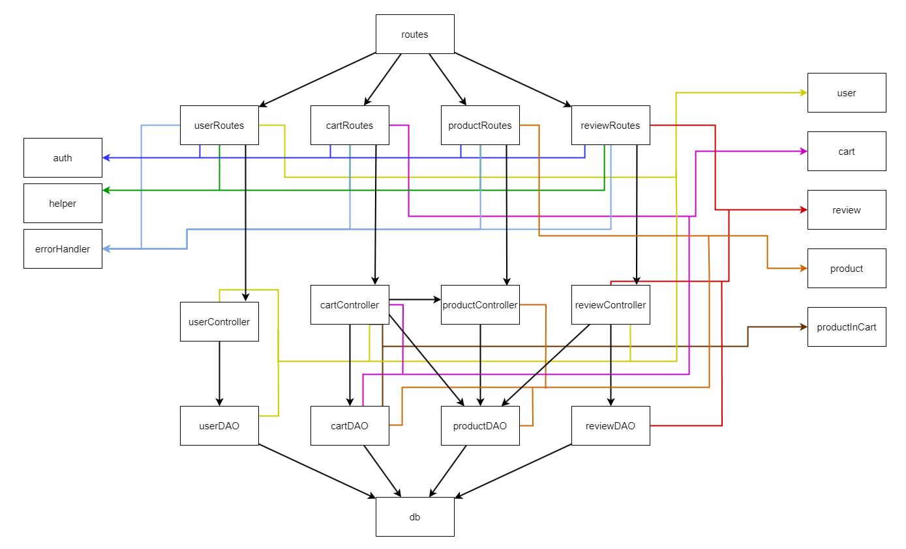
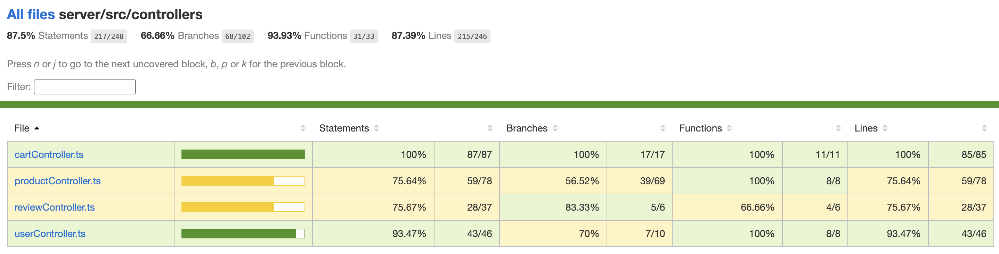
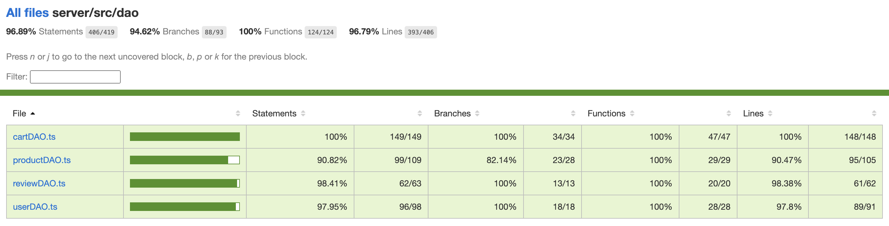
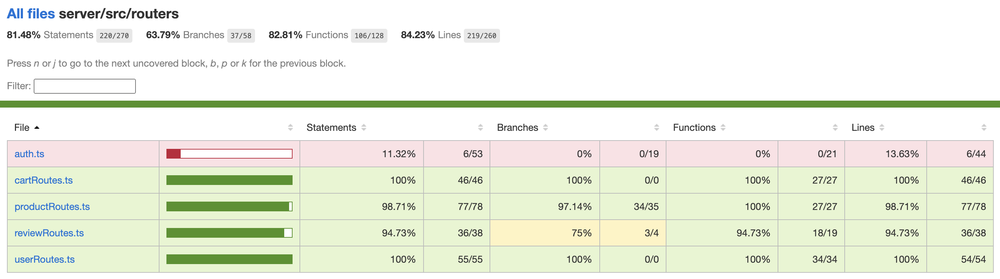
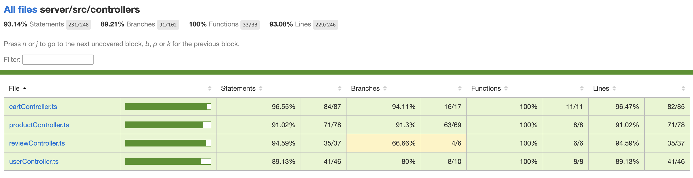
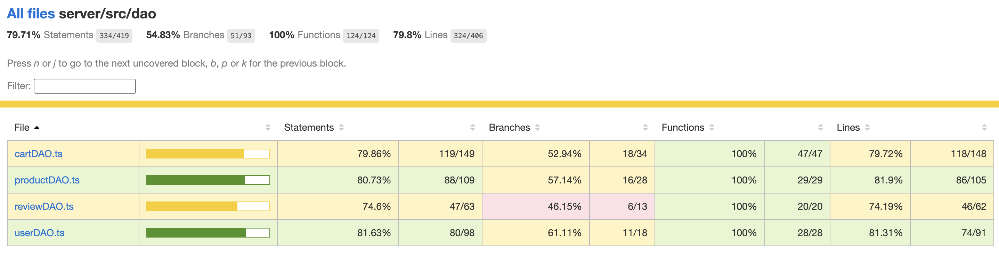
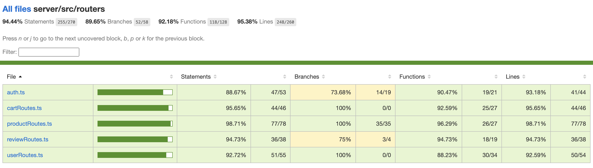

# Test Report

<The goal of this document is to explain how the application was tested, detailing how the test cases were defined and what they cover>

# Contents

- [Test Report](#test-report)
- [Contents](#contents)
- [Dependency graph](#dependency-graph)
- [Integration approach](#integration-approach)
- [Tests](#tests)
- [Coverage](#coverage)
  - [Coverage of FR](#coverage-of-fr)
  - [Coverage white box](#coverage-white-box)

# Dependency graph

# Integration approach

   Abbiamo seguito un approccio bottom-up testando inizialmente il funzionamento del database e del dao insieme, eseguendo successivamente API test per testare il funzionamento dell'intera applicazione nei vari scenari e casi d'uso, verificando il funzionamento di tutte le funzionalita' ed API.

    Step1: dao + db
    Step2: Routes + controller + dao + db
# Tests

<in the table below list the test cases defined For each test report the object tested, the test level (API, integration, unit) and the technique used to define the test case (BB/ eq partitioning, BB/ boundary, WB/ statement coverage, etc)> <split the table if needed>

### UNIT TEST USER DAO

| Test case name | Object(s) tested | Test level | Technique used |
| :------------: | :--------------: | :--------: | :------------: |
| user not found | getUserByUsername | Unit | WB/ Statement Coverage |
| error Database | getUserByUsername | Unit | WB/ Statement Coverage |
| User Returned correctly by Houser | getUserByUsername | Unit | WB/ Statement Coverage |
| Successful user information update | updateUserInfo | Unit | WB/ Statement Coverage |
| Error when updating the user information | updateUserInfo | Unit | WB/ Statement Coverage |
| should resolve true when user is authenticated | getIsUserAuthenticated | Unit | WB/ Statement Coverage |
| should resolve false when user is not found in database | getIsUserAuthenticated | Unit | WB/ Statement Coverage |
| should resolve false when user salt is not saved in the database | getIsUserAuthenticated | Unit | WB/ Statement Coverage |
| should resolve false when password does not match | getIsUserAuthenticated | Unit | WB/ Statement Coverage |
| should reject with an error if db.get fails | getIsUserAuthenticated | Unit | WB/ Statement Coverage |
| should reject with an error if there is an exception | getIsUserAuthenticated | Unit | WB/ Statement Coverage |
| It should resolve true when user is created | createUser | Unit | WB/ Statement Coverage |
| should throw UserAlreadyExistsError if username is taken | createUser | Unit | WB/ Statement Coverage |
| should reject error | createUser | Unit | WB/ Statement Coverage |
| should reject with an error if there is an exception | createUser | Unit | WB/ Statement Coverage |
| should resolve to an empty array when no users exist | getUsers | Unit | WB/ Statement Coverage |
| should resolve to an array of users | getUsers | Unit | WB/ Statement Coverage |
| should reject with error if db.all fails | getUsers | Unit | WB/ Statement Coverage |
| should reject with an error if there is an exception | getUsers | Unit | WB/ Statement Coverage |
| should resolve to an array of users with the specified role | getUsersByRole | Unit | WB/ Statement Coverage |
| should reject with an error if db.all fails | getUsersByRole | Unit | WB/ Statement Coverage |
| should resolve to an empty array no users with the specified role are found | getUsersByRole | Unit | WB/ Statement Coverage |
| should reject with an error if there is an exception | getUsersByRole | Unit | WB/ Statement Coverage |
| should resolve true when user is successfully deleted | deleteUser | Unit | WB/ Statement Coverage |
| should reject with an error if db.run fails | deleteUser | Unit | WB/ Statement Coverage |
| should reject with an error if there is an exception | deleteUser | Unit | WB/ Statement Coverage |
| should resolve to true when all non-admin users are deleted successfully | deleteAll | Unit | WB/ Statement Coverage |
| should reject with error when database deletion fails | deleteAll | Unit | WB/ Statement Coverage |
| should reject with an error if there is an exception | deleteAll | Unit | WB/ Statement Coverage |

### UNIT TEST REVIEW DAO
| Test case name | Object(s) tested | Test level | Technique used |
| :------------: | :--------------: | :--------: | :------------: |
| Add a product review successfully | addProductReview  | Unit | WB/ Statement Coverage |
| Reject with an error when db.run callback contains an error | addProductReview | Unit | WB/ Statement Coverage |
| Reject with an error when db.run throws an error | addProductReview  | Unit | WB/ Statement Coverage |
| It should delete the product from th | deleteUserProductReview  | Unit | WB/ Statement Coverage |
| Reject with an error when db.run callback contains an error (deleteUserProductReview) | deleteUserProductReview  | Unit | WB/ Statement Coverage |
| Reject with an error when db.run throws an error (deleteUserProductReview) | deleteUserProductReview  | Unit | WB/ Statement Coverage |
| It should return a product review | getUserProductReview  | Unit | WB/ Statement Coverage |
| It should return null | getUserProductReview | Unit | WB/ Statement Coverage |
| Reject with an error when db.get callback contains an error | getUserProductReview  | Unit | WB/ Statement Coverage |
| Reject with an error when db.get throws an error | getUserProductReview  | Unit | WB/ Statement Coverage |
| It should delete all reviews of a specific product. | deleteReviewsOfProduct  | Unit | WB/ Statement Coverage |
| this should be deleted | deleteReviewsOfProduct  | Unit | WB/ Statement Coverage |
| should reject with error in db.all | deleteReviewsOfProduct  | Unit | WB/ Statement Coverage |
| should reject with error in db.all if there is an exception | deleteReviewsOfProduct  | Unit | WB/ Statement Coverage |
| should reject with error in db.run | deleteReviewsOfProduct  | Unit | WB/ Statement Coverage |
| should reject with error in db.run if there is an exception | deleteReviewsOfProduct  | Unit | WB/ Statement Coverage |
| It should delete all reviews | deleteAllReviews  | Unit | WB/ Statement Coverage |
| should reject with error in db.run | deleteAllReviews  | Unit | WB/ Statement Coverage |
| should reject with error in db.run if there is an exception | deleteAllReviews  | Unit | WB/ Statement Coverage |

### UNIT TEST CART DAO
| Test case name | Object(s) tested | Test level | Technique used |
| :------------: | :--------------: | :--------: | :------------: |
| It should return the unpaid cart and its ID | getUnpaidCartByCustomer - DAO | Unit | WB/ Statement Coverage |
| Reject with an error when db.get callback contains an error | getUnpaidCartByCustomer - DAO | Unit | WB/ Statement Coverage |
| Reject with an error when db.all callback contains an error | getUnpaidCartByCustomer - DAO | Unit | WB/ Statement Coverage |
| Reject with an error when db.get throws an error | getUnpaidCartByCustomer - DAO | Unit | WB/ Statement Coverage |
| Reject with an error when db.all throws an error | getUnpaidCartByCustomer - DAO | Unit | WB/ Statement Coverage |
| Customer doesn't have any unpaid cart | getUnpaidCartByCustomer - DAO | Unit | WB/ Statement Coverage |
| Unpayed cart without products | getUnpaidCartByCustomer - DAO | Unit | WB/ Statement Coverage |
| 1 paid cart with 1 product | getPaidCartByCustomer - DAO | Unit | WB/ Statement Coverage |
| 1 paid cart with 2 products | getPaidCartByCustomer - DAO | Unit | WB/ Statement Coverage |
| 0 paid carts | getPaidCartByCustomer - DAO | Unit | WB/ Statement Coverage |
| Reject with an error when db.all callback contains an error | getPaidCartByCustomer - DAO | Unit | WB/ Statement Coverage |
| Reject with an error when db.all throws an error | getPaidCartByCustomer - DAO | Unit | WB/ Statement Coverage |
| It should return an empty Promise | clearProductsFromCart - DAO | Unit | WB/ Statement Coverage |
| Reject with an error when db.run callback contains an error | clearProductsFromCart - DAO | Unit | WB/ Statement Coverage |
| Reject with an error when db.run throws an error | clearProductsFromCart - DAO | Unit | WB/ Statement Coverage |
| It should return an empty Promise | resetCartTotal - DAO | Unit | WB/ Statement Coverage |
| Reject with an error when db.run callback contains an error | resetCartTotal - DAO | Unit | WB/ Statement Coverage |
| Reject with an error when db.run throws an error | resetCartTotal - DAO | Unit | WB/ Statement Coverage |
| It should return an empty Promise | decrementProductQuantity - DAO | Unit | WB/ Statement Coverage |
| Reject with an error when db.run callback contains an error | decrementProductQuantity - DAO | Unit | WB/ Statement Coverage |
| Reject with an error when db.run throws an error | decrementProductQuantity - DAO | Unit | WB/ Statement Coverage |
| It should return an empty Promise | removeProductFromCart - DAO | Unit | WB/ Statement Coverage |
| Reject with an error when db.run callback contains an error | removeProductFromCart - DAO | Unit | WB/ Statement Coverage |
| Reject with an error when db.run throws an error | removeProductFromCart - DAO | Unit | WB/ Statement Coverage |
| It should return an empty Promise | decreaseCartTotal - DAO | Unit | WB/ Statement Coverage |
| Reject with an error when db.run callback contains an error | decreaseCartTotal - DAO | Unit | WB/ Statement Coverage |
| Reject with an error when db.run throws an error | decreaseCartTotal - DAO | Unit | WB/ Statement Coverage |
| It should return an empty Promise | setPayementDate - DAO | Unit | WB/ Statement Coverage |
| Reject with an error when db.run callback contains an error | setPayementDate - DAO | Unit | WB/ Statement Coverage |
| Reject with an error when db.run throws an error | setPayementDate - DAO | Unit | WB/ Statement Coverage |
| It should return an empty Promise | createCart - DAO | Unit | WB/ Statement Coverage |
| Reject with an error when db.run callback contains an error | createCart - DAO | Unit | WB/ Statement Coverage |
| Reject with an error when db.run throws an error | createCart - DAO | Unit | WB/ Statement Coverage |
| It should return an empty Promise | incrementProductQuantity - DAO | Unit | WB/ Statement Coverage |
| Reject with an error when db.run callback contains an error | incrementProductQuantity - DAO | Unit | WB/ Statement Coverage |
| Reject with an error when db.run throws an error | incrementProductQuantity - DAO | Unit | WB/ Statement Coverage |
| It should return an empty Promise | addProductToCart -DAO | Unit | WB/ Statement Coverage |
| Reject with an error when db.run callback contains an error | addProductToCart -DAO | Unit | WB/ Statement Coverage |
| Reject with an error when db.run throws an error | addProductToCart -DAO | Unit | WB/ Statement Coverage |
| It should return an empty Promise | updateCartTotal - DAO | Unit | WB/ Statement Coverage |
| Reject with an error when db.run callback contains an error | updateCartTotal - DAO | Unit | WB/ Statement Coverage |
| Reject with an error when db.run throws an error | updateCartTotal - DAO | Unit | WB/ Statement Coverage |
| It should return an array of all carts with their products | getAllCarts - DAO | Unit | WB/ Statement Coverage |
| Reject with an error when db.all callback contains an error | getAllCarts - DAO | Unit | WB/ Statement Coverage |
| Reject with an error when db.all throws an error | getAllCarts - DAO | Unit | WB/ Statement Coverage |
| Resolves to an empty list | getAllCarts - DAO | Unit | WB/ Statement Coverage |
| It should return true when all carts are successfully deleted | deleteAllcarts - DAO | Unit | WB/ Statement Coverage |
| It should throw an error when the first run function fails | deleteAllcarts - DAO | Unit | WB/ Statement Coverage |
| It should throw an error when the second run fails | deleteAllcarts - DAO | Unit | WB/ Statement Coverage |
| It should throw an error when failing to delete products in cart | deleteAllcarts - DAO | Unit | WB/ Statement Coverage |
| It should throw an error when failing to delete carts | deleteAllcarts - DAO | Unit | WB/ Statement Coverage |

### UNIT TEST PRODUCT DAO
| Test case name | Object(s) tested | Test level | Technique used |
| :------------: | :--------------: | :--------: | :------------: |
| Remove all the products from the cart | reduceProductQuantity - DAO | Unit | WB/ Statement Coverage |
| Reject with an error when db.run callback contains an error | reduceProductQuantity - DAO | Unit | WB/ Statement Coverage |
| Reject with an error when db.run throws an error | reduceProductQuantity - DAO | Unit | WB/ Statement Coverage |
| Check Success | registerProduct - DAO | Unit | WB/ Statement Coverage |
| Reject with an error when db.run callback contains an error | registerProduct - DAO | Unit | WB/ Statement Coverage |
| Reject with an error when db.run throws an error | registerProduct - DAO | Unit | WB/ Statement Coverage |
| it should return a Promise with the updated quantity | updateProductQuantity - DAO | Unit | WB/ Statement Coverage |
| it should handle db.get error | updateProductQuantity - DAO | Unit | WB/ Statement Coverage |
| it should handle db.run error | updateProductQuantity - DAO | Unit | WB/ Statement Coverage |
| Reject with an error when db.run callback contains an error | updateProductQuantity - DAO | Unit | WB/ Statement Coverage |
| Reject with an error when db.get callback contains an error | updateProductQuantity - DAO | Unit | WB/ Statement Coverage |
| it should handle product not found | updateProductQuantity - DAO | Unit | WB/ Statement Coverage |
| It should return true when all products are successfully deleted | deleteAllProducts - DAO | Unit | WB/ Statement Coverage |
| should reject error | deleteAllProducts - DAO | Unit | WB/ Statement Coverage |
| should reject with an error if there is an exception | deleteAllProducts - DAO | Unit | WB/ Statement Coverage |
| it should return a Promise with the updated quantity | sellProduct - DAO | Unit | WB/ Statement Coverage |
| it should handle db.get error | sellProduct - DAO | Unit | WB/ Statement Coverage |
| it should handle db.run error | sellProduct - DAO | Unit | WB/ Statement Coverage |
| Reject with an error when db.run callback contains an error | sellProduct - DAO | Unit | WB/ Statement Coverage |
| Reject with an error when db.get callback contains an error | sellProduct - DAO | Unit | WB/ Statement Coverage |
| it should handle product not found | sellProduct - DAO | Unit | WB/ Statement Coverage |
| it should handle quantity of product associated to model equal 0 | sellProduct - DAO | Unit | WB/ Statement Coverage |
| it should handle quantity to sell greater than current quantity | sellProduct - DAO | Unit | WB/ Statement Coverage |
| it should selling Date after current date | sellProduct - DAO | Unit | WB/ Statement Coverage |

### UNIT TEST USER CONTROLLER

|Test case name | Object(s) tested | Test level | Technique used |
| :------------: | :--------------: | :--------: | :------------: |
| It should return true | createUser | Unit | WB/ Statement Coverage |
| It should throw an error when DAO createUser method throws an error | createUser | Unit | WB/ Statement Coverage |
| It should throw an UserArleadyExist error when DAO createUser method throws that error | createUser | Unit | WB/ Statement Coverage |
| Admin retrieves any user | getUserByUsername  | Unit | WB/ Statement Coverage |
| Non-admin user retrieves own information | getUserByUsername  | Unit | WB/ Statement Coverage |
| Non-admin user cannot retrieve other user's information | getUserByUsername  | Unit | WB/ Statement Coverage |
| User not found in the database | getUserByUsername  | Unit | WB/ Statement Coverage |
| User updates own information | updateUserInfo  | Unit | WB/ Statement Coverage |
| Non-admin user cannot update other user's information | updateUserInfo  | Unit | WB/ Statement Coverage |
| It should return a list of users | getUsers | Unit | WB/ Statement Coverage |
| It should throw an error when DAO getUsers method throws an error | getUsers | Unit | WB/ Statement Coverage |
| It should return a list of customers | getUsersByRole | Unit | WB/ Statement Coverage |
| It should throw an error when DAO getUsers method throws an error | getUsersByRole | Unit |WB/ Statement Coverage|
| It should delete all users and return true | deleteAll | Unit | WB/ Statement Coverage |
| It should throw an error when DAO deleteAll method throws an error | deleteAll | Unit | WB/ Statement Coverage |
| it should delete the user and return true, Admin is traing to delete another non-admin user | deleteUser | Unit |WB/ Statement Coverage |
| it should delete the user and return true, user is traing to delete him self | deleteUser | Unit | WB/ Statement Coverage |
| should throw UserNotFoundError if the user does not exist | deleteUser | Unit | WB/ Statement Coverage |
| should throw UnauthorizedUserError if the user is not admin and tries to delete another user | deleteUser | Unit |WB/ Statement Coverage |
| should throw UserIsAdminError if an admin tries to delete another admin | deleteUser | Unit | WB/ Statement Coverage |

### UNIT TEST REVIEWS CONTROLLER
|Test case name | Object(s) tested | Test level | Technique used |
| :------------: | :--------------: | :--------: | :------------: |
| It should return an array of reviews for a product model | getProductReviews  | Unit |WB/ Statement Coverage|
| It should throw ProductNotFoundError when the product model does not exist | getProductReviews  | Unit | WB/ Statement Coverage |
| It should add the review | addReview  | Unit | WB/ Statement Coverage |
| It should throw ProductNotFoundError when the product is not found in the database | addReview  | Unit | WB/ Statement Coverage |
| It should throw ExistingReviewError when the user has already left a review for the product | addReview  | Unit | WB/ Statement Coverage |
| It should delete the review of the customer for the product | deleteUserProductReview  | Unit | WB/ Statement Coverage |
| It should throw a ProductNotFoundError | deleteUserProductReview  | Unit | WB/ Statement Coverage |
| It should throw a NoReviewProductError | deleteUserProductReview  | Unit | WB/ Statement Coverage |

### UNIT TEST CART CONTROLLER

| Test case name | Object(s) tested | Test level | Technique used |
| :------------: | :--------------: | :--------: | :------------: |
| It should return the current cart of the user | getCart  | Unit | WB/ Statement Coverage |
| It should return an empty cart | getCart  | Unit | WB/ Statement Coverage |
| It should throw an error | getCart  | Unit | WB/ Statement Coverage |
| It should return true | checkoutCart  | Unit | WB/ Statement Coverage |
| It should return a CartNotFoundError | checkoutCart  | Unit | WB/ Statement Coverage |
| It should throw an error when getUnpaidCartByCustomer fails | checkoutCart  | Unit | WB/ Statement Coverage |
| It should return a EmptyCartError | checkoutCart  | Unit | WB/ Statement Coverage |
| It should return a EmptyProductStockError | checkoutCart  | Unit | WB/ Statement Coverage |
| It should return a LowProductStockError | checkoutCart  | Unit | WB/ Statement Coverage |
| It should throw an error when getProducts fails | checkoutCart  | Unit | WB/ Statement Coverage |
| It should throw an error when reduceProductQuantity fails | checkoutCart  | Unit | WB/ Statement Coverage |
| It should throw an error when setPaymentDate fails | checkoutCart  | Unit | WB/ Statement Coverage |
| It should return true | clearCart  | Unit | WB/ Statement Coverage |
| It should return a CartNotFoundError | clearCart  | Unit | WB/ Statement Coverage |
| It should throw an error when getUnpaidCartByCustomer fails | clearCart  | Unit | WB/ Statement Coverage |
| It should throw an error when clearProductsFromCart fails | clearCart  | Unit | WB/ Statement Coverage |
| It should throw an error when resetCartTotal fails | clearCart  | Unit | WB/ Statement Coverage |
| It should return an array of carts | getCustomerCarts  | Unit | WB/ Statement Coverage |
| It should return an empty array if no carts are found | getCustomerCarts  | Unit | WB/ Statement Coverage |
| It should throw an error when getPaidCartByCustomer fails | getCustomerCarts  | Unit | WB/ Statement Coverage |
| It should return true when a product is removed from the cart successfully | removeProductFromCart  | Unit | WB/ Statement Coverage |
| It should return true when a product quantity is decremented in the cart | removeProductFromCart  | Unit | WB/ Statement Coverage |
| It should throw a CartNotFoundError when there is no unpaid cart for the user | removeProductFromCart  | Unit | WB/ Statement Coverage |
| It should throw an error when getUnpaidCartByCustomer fails | removeProductFromCart  | Unit | WB/ Statement Coverage |
| It should throw a ProductNotInCartError when the product is not in the cart | removeProductFromCart  | Unit | WB/ Statement Coverage |
| It should throw an error when getProducts fails | removeProductFromCart  | Unit | WB/ Statement Coverage |
| It should throw an error when decrementProductQuantity fails | removeProductFromCart  | Unit | WB/ Statement Coverage |
| It should throw an error when removeProductFromCart fails | removeProductFromCart  | Unit | WB/ Statement Coverage |
| It should throw an error when decreaseCartTotal fails | removeProductFromCart  | Unit | WB/ Statement Coverage |
| It should return true when the product is added to the cart | addToCart  | Unit | WB/ Statement Coverage |
| It should return true when a new product is successfully added to the cart | addToCart  | Unit | WB/ Statement Coverage |
| It should create a new cart if there is no current unpaid cart and add the product to it | addToCart  | Unit | WB/ Statement Coverage |
| It should throw an EmptyProductStockError when the product is out of stock | addToCart  | Unit | WB/ Statement Coverage |
| It should throw an error when getUnpaidCartByCustomer fails | addToCart  | Unit | WB/ Statement Coverage |
| It should throw an error when createCart fails | addToCart  | Unit | WB/ Statement Coverage |
| It should throw an error when incrementProductQuantity fails | addToCart  | Unit | WB/ Statement Coverage |
| It should throw an error when addProductToCart fails | addToCart  | Unit | WB/ Statement Coverage |
| It should throw an error if updateCartTotal fails | addToCart  | Unit | WB/ Statement Coverage |
| It should return an array of all carts when retrieval is successful | getAllCarts | Unit | WB/ Statement Coverage |
| It should throw an error when failing to retrieve all carts | getAllCarts | Unit | WB/ Statement Coverage |
| Admin retrieves all carts | getAllCarts | Unit | WB/ Statement Coverage |
| It should throw an error when DAO getAllCarts method throws an error | getAllCarts | Unit | WB/ Statement Coverage |
| Admin deletes all carts of all users | deleteAllCarts | Unit | WB/ Statement Coverage |
| It should throw an error when DAO deleteAllCarts method throws an error | deleteAllCarts | Unit | WB/ Statement Coverage |

### UNIT TEST PRODUCT CONTROLLER
| Test case name | Object(s) tested | Test level | Technique used |
| :------------: | :--------------: | :--------: | :------------: |
| It should return an array of products when grouping is null | getProducts  | Unit | WB/Boundary |
| It should return an array of products when grouping is 'category' | getProducts  | Unit | WB/Boundary |
| It should return an empty array when no products are found | getProducts  | Unit | WB/Boundary |
| It should handle database errors correctly | getProducts  | Unit | WB/Boundary |
| It should return an array of available products (quantity>0) when grouping is 'model' | getAvailableProducts  | Unit | WB/Boundary |
| It should return an array of available products (quantity>0) when grouping is 'category' | getAvailableProducts  | Unit | WB/Boundary |
| It should throw InvalidGroupingError when grouping is null and category or model is provided | getAvailableProducts  | Unit | WB/Boundary |
| It should throw InvalidCategoryGroupingError when grouping is 'category' but model is provided | getAvailableProducts  | Unit | WB/Boundary |
| It should throw InvalidModelGroupingError when grouping is 'model' but category is provided | getAvailableProducts  | Unit | WB/Boundary |
| it should registers the arrival of a set of products that have the same model | registerProducts  | Unit | WB/Boundary |
| it should throw an error when the product already exists in the database | registerProducts  | Unit | WB/Boundary |
| it should throw an error when registerProduct fails | registerProducts  | Unit | WB/Boundary |
| it should increase the available quantity of a set of products | changeProductQuantity  | Unit | WB/Boundary |
| it should throw an error when DAO updateProductQuantity method throws an error | changeProductQuantity  | Unit | WB/Boundary |
| it should decrease the available quantity of a set of products | sellProduct  | Unit | WB/Boundary |
| it should throw an error when DAO updateProductQuantity method throws an error | sellProduct  | Unit | WB/Boundary |
| Admin deletes all carts of all users | deleteAllProducts  | Unit | WB/Boundary |
| It should throw an error when DAO deleteAllCarts method throws an error | deleteAllProducts  | Unit | WB/Boundary |
| It should return true when the product is successfully deleted | deleteProduct | Unit | WB/Boundary |
| It should throw ProductNotFoundError when the product does not exist | deleteProduct | Unit | WB/Boundary |
| It should throw an error when the DAO deleteProduct method throws an error | deleteProduct | Unit | WB/Boundary |

### UNIT TEST USER ROUTES
|       Test case name       |          Object(s) tested          | Test level |       Technique used       |
| :------------------------: | :--------------------------------: | :--------: | :------------------------: |
| It should return a 200 success code               | POST /users  | Unit       | WB/Statement Coverage      |
| It should return a 409 error when username represents a user that is already in the database | POST /users | Unit | WB/Statement Coverage |
| It should return a 503 error when the createUser fail with a not known error | POST /users | Unit | WB/Statement Coverage |
| It should fail with a 422 error if one of the params is not valid | POST /users | Unit | WB/Statement Coverage |
| Updates user information successfully | PATCH /users/:username     | Unit       | WB/Statement Coverage      |
| Returns 404 error when username does not exist | PATCH /users/:username | Unit | WB/Statement Coverage |
| Returns 401 error when user is not logged in | PATCH /users/:username | Unit | WB/Statement Coverage |
| Returns 400 error when birthdate is after the current date | PATCH /users/:username | Unit | WB/Statement Coverage |
| Returns 401 error when non-admin user tries to update another user's information | PATCH /users/:username | Unit | WB/Statement Coverage |
| Retrieves user information successfully for Admin | GET /users/:username | Unit | WB/Statement Coverage |
| Retrieves own user information successfully for non-Admin user | GET /users/:username | Unit | WB/Statement Coverage |
| Returns 404 error when user does not exist | GET /users/:username | Unit | WB/Statement Coverage |
| Returns 401 error when non-Admin user attempts to retrieve another user's information | GET /users/:username | Unit | WB/Statement Coverage |
| Returns 200 when user logs out successfully | DELETE /sessions/current | Unit | WB/Statement Coverage |
| Returns 401 error if the user is not logged in | DELETE /sessions/current | Unit | WB/Statement Coverage |
| Returns 503, logout failed due to server error | DELETE /sessions/current | Unit | WB/Statement Coverage |
| It returns an array of users | GET /users | Unit | WB/Statement Coverage |
| It should fail if the user is not an Admin or the user is not logged in | GET /users | Unit | WB/Statement Coverage |
| It should return a 503 error when the getUser fail with a not known error | GET /users | Unit | WB/Statement Coverage |
| It returns an array of users with a specific role | GET /users/roles/:role | Unit | WB/Statement Coverage |
| It should fail if the user is not an Admin or the user is not logged in | GET /users/roles/:role | Unit | WB/Statement Coverage |
| It should fail with a 422 error if one of the params is not valid | GET /users/roles/:role | Unit | WB/Statement Coverage |
| It should return a 503 error when the getUsersByRole fail with a not known error | GET /users/roles/:role | Unit | WB/Statement Coverage |
| It should delete a user and return a 200 status code, if the logged in user is an admin and the user he wants to eliminate is not an Admin | DELETE /users/:username | Unit | WB/Statement Coverage |
| It should delete a user and return a 200 status code, if the logged in user is also the user that we are trying to eliminate | DELETE /users/:username | Unit | WB/Statement Coverage |
| It should fail if the user is not logged in | DELETE /users/:username | Unit | WB/Statement Coverage |
| It should return a 404 error when username represents a user that does not exist in the database | DELETE /users/:username | Unit | WB/Statement Coverage |
| It should return a 401 error when the calling user is an Admin and username represents a different Admin user, username is not equal to the username of the logged user calling the route, and the user calling the route is not an Admin or the user is not logged in | DELETE /users/:username | Unit | WB/Statement Coverage |
| Deletes all non-Admin users from the database | DELETE /users | Unit | WB/Statement Coverage |
| It should return a 503 status if deleteAll fails with a generic error | DELETE /users | Unit | WB/Statement Coverage |
| It should fail if the user is not an Admin or the user is not logged in | DELETE /users | Unit | WB/Statement Coverage |
| It should return a 200 success code on login | POST /sessions | Unit | WB/Statement Coverage |
| It should fail with a 401 error if the username does not exist or the password provided does not match the one in the database | POST /sessions | Unit | WB/Statement Coverage |
| It should fail with a 422 error if one of the params is not valid | POST /sessions | Unit | WB/Statement Coverage |
| It should return a 200 success code on logout | DELETE /sessions/current | Unit | WB/Statement Coverage |
| It should fail with a 401 error code if the user calling the route is not logged in | DELETE /sessions/current | Unit | WB/Statement Coverage |
| It should fail if the logout fails | DELETE /sessions/current | Unit | WB/Statement Coverage |
| It should return the currently logged in user | GET /sessions/current | Unit | WB/Statement Coverage |
| It should fail with a 401 error code if the user calling the route is not logged in | GET /sessions/current | Unit | WB/Statement Coverage |

### UNIT TEST REVIEW ROUTES
| Test case name | Object(s) tested | Test level | Technique used |
| :------------: | :--------------: | :--------: | :------------: |
| It should return a 200 success code when the review is successfully added | POST /reviews/:model | Unit | WB/Statement Coverage |
| It should return a 409 error code when there is already a review for the product from that user | POST /reviews/:model | Unit | WB/Statement Coverage |
| It should return a 404 error code when product is not registered | POST /reviews/:model | Unit | WB/Statement Coverage |
| It should return a 422 error code when the score is invalid | POST /reviews/:model | Unit | WB/Statement Coverage |
| It should return a 422 error code when the comment has not been inserted | POST /reviews/:model | Unit | WB/Statement Coverage |
| It should return a 401 error code when the user is not a customer | POST /reviews/:model | Unit | WB/Statement Coverage |
| It should return a 401 error code when the user is not logged in | POST /reviews/:model | Unit | WB/Statement Coverage |
| It should return a 200 success code when the review is removed by the current user for a specific product | DELETE /reviews/:model | Unit | WB/Statement Coverage |
| It should return a 401 error code when the user is not a customer | DELETE /reviews/:model | Unit | WB/Statement Coverage |
| It should return a 401 error code when the user is not logged in | DELETE /reviews/:model | Unit | WB/Statement Coverage |
| It should return a 404 error code when the product is not registered | DELETE /reviews/:model | Unit | WB/Statement Coverage |
| It should return a 200 success code when deletes all reviews of a specific product | DELETE /reviews/:model/all | Unit | WB/Statement Coverage |
| It should return a 401 error code when the user is not an Admin or Manager | DELETE /reviews/:model/all | Unit | WB/Statement Coverage |
| It should return a 401 error code when the user is not logged in | DELETE /reviews/:model/all | Unit | WB/Statement Coverage |
| It should return a 404 error if model does not represent an existing product in the database | DELETE /reviews/:model/all | Unit | WB/Statement Coverage |
| It should return a 200 success code when deletes all reviews of all existing products | DELETE /reviews | Unit | WB/Statement Coverage |
| It should return a 401 error code when the user is not an Admin or Manager | DELETE /reviews | Unit | WB/Statement Coverage |
| It should return a 401 error code when the user is not logged in | DELETE /reviews | Unit | WB/Statement Coverage |

### UNIT TEST CART ROUTES
| Test case name | Object(s) tested | Test level | Technique used |
| :------------: | :--------------: | :--------: | :------------: |
| It should return a 200 success code when retrieving cart with one product | GET /carts | Unit | WB/Statement Coverage |
| It should return a 503 error code when failing to retrieve cart | GET /carts  | Unit | WB/Statement Coverage |
| It should return a 401 error code when user is not logged in | GET /carts  | Unit | WB/Statement Coverage |
| It should return a 401 error code when user is not a customer | GET /carts  | Unit | WB/Statement Coverage |
| It should return a 200 success code when the product has been added to the cart | POST /carts  | Unit | WB/Statement Coverage |
| It should return a 401 code when the user is not logged in | POST /carts  | Unit | WB/Statement Coverage |
| It should return a 401 code when the user is not a customer | POST /carts | Unit | WB/Statement Coverage |
| It should return a 422 code when the request parameter is empty | POST /carts | Unit | WB/Statement Coverage |
| It should return a 422 code when the request parameter is not a string | POST /carts | Unit | WB/Statement Coverage |
| It should return a 404 code when the product is not registered | POST /carts | Unit | WB/Statement Coverage |
| It should return a 409 code when the product is not available | POST /carts | Unit | WB/Statement Coverage |
| It should return 200 status code when the cart has been deleted | DELETE /carts/current | Unit | WB/Statement Coverage |
| It should return 401 status code when the user is not logged in | DELETE /carts/current | Unit | WB/Statement Coverage |
| It should return 401 when user is not a customer | DELETE /carts/current  | Unit | WB/Statement Coverage |
| It should return 404 status when there is not an unpaid cart for the user | DELETE /carts/current  | Unit | WB/Statement Coverage |
| It should return a 200 success code when there is at least 1 paid cart | GET /carts/history | Unit | WB/Statement Coverage |
| It should return a 401 code when the user is not logged in | GET /carts/history  | Unit | WB/Statement Coverage |
| It should return a 401 code when the user is not a customer | GET /carts/history | Unit | WB/Statement Coverage |
| It should return a 503 code whene there is an error | GET /carts/history | Unit | WB/Statement Coverage |
| It should return a 200 success code when the cart has been checked out | PATCH /carts | Unit | WB/Statement Coverage |
| It should return a 401 code when the user is not logged in | PATCH /carts | Unit | WB/Statement Coverage |
| It should return a 401 code when the user is not a customer | PATCH /carts| Unit | WB/Statement Coverage |
| It should return a 404 code when there is not an unpaid cart for the customer | PATCH /carts | Unit | WB/Statement Coverage |
| It should return a 404 code when the cart is empty | PATCH /carts | Unit | WB/Statement Coverage |
| It should return a 409 code when at least one product is out of stock | PATCH /carts  | Unit | WB/Statement Coverage |
| It should return a 409 code when there is not enough quantity of the requested item in stock | PATCH /carts | Unit | WB/Statement Coverage |
| It should return a 200 success code when the cart has been checked out | DELETE /carts/products/:model | Unit | WB/Statement Coverage |
| It should return a 401 code when the user is not logged in | DELETE /products | Unit | WB/ Statement Coverage |
|It should return a 401 code when the user is not a manager or an admin | DELETE /products | Unit | WB/ Statement Coverage |
|It should return 503 code whene there is an error | DELETE /products | Unit | WB/ Statement Coverage |

### TEST INTEGRATION - CART ROUTES 
| Test case name | Object(s) tested | Test level | Technique used |
| :------------: | :--------------: | :--------: | :------------: |
| It should delete all carts and return a 200 status code(Manager) | DELETE /carts | Integration | BB/ boundary |
| It should delete all carts and return a 200 status code(Admin) | DELETE /carts | Integration | BB/ boundary |
| It should return a 401 error code if the user is not an Admin or Manager | DELETE /carts | Integration | BB/ equivalence partitioning |
| It should return error 503 code if there's been an error in the database | DELETE /carts | Integration | BB/ boundary |
| It should get all carts and return a 200 status code(Manager) | GET /carts/all | Integration | BB/ boundary |
| It should get all carts and return a 200 status code(Admin) | GET /carts/all | Integration | BB/ boundary |
| It should return a 401 error code if the user is not an Admin or Manager | GET /carts/all | Integration | BB/ equivalence partitioning |
| It should return error 503 code if there's been an error in the database | GET /carts/all | Integration | BB/ boundary |
| It should get all carts and return a 200 status code(Manager) | GET /carts | Unit | BB/ Statement Coverage |
| It should remove all the products from the cart of the user | DELETE /carts/current | Unit | BB/ Statement Coverage |
| It should return 404 if the user do not have an unpaid cart | DELETE /carts/current | Unit | BB/ Statement Coverage |
| It should fail if the user is a manager/admin | DELETE /carts/current | Unit | BB/ Statement Coverage |
| It should add a product to the cart of the user | POST /carts | Unit | BB/ Statement Coverage |
| It should return 404 if the model is not registered | POST /carts | Unit | BB/ Statement Coverage |
| It should return 409 if the model has quantity 0 | POST /carts | Unit | BB/ Statement Coverage |
| It should return 401 if the user is not a Customer | POST /carts | Unit | BB/ Statement Coverage |
| It should return 422 if model parameter is not a string | POST /carts | Unit | BB/ Statement Coverage |
| It should return 422 if model parameter is empty | POST /carts | Unit | BB/ Statement Coverage |
| It should return 401 if model user is not authenticated | POST /carts | Unit | BB/ Statement Coverage |
| It should return the cart of the user | GET /carts | Unit | BB/ Statement Coverage |
| It should return an empty cart | GET /carts | Unit | BB/ Statement Coverage |
| It should return 401 if the user is not a Customer | GET /carts | Unit | BB/ Statement Coverage |
| It should checkout the cart | PATCH /carts | Unit | BB/ Statement Coverage |
| It should return 404 if the user do not have an unpaid cart | PATCH /carts | Unit | BB/ Statement Coverage |
| It should return a 400 error if the cart is empty | PATCH /carts | Unit | BB/ Statement Coverage |
| It should return 409 if the user do not have an unpaid cart | PATCH /carts | Unit | BB/ Statement Coverage |
| It should return 401 if the user is not a Customer | PATCH /carts | Unit | BB/ Statement Coverage |
| It should return 401 if the user is not logged in | PATCH /carts | Unit | BB/ Statement Coverage |
| It should retrieve the paid carts | GET /carts/history | Unit | BB/ Statement Coverage |
| It should return an empty list | GET /carts/history | Unit | BB/ Statement Coverage |
| It should return 401 is the user is not a Customer | GET /carts/history | Unit | BB/ Statement Coverage |
| It should return 401 is the user is not authenticated | GET /carts/history | Unit | BB/ Statement Coverage |
| It should remove 1 product quantity from the cart | DELETE /carts/history | Unit | BB/ Statement Coverage |
| It should return 404 if th model represents a product that is not in the cart | DELETE /carts/history | Unit | BB/ Statement Coverage |
| It should remove 404 if the product does not represent an existing product | DELETE /carts/history | Unit | BB/ Statement Coverage |
| It should remove 404 if the cart is empty | DELETE /carts/history | Unit | BB/ Statement Coverage |
| It should remove 401 if the user is not a Customer | DELETE /carts/history | Unit | BB/ Statement Coverage |
| It should remove 404 if the user is not logged in | DELETE /carts/history | Unit | BB/ Statement Coverage |

### TEST INTEGRATION - PRODUCTS ROUTES
| Test case name | Object(s) tested | Test level | Technique used |
| :------------: | :--------------: | :--------: | :------------: |
| Retrieve all products when grouping, category, and model are not provided | Get Products | Integration | BB/ equivalence partitioning |
| Retrieve all products of a specific category | Get Products | Integration | BB/ equivalence partitioning |
| Retrieve all products of a specific model | Get Products | Integration | BB/ equivalence partitioning |
| Error when category is not provided for category grouping | Get Products | Integration | BB/ boundary |
| Error for invalid category | Get Products | Integration | BB/ boundary |
| Error when model is not provided for model grouping | Get Products | Integration | BB/ boundary |
| Empty model error | Get Products | Integration | BB/ boundary |
| Product not found error | Get Products | Integration | BB/ boundary |
| Invalid grouping error | Get Products | Integration | BB/ boundary |
| Error when no grouping provided but category or model is provided | Get Products | Integration | BB/ boundary |
| Grouping on model but model is null error | Get Products | Integration | BB/ boundary |
| Retrieve all products | Get Products | Integration | BB/ equivalence partitioning |
| Error 401 when user is not logged in | Get Products | Integration | BB/ equivalence partitioning |
| Error 401 for non-admin or manager | Get Products | Integration | BB/ equivalence partitioning |
| Retrieve all available products | Get Available Products | Integration | BB/ equivalence partitioning |
| Retrieve all available products of a specific category | Get Available Products | Integration | BB/ equivalence partitioning |
| Retrieve all available products of a specific model | Get Available Products | Integration | BB/ equivalence partitioning |
| Error when category is not provided for category grouping | Get Available Products | Integration | BB/ boundary |
| Error for invalid category | Get Available Products | Integration | BB/ boundary |
| Error when model is not provided for model grouping | Get Available Products | Integration | BB/ boundary |
| Empty model error | Get Available Products | Integration | BB/ boundary |
| Product not found error | Get Available Products | Integration | BB/ boundary |
| Invalid grouping error | Get Available Products | Integration | BB/ boundary |
| Error when no grouping provided but category or model is provided | Get Available Products | Integration | BB/ boundary |
| Grouping on model but model is null error | Get Available Products | Integration | BB/ boundary |
| It should delete all products and return a 200 status code(Manager) | DELETE /products | Integration | BB/ boundary |
| It should delete all products and return a 200 status code(Admin) | DELETE /products | Integration | BB/ boundary |
| It should return a 401 error code if the user is not an Admin or Manager | DELETE /products | Integration | BB/ equivalence partitioning |
| It should return error 503 code if there's been an error in the database | DELETE /products | Integration | BB/ boundary |
| It should delete all products and return a 200 status code(Manager) | DELETE /products | Integration | BB/ boundary |
| It should delete all products and return a 200 status code(Admin) | DELETE /products | Integration | BB/ boundary |
| It should return a 401 error code if the user is not an Admin or Manager | DELETE /products | Integration | BB/ equivalence partitioning |
| It should return error 503 code if there's been an error in the database | DELETE /products | Integration | BB/ boundary |
| It should register the arrival of a set of products that have the same model(Manager) | POST /products | Integration | BB/ equivalence partitioning |
| It should register the arrival of a set of products that have the same model(Admin) | POST /products | Integration | BB/ equivalence partitioning |
| It should return a 409 error when model represents a Product that is already in the database | POST /products | Integration | BB/ boundary |
| It should return a 422 error code if model is empty | POST /products | Integration | BB/ boundary |
| It should return a 422 error code if model is not a string | POST /products | Integration | BB/ boundary |
| It should return a 401 error code if user is not Admin or manager | POST /products | Integration | BB/ equivalence partitioning |
| It should return a 422 error code if sellingPrince is 0 | POST /products | Integration | BB/ boundary |
| It should return a 422 error code if sellingPrice is not a number | POST /products | Integration | BB/ boundary |
| It should return a 422 error code if category is not valid | POST /products | Integration | BB/ boundary |
| It should return a 422 error code if quantity is 0 | POST /products | Integration | BB/ boundary |
| It should return a 422 error code if quantity is not a number | POST /products | Integration | BB/ boundary |
| It should return a 422 error code if details is not a string | POST /products | Integration | BB/ boundary |
| It should return a 422 error code if arrivalDate is after current Date | POST /products | Integration | BB/ boundary |
| It should return a 422 error code if arrivalDate format is not valid | POST /products | Integration | BB/ boundary |
| it should increases the available quantity of a set of products(Manager) | PATCH /products/:model | Integration | BB/ equivalence partitioning |
| it should increases the available quantity of a set of products(Manager) | PATCH /products/:model | Integration | BB/ equivalence partitioning |
| it should increases the available quantity of a set of products(Admin) | PATCH /products/:model | Integration | BB/ equivalence partitioning |
| It should return a 404 error when model does't represents a Product in the database | PATCH /products/:model | Integration | BB/ boundary |
| It should return a 422 error when quantity is 0 | PATCH /products/:model | Integration | BB/ boundary |
| It should return a 422 error when quantity is not a number | PATCH /products/:model | Integration | BB/ boundary |
| It should return a 422 error when changeDate format is not correct | PATCH /products/:model | Integration | BB/ boundary |
| It should return a 422 error when changeDate format is not correct | PATCH /products/:model | Integration | BB/ boundary |
| It should return a 422 error when changeDate is after current date | PATCH /products/:model | Integration | BB/ boundary |
| It should return a 400 error when changeDate is before arrival date | PATCH /products/:model | Integration | BB/ boundary |
| It should return a 401 error code if user is not Admin or manager | PATCH /products/:model | Integration | BB/ equivalence partitioning |
| it should increases the available quantity of a set of products(Manager) | PATCH /products/:model | Integration | BB/ equivalence partitioning |
| it should increases the available quantity of a set of products(Manager) | PATCH /products/:model | Integration |BB/ equivalence partitioning |
| it should increases the available quantity of a set of products(Admin) | PATCH /products/:model | Integration | BB/ equivalence partitioning |
| It should return a 404 error when model does't represents a Product in the database | PATCH /products/:model | Integration | BB/ boundary |
| It should return a 422 error when quantity is 0 | PATCH /products/:model | Integration | BB/ boundary |
| It should return a 422 error when quantity is not a number | PATCH /products/:model | Integration | BB/ boundary |
| It should return a 422 error when changeDate format is not correct | PATCH /products/:model | Integration | BB/ boundary |
| It should return a 422 error when changeDate format is not correct | PATCH /products/:model | Integration | BB/ boundary |
| It should return a 422 error when changeDate is after current date | PATCH /products/:model | Integration | BB/ boundary |
| It should return a 400 error when changeDate is before arrival date | PATCH /products/:model | Integration | BB/ boundary |
| It should return a 401 error code if user is not Admin or manager | PATCH /products/:model | Integration | BB/ boundary |
| it should increases the available quantity of a set of products(Manager) | PATCH /products/:model | Integration | BB/ boundary |
| it should increases the available quantity of a set of products(Manager) | PATCH /products/:model | Integration | BB/ boundary |
| it should increases the available quantity of a set of products(Admin) | PATCH /products/:model | Integration | BB/ boundary |
| It should return a 404 error when model does't represents a Product in the database | PATCH /products/:model | Integration | BB/ boundary |
| It should return a 422 error when quantity is 0 | PATCH /products/:model | Integration | BB/ boundary |
| It should return a 422 error when quantity is not a number | PATCH /products/:model | Integration | BB/ boundary |
| It should return a 422 error when changeDate format is not correct | PATCH /products/:model | Integration | BB/ boundary |
| It should return a 422 error when changeDate format is not correct | PATCH /products/:model | Integration | BB/ boundary |
| It should return a 422 error when changeDate is after current date | PATCH /products/:model | Integration | BB/ boundary |
| It should return a 400 error when changeDate is before arrival date | PATCH /products/:model | Integration | BB/ boundary |
| It should return a 401 error code if user is not Admin or manager | PATCH /products/:model | Integration | BB/ boundary |
| it should record a product's sale, reducing its quantity in the stock by a specified amount(Manager) | PATCH /:model/sell | Integration | BB/ boundary |
| it should record a product's sale, reducing its quantity in the stock by a specified amount(Admin) | PATCH /:model/sell | Integration | BB/ boundary |
| It should return a 404 error when model does't represents a Product in the database | PATCH /:model/sell | Integration | BB/ boundary |
| It should return a 422 error when quantity is 0 | PATCH /:model/sell | Integration | BB/ boundary |
| It should return a 422 error when quantity is not a number | PATCH /:model/sell | Integration | BB/ boundary |
| It should return a 422 error when sellingDate format is not correct | PATCH /:model/sell | Integration | BB/ boundary |
| It should return a 422 error when sellingDate is after current date | PATCH /:model/sell | Integration | BB/ boundary |
| It should return a 400 error when sellingDate is before arrival date | PATCH /:model/sell | Integration | BB/ boundary |
| It should return a 401 error code if user is not Admin or manager | PATCH /:model/sell | Integration | BB/ boundary |
| It should return a 409 error if model represents a product whose available quantity is 0 | PATCH /:model/sell | Integration | BB/ boundary |
| It should return a 409 error if the available quantity of model is lower than the requested quantity | PATCH /:model/sell | Integration | BB/ boundary |
### TEST INTEGRATION - REVIEWS ROUTES
| Test case name | Object(s) tested | Test level | Technique used |
| :------------: | :--------------: | :--------: | :------------: |
| Returns 200 and the correct reviews for a valid product model | GET /reviews/:model | Integration | BB/ eq partitioning |
| Returns 404 when reviews for a non-existing product model are requested | GET /reviews/:model | Integration | BB/ boundary |
| Returns 401 error when the user is not authenticated | GET /reviews/:model | Integration | BB/ boundary |
| It should delete all reviews for a specific model of products(Manager) | DELETE /reviews/:model/all | Integration | BB/ eq partitioning |
| It should delete all reviews for a specific model of products(Admin) | DELETE /reviews/:model/all | Integration | BB/ eq partitioning |
| It should return a 404 error when product model is not in the database | DELETE /reviews/:model/all | Integration | BB/ boundary |
| It should return a 401 error code if the user is not an Admin or Manager | DELETE /reviews/:model/all | Integration | BB/ boundary |
| It should return error 503 code if there's been an error in the database | DELETE /reviews/:model/all | Integration | BB/ boundary |
| It should delete all reviews for all products(Manager) | DELETE /reviews | Integration | BB/ eq partitioning |
| It should delete all reviews for a specific model of products(Admin) | DELETE /reviews | Integration | BB/ eq partitioning |
| It should return a 401 error code if the user is not an Admin or Manager | DELETE /reviews | Integration | BB/ boundary |
| It should return error 503 code if there's been an error in the database | DELETE /reviews | Integration | BB/ boundary |
| It should delete the review by the logged-in customer | DELETE /reviews/:model | Integration | BB/ eq partitioning |
| It should return a 404 error if the product model does not exist | DELETE /reviews/:model | Integration | BB/ boundary |
| It should return a 404 error if the customer has not reviewed the specified product | DELETE /reviews/:model | Integration | BB/ boundary |
| It should return a 401 error if the user is not logged in | DELETE /reviews/:model | Integration | BB/ boundary |
| It should return a 404 error if the user-logged in has not reviewed the specified product but another user did it | DELETE /reviews/:model | Integration | BB/ boundary |
| It should return a 401 error if the user is not logged-in | DELETE /reviews/:model | Integration | BB/ boundary |

### TEST INTEGRATION - USER ROUTES
| Test case name | Object(s) tested | Test level | Technique used |
| :------------: | :--------------: | :--------: | :------------: |
| Updates user information successfully | Update user information Route | Integration | BB/ eq partitioning |
| Returns 404 error when username does not exist | Update user information Route | Integration | BB/ boundary |
| Returns 401 error when user is not logged in | Update user information Route | Integration | BB/ boundary |
| Returns 400 error when birthdate is after the current date | Update user information Route | Integration | BB/ boundary |
| Returns 401 error when non-admin user tries to update another user's information | Update user information Route | Integration | BB/ boundary |
| Retrieves user information successfully for Admin | User Route Tests | Integration | BB/ eq partitioning |
| Retrieves own user information successfully for non-Admin user | User Route Tests | Integration | BB/ eq partitioning |
| Returns 404 error when user does not exist | User Route Tests | Integration | BB/ boundary |
| Returns 401 error when non-Admin user attempts to retrieve another user's information | User Route Tests | Integration | BB/ boundary |
| Returns 200 when user logs out successfully | Logout Route Tests | Integration | BB/ eq partitioning |
| Returns 401 error if the user is not logged in | Logout Route Tests | Integration | BB/ boundary |
| It should return a 200 success code and create a new user | POST /users | Integration | BB/ eq partitioning |
| It should return a 409 error when username represents a user that is already in the database | POST /users | Integration | BB/ eq partitioning |
| It should return a 422 error code if username is empty | POST /users | Integration | BB/ eq partitioning |
| It should return a 422 error code if username is not a string | POST /users | Integration | BB/ eq partitioning |
| It should return a 422 error code if name is empty | POST /users | Integration | BB/ eq partitioning |
| It should return a 422 error code if name is not a string | POST /users | Integration | BB/ eq partitioning |
| It should return a 422 error code if surname is empty | POST /users | Integration | BB/ eq partitioning |
| It should return a 422 error code if surname is not a string | POST /users | Integration | BB/ eq partitioning |
| It should return a 422 error code if password is empty | POST /users | Integration | BB/ eq partitioning |
| It should return a 422 error code if password is not a string | POST /users | Integration | BB/ eq partitioning |
| It should return a 422 error code if the role is not one of the allowed values | POST /users | Integration | BB/ eq partitioning |
| It should return an array of users | GET /users | Integration | BB/ eq partitioning |
| It should return a 401 error code if the user is not an Admin | GET /users | Integration | BB/ boundary |
| It should return an array of users with a specific role | GET /users/roles/:role | Integration | BB/ eq partitioning |
| It should return a 422 error code if the role is not valid | GET /users/roles/:role | Integration | BB/ eq partitioning |
| It should return a 401 error code if the user is not an Admin | GET /users/roles/:role | Integration | BB/ boundary |
| It should delete a user and return a 200 status code, if the logged in user is also the user that we are trying to eliminate(Admin version) | DELETE /users/:username | Integration | BB/ eq partitioning |
| It should delete a user and return a 200 status code, if the logged in user is an admin and the the user he want to eliminate is not an Admin | DELETE /users/:username | Integration | BB/ eq partitioning |
| It should delete a user and return a 200 status code, if the logged in user is also the user that we are trying to eliminate(generic user version) | DELETE /users/:username | Integration | BB/ eq partitioning |
| It should return a 404 error if the user does not exist | DELETE /users/:username | Integration | BB/ boundary |
| It should return a 401 error if a non-Admin user tries to delete another user | DELETE /users/:username | Integration | BB/ boundary |
| It should return a 401 error if a Admin user tries to delete another Admin user | DELETE /users/:username | Integration | BB/ boundary |
| it should return a 401 error if the user is not logged in | DELETE /users/:username | Integration | BB/ boundary |
| It should delete all non-Admin users if called by an Admin | DELETE /users | Integration | BB/ eq partitioning |
| It should return a 401 error if called by a non-Admin user | DELETE /users | Integration | BB/ boundary |
| It should return a 401 error if the user is not logged-in | DELETE /users | Integration | BB/ boundary |
| It should log in a user with correct credentials | POST /sessions | Integration | BB/ eq partitioning |
| It should return a 401 error if the username does not exist | POST /sessions | Integration | BB/ boundary |
| It should return a 401 error if the password provided does not match the one in the database | POST /sessions | Integration | BB/ boundary |
| It should return a 422 error if the username is empty | POST /sessions | Integration | BB/ eq partitioning |
| It should return a 422 error if the password is not a string | POST /sessions | Integration | BB/ eq partitioning |
| It should log out the current user and clear the cookie | DELETE /sessions/current | Integration | BB/ eq partitioning |
| It should return a 401 error if no user is logged in | DELETE /sessions/current | Integration | BB/ boundary |
| It should return the currently logged-in user | GET /sessions/current | Integration | BB/ eq partitioning |
| It should return a 401 error if no user is logged in | GET /sessions/current | Integration | BB/ boundary |

# Coverage

## Coverage of FR
| Functional Requirement or scenario | Test(s) |
| :--------------------------------: | :-----: |
| **FR1: Manage account**            |         |
| FR1.1 (Login)                      | It should log in a user with correct credentials |
| FR1.1 (Login)                      | It should return a 401 error if the username does not exist |
| FR1.1 (Login)                      | It should return a 401 error if the password provided does not match the one in the database |
| FR1.1 (Login)                      | It should return a 422 error if the username is empty |
| FR1.1 (Login)                      | It should return a 422 error if the password is not a string |
| FR1.2 (Logout)                     | It should log out the current user and clear the session |
| FR1.2 (Logout)                     | It should return a 401 error if no user is logged in |
| FR1.3 (Create a new user account)  | It should return a 200 success code and create a new user |
| FR1.3 (Create a new user account)  | It should return a 409 error when username represents a user that is already in the database |
| FR1.3 (Create a new user account)  | It should return a 422 error code if username is empty |
| FR1.3 (Create a new user account)  | It should return a 422 error code if username is not a string |
| FR1.3 (Create a new user account)  | It should return a 422 error code if name is empty |
| FR1.3 (Create a new user account)  | It should return a 422 error code if name is not a string |
| FR1.3 (Create a new user account)  | It should return a 422 error code if surname is empty |
| FR1.3 (Create a new user account)  | It should return a 422 error code if surname is not a string |
| **FR2: Manage users**              |         |
| FR2.1 (Show the list of all users) | Retrieves user information successfully for Admin |
| FR2.1 (Show the list of all users) | Retrieves own user information successfully for non-Admin user |
| FR2.1 (Show the list of all users) | Returns 404 error when user does not exist |
| FR2.1 (Show the list of all users) | Returns 401 error when non-Admin user attempts to retrieve another user's information |
| FR2.2 (Show the list of all users with a specific role) | It should retrieve users with a specified role for Admin |
| FR2.2 (Show the list of all users with a specific role) | It should return a 401 error for non-Admin users |
| FR2.2 (Show the list of all users with a specific role) | It should return a 422 error for invalid role format |
| FR2.3 (Show the information of a single user) | Retrieves user information successfully for Admin |
| FR2.3 (Show the information of a single user) | Retrieves own user information successfully for non-Admin user |
| FR2.3 (Show the information of a single user) | Returns 404 error when user does not exist |
| FR2.3 (Show the information of a single user) | Returns 401 error when non-Admin user attempts to retrieve another user's information |
| FR2.4 (Update the information of a single user) | Updates user information successfully |
| FR2.4 (Update the information of a single user) | Returns 404 error when username does not exist |
| FR2.4 (Update the information of a single user) | Returns 401 error when user is not logged in |
| FR2.4 (Update the information of a single user) | Returns 400 error when birthdate is after the current date |
| FR2.4 (Update the information of a single user) | Returns 401 error when non-admin user tries to update another user's information |
| FR2.5 (Delete a single non-Admin user) | Deletes a non-Admin user successfully |
| FR2.5 (Delete a single non-Admin user) | Returns 404 error when user does not exist |
| FR2.5 (Delete a single non-Admin user) | Returns 401 error when user is not an Admin |
| FR2.6 (Delete all non-Admin users) | Deletes all non-Admin users successfully |
| FR2.6 (Delete all non-Admin users) | Returns 401 error when user is not an Admin |
| **FR3: Manage products**           |         |
| FR3.1 (Register a set of new products) | It should register the arrival of a set of products that have the same model (Manager) |
| FR3.1 (Register a set of new products) | It should register the arrival of a set of products that have the same model (Admin) |
| FR3.1 (Register a set of new products) | It should return a 409 error when model represents a Product that is already in the database |
| FR3.1 (Register a set of new products) | It should return a 422 error code if model is empty |
| FR3.1 (Register a set of new products) | It should return a 422 error code if model is not a string |
| FR3.1 (Register a set of new products) | It should return a 401 error code if user is not Admin or manager |
| FR3.2 (Update the quantity of a product) | It should increase the available quantity of a set of products (Manager) |
| FR3.2 (Update the quantity of a product) | It should increase the available quantity of a set of products (Admin) |
| FR3.2 (Update the quantity of a product) | It should return a 404 error when model doesn't represent a Product in the database |
| FR3.2 (Update the quantity of a product) | It should return a 422 error when quantity is 0 |
| FR3.2 (Update the quantity of a product) | It should return a 422 error when quantity is not a number |
| FR3.2 (Update the quantity of a product) | It should return a 422 error when changeDate format is not correct |
| FR3.2 (Update the quantity of a product) | It should return a 422 error when changeDate is after current date |
| FR3.2 (Update the quantity of a product) | It should return a 400 error when changeDate is before arrival date |
| FR3.2 (Update the quantity of a product) | It should return a 401 error code if user is not Admin or manager |
| FR3.3 (Sell a product)             | It should record a product's sale, reducing its quantity in the stock by a specified amount (Manager) |
| FR3.3 (Sell a product)             | It should record a product's sale, reducing its quantity in the stock by a specified amount (Admin) |
| FR3.3 (Sell a product)             | It should return a 404 error when model doesn't represent a Product in the database |
| FR3.3 (Sell a product)             | It should return a 422 error when quantity is 0 |
| FR3.3 (Sell a product)             | It should return a 422 error when quantity is not a number |
| FR3.3 (Sell a product)             | It should return a 422 error when sellingDate format is not correct |
| FR3.3 (Sell a product)             | It should return a 422 error when sellingDate is after current date |
| FR3.3 (Sell a product)             | It should return a 400 error when sellingDate is before arrival date |
| FR3.3 (Sell a product)             | It should return a 401 error code if user is not Admin or manager |
| FR3.3 (Sell a product)             | It should return a 409 error if model represents a product whose available quantity is 0 |
| FR3.3 (Sell a product)             | It should return a 409 error if the available quantity of model is lower than the requested quantity |
| FR3.4 (Show the list of all products) | Displays all available products |
| FR3.5 (Show the list of all products with the same category) | Displays all available products with the specified category |
| FR3.5 (Show the list of all products with the same model) | Displays all available products with the specified model |
| FR3.7 (Delete a product)           | Deletes a product from the database |
| FR3.7 (Delete a product)           | Returns 404 error when product does not exist |
| FR3.7 (Delete a product)           | Returns 401 error when user is not Admin |
| FR3.8 (Delete all products)        | Deletes all products from the database |
| FR3.8 (Delete all products)        | Returns 401 error when user is not Admin |
| **FR4: Manage reviews**            |         |
| FR4.1 (Add a new review to a product) | Adds a review to the specified product |
| FR4.1 (Add a new review to a product) | Returns 404 error when product does not exist |
| FR4.1 (Add a new review to a product) | Returns 422 error when review content is empty |
| FR4.1 (Add a new review to a product) | Returns 422 error when review content is not a string |
| FR4.1 (Add a new review to a product) | Returns 422 error when rating is not between 1 and 5 |
| FR4.2 (Get the list of all reviews assigned to a product) | Retrieves all reviews for the specified product |
| FR4.2 (Get the list of all reviews assigned to a product) | Returns 404 error when product does not exist |
| FR4.3 (Delete a review given to a product) | Deletes the specified review |
| FR4.3 (Delete a review given to a product) | Returns 404 error when review does not exist |
| FR4.3 (Delete a review given to a product) | Returns 401 error when user is not Admin or the owner of the review |
| FR4.4 (Delete all reviews of a product) | Deletes all reviews associated with the specified product |
| FR4.4 (Delete all reviews of a product) | Returns 404 error when product does not exist |
| FR4.4 (Delete all reviews of a product) | Returns 401 error when user is not Admin |
| FR4.5 (Delete all reviews of all products) | Deletes all reviews for all products |
| FR4.5 (Delete all reviews of all products) | Returns 401 error when user is not Admin |
| **FR5: Manage carts**              |         |
| FR5.1 (Show the information of the current cart) | Retrieves the current cart for the logged-in user |
| FR5.1 (Show the information of the current cart) | Returns 401 error when user is not logged in |
| FR5.2 (Add a product to the current cart) | Adds a product to the current user's cart |
| FR5.2 (Add a product to the current cart) | Returns 404 error when product does not exist |
| FR5.2 (Add a product to the current cart) | Returns 401 error when user is not logged in |
| FR5.2 (Add a product to the current cart) | Returns 422 error when quantity is 0 |
| FR5.2 (Add a product to the current cart) | Returns 422 error when quantity is not a number |
| FR5.3 (Checkout the current cart)  | Completes the checkout process for the current cart |
| FR5.3 (Checkout the current cart)  | Returns 401 error when user is not logged in |
| FR5.3 (Checkout the current cart)  | Returns 422 error when there are no items in the cart |
| FR5.3 (Checkout the current cart)  | Returns 422 error when there are insufficient quantities of products in stock |
| FR5.4 (Show the history of the paid carts) | Retrieves the history of all paid carts for the logged-in user |
| FR5.4 (Show the history of the paid carts) | Returns 401 error when user is not logged in |
| FR5.5 (Remove a product from the current cart) | Removes a product from the current user's cart |
| FR5.5 (Remove a product from the current cart) | Returns 404 error when product does not exist in the cart |
| FR5.5 (Remove a product from the current cart) | Returns 401 error when user is not logged in |
| FR5.6 (Delete the current cart)   | Deletes the current user's cart |
| FR5.6 (Delete the current cart)   | Returns 401 error when user is not logged in |
| FR5.7 (See the list of all carts of all users) | Retrieves the list of all carts for Admin users |
| FR5.7 (See the list of all carts of all users) | Returns 401 error when user is not Admin |
| FR5.8 (Delete all carts)          | Deletes all carts from the database |
| FR5.8 (Delete all carts)          | Returns 401 error when user is not Admin |

## Coverage white box

Report here the screenshot of coverage values obtained with jest-- coverage

### Test Unit Controller

### Test Unit Dao

### Test Unit Routes

### Test Integration Controller

### Test Integration Dao

### Test Integration Routes

